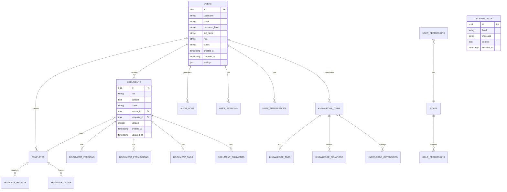

# 金融售前方案辅助编写系统 - 数据库设计文档

## 文档信息

| 项目 | 内容 |
|------|------|
| 文档名称 | 数据库设计文档 (DBD) |
| 产品名称 | 金融售前方案辅助编写系统 |
| 版本 | v1.2.0 |
| 发布日期 | 2025-01-08 |
| 作者 | 数据库架构师 |
| 状态 | 正式发布 |
| 目标读者 | 数据库管理员、开发团队、运维团队 |

## 版本历史

| 版本 | 日期 | 修改人 | 修改内容 |
|------|------|--------|----------|
| v1.0.0 | 2024-12-01 | 数据库团队 | 初始版本创建 |
| v1.1.0 | 2024-12-15 | 数据库团队 | 优化索引设计，增加分区表 |
| v1.2.0 | 2025-01-08 | 数据库团队 | 完善向量数据库集成设计 |

## 1. 数据库架构概述

### 1.1 数据库选型

基于金融售前方案辅助编写系统的业务特性和性能要求，我们采用**多数据库融合架构**：

#### 1.1.1 主数据库：PostgreSQL 14+
- **选择理由**：
  - 企业级关系数据库，支持复杂查询和事务
  - 优秀的JSON支持，适合存储半结构化数据
  - 强大的全文搜索能力
  - 支持地理信息数据和向量计算
  - 开源免费，社区活跃
  - 符合金融行业数据安全要求

#### 1.1.2 缓存数据库：Redis 7+
- **选择理由**：
  - 高性能内存数据库，读写速度极快
  - 支持多种数据结构（字符串、哈希、列表、集合等）
  - 支持发布订阅和事务
  - 支持主从复制和高可用
  - 支持Lua脚本扩展

#### 1.1.3 搜索引擎：Elasticsearch 8+
- **选择理由**：
  - 分布式搜索引擎，支持PB级数据
  - 实时搜索和分析能力
  - 支持复杂查询聚合
  - 高可用性和水平扩展
  - RESTful API接口

#### 1.1.4 向量数据库：Qdrant
- **选择理由**：
  - 专用向量数据库，支持高维向量存储
  - 高效的相似度搜索算法
  - 支持过滤和分页
  - 支持实时更新
  - 支持分布式部署

#### 1.1.5 对象存储：MinIO
- **选择理由**：
  - 兼容S3协议的对象存储
  - 支持大文件存储
  - 数据分片和冗余
  - 支持版本控制
  - 支持加密存储

### 1.2 数据库架构图

```
┌─────────────────────────────────────────────────────────────┐
│                  应用服务层                                 │
├─────────────────────────────────────────────────────────────┤
│  用户服务  │  文档服务  │  AI服务  │  知识库服务  │  导出服务  │
└─────────────────────┬───────────────────────────────────────┘
                      │
┌─────────────────────▼───────────────────────────────────────┐
│                  数据访问层                                │
│  ┌─────────────┐ ┌─────────────┐ ┌─────────────┐         │
│  │  SQLAlchemy │ │  Redis      │ │ Elasticsearch│         │
│  │  (ORM)      │ │  (Cache)    │ │  (Search)   │         │
│  └─────────────┘ └─────────────┘ └─────────────┘         │
│  ┌─────────────┐ ┌─────────────┐ ┌─────────────┐         │
│  │  Qdrant     │ │   MinIO     │ │  PostgreSQL │         │
│  │ (Vector DB) │ │ (Storage)   │ │  (Primary)  │         │
│  └─────────────┘ └─────────────┘ └─────────────┘         │
└─────────────────────────────────────────────────────────────┘
```

## 2. 逻辑数据模型

### 2.1 实体关系图



### 2.2 数据实体定义

#### 2.2.1 用户实体 (Users)
```sql
-- 用户表
CREATE TABLE users (
    id UUID PRIMARY KEY DEFAULT gen_random_uuid(),
    username VARCHAR(50) UNIQUE NOT NULL,
    email VARCHAR(100) UNIQUE NOT NULL,
    password_hash VARCHAR(255) NOT NULL,
    full_name VARCHAR(100),
    department VARCHAR(100),
    position VARCHAR(50),
    phone VARCHAR(20),
    avatar_url TEXT,

    -- 权限和状态
    role VARCHAR(50) DEFAULT 'user' CHECK (role IN ('admin', 'editor', 'viewer', 'guest')),
    status VARCHAR(20) DEFAULT 'active' CHECK (status IN ('active', 'inactive', 'suspended', 'deleted')),

    -- 系统信息
    last_login_at TIMESTAMP,
    last_login_ip INET,
    login_count INTEGER DEFAULT 0,
    failed_login_count INTEGER DEFAULT 0,
    last_password_change_at TIMESTAMP,

    -- 偏好设置
    settings JSONB DEFAULT '{}',
    notification_preferences JSONB DEFAULT '{}',

    -- 审计字段
    created_at TIMESTAMP DEFAULT CURRENT_TIMESTAMP,
    updated_at TIMESTAMP DEFAULT CURRENT_TIMESTAMP,
    created_by UUID REFERENCES users(id),
    updated_by UUID REFERENCES users(id),

    -- 约束
    CONSTRAINT chk_username_format CHECK (username ~ '^[a-zA-Z0-9_-]{3,50}$'),
    CONSTRAINT chk_email_format CHECK (email ~ '^[A-Za-z0-9._%+-]+@[A-Za-z0-9.-]+\.[A-Za-z]{2,}$'),
    CONSTRAINT chk_phone_format CHECK (phone IS NULL OR phone ~ '^\+?[1-9]\d{1,14}$')
);

-- 用户索引
CREATE INDEX idx_users_username ON users(username);
CREATE INDEX idx_users_email ON users(email);
CREATE INDEX idx_users_department ON users(department);
CREATE INDEX idx_users_status ON users(status);
CREATE INDEX idx_users_role ON users(role);
CREATE INDEX idx_users_created_at ON users(created_at);
```

#### 2.2.2 文档实体 (Documents)
```sql
-- 文档表
CREATE TABLE documents (
    id UUID PRIMARY KEY DEFAULT gen_random_uuid(),
    title VARCHAR(200) NOT NULL,
    content TEXT,
    content_type VARCHAR(20) DEFAULT 'markdown' CHECK (content_type IN ('markdown', 'html', 'json', 'text')),

    -- 文档状态
    status VARCHAR(20) DEFAULT 'draft' CHECK (status IN ('draft', 'published', 'archived', 'deleted')),
    visibility VARCHAR(20) DEFAULT 'private' CHECK (visibility IN ('private', 'internal', 'public')),

    -- 关联关系
    author_id UUID NOT NULL REFERENCES users(id),
    template_id UUID REFERENCES templates(id),
    parent_id UUID REFERENCES documents(id),  -- 支持文档层级结构

    -- 版本信息
    version INTEGER DEFAULT 1,
    is_current_version BOOLEAN DEFAULT TRUE,

    -- 内容统计
    word_count INTEGER DEFAULT 0 CHECK (word_count >= 0),
    page_count INTEGER DEFAULT 0 CHECK (page_count >= 0),
    file_size BIGINT DEFAULT 0 CHECK (file_size >= 0),

    -- 元数据
    language VARCHAR(10) DEFAULT 'zh-CN',
    charset VARCHAR(20) DEFAULT 'utf-8',
    tags TEXT[],
    keywords TEXT[],
    description TEXT,

    -- 自定义字段
    custom_fields JSONB DEFAULT '{}',
    metadata JSONB DEFAULT '{}',

    -- 时间戳
    created_at TIMESTAMP DEFAULT CURRENT_TIMESTAMP,
    updated_at TIMESTAMP DEFAULT CURRENT_TIMESTAMP,
    published_at TIMESTAMP,
    last_accessed_at TIMESTAMP,

    -- 访问统计
    view_count INTEGER DEFAULT 0 CHECK (view_count >= 0),
    download_count INTEGER DEFAULT 0 CHECK (download_count >= 0),
    like_count INTEGER DEFAULT 0 CHECK (like_count >= 0),

    -- 外部引用
    source_url TEXT,
    source_type VARCHAR(50),
    source_id VARCHAR(100),

    -- 约束
    CONSTRAINT chk_document_title_length CHECK (LENGTH(title) >= 1 AND LENGTH(title) <= 200),
    CONSTRAINT chk_document_version CHECK (version > 0),
    CONSTRAINT chk_document_dates CHECK (
        published_at IS NULL OR published_at >= created_at
    )
);

-- 文档索引
CREATE INDEX idx_documents_author ON documents(author_id);
CREATE INDEX idx_documents_template ON documents(template_id);
CREATE INDEX idx_documents_parent ON documents(parent_id);
CREATE INDEX idx_documents_status ON documents(status);
CREATE INDEX idx_documents_visibility ON documents(visibility);
CREATE INDEX idx_documents_created_at ON documents(created_at);
CREATE INDEX idx_documents_updated_at ON documents(updated_at);
CREATE INDEX idx_documents_published_at ON documents(published_at);
CREATE INDEX idx_documents_tags ON documents USING GIN(tags);
CREATE INDEX idx_documents_keywords ON documents USING GIN(keywords);
CREATE INDEX idx_documents_fulltext ON documents USING GIN(to_tsvector('chinese', title || ' ' || COALESCE(content, '')));
```

#### 2.2.3 知识库实体 (Knowledge Items)
```sql
-- 知识条目表
CREATE TABLE knowledge_items (
    id UUID PRIMARY KEY DEFAULT gen_random_uuid(),
    title VARCHAR(200) NOT NULL,
    content TEXT NOT NULL,
    summary TEXT,

    -- 分类和标签
    category VARCHAR(100),
    subcategory VARCHAR(100),
    tags TEXT[],

    -- 关联关系
    author_id UUID REFERENCES users(id),

    -- 内容类型
    content_type VARCHAR(50) DEFAULT 'text' CHECK (content_type IN ('text', 'markdown', 'html', 'json')),

    -- 来源信息
    source VARCHAR(100),
    source_url TEXT,
    source_id VARCHAR(100),

    -- 向量嵌入（用于语义搜索）
    embedding vector(384),  -- 384维向量

    -- 质量评分
    quality_score DECIMAL(3,2) DEFAULT 0.00 CHECK (quality_score >= 0 AND quality_score <= 5.00),
    reliability_score DECIMAL(3,2) DEFAULT 0.00 CHECK (reliability_score >= 0 AND reliability_score <= 1.00),

    -- 使用统计
    view_count INTEGER DEFAULT 0 CHECK (view_count >= 0),
    use_count INTEGER DEFAULT 0 CHECK (use_count >= 0),
    favorite_count INTEGER DEFAULT 0 CHECK (favorite_count >= 0),

    -- 状态管理
    status VARCHAR(20) DEFAULT 'active' CHECK (status IN ('active', 'inactive', 'draft', 'reviewing', 'rejected')),

    -- 元数据
    language VARCHAR(10) DEFAULT 'zh-CN',
    custom_fields JSONB DEFAULT '{}',
    metadata JSONB DEFAULT '{}',

    -- 时间戳
    created_at TIMESTAMP DEFAULT CURRENT_TIMESTAMP,
    updated_at TIMESTAMP DEFAULT CURRENT_TIMESTAMP,
    reviewed_at TIMESTAMP,

    -- 约束
    CONSTRAINT chk_knowledge_title_length CHECK (LENGTH(title) >= 1 AND LENGTH(title) <= 200),
    CONSTRAINT chk_knowledge_content_length CHECK (LENGTH(content) >= 10)
);

-- 知识库索引
CREATE INDEX idx_knowledge_author ON knowledge_items(author_id);
CREATE INDEX idx_knowledge_category ON knowledge_items(category);
CREATE INDEX idx_knowledge_subcategory ON knowledge_items(subcategory);
CREATE INDEX idx_knowledge_status ON knowledge_items(status);
CREATE INDEX idx_knowledge_created_at ON knowledge_items(created_at);
CREATE INDEX idx_knowledge_tags ON knowledge_items USING GIN(tags);
CREATE INDEX idx_knowledge_fulltext ON knowledge_items USING GIN(to_tsvector('chinese', title || ' ' || content));
CREATE INDEX idx_knowledge_embedding ON knowledge_items USING ivfflat (embedding vector_cosine_ops);
```

#### 2.2.4 模板实体 (Templates)
```sql
-- 模板表
CREATE TABLE templates (
    id UUID PRIMARY KEY DEFAULT gen_random_uuid(),
    name VARCHAR(100) NOT NULL,
    description TEXT,
    content TEXT NOT NULL,

    -- 分类信息
    category VARCHAR(100),
    subcategory VARCHAR(100),
    industry VARCHAR(100),
    scenario VARCHAR(100),

    -- 标签和关键词
    tags TEXT[],
    keywords TEXT[],

    -- 关联关系
    author_id UUID REFERENCES users(id),

    -- 模板类型
    template_type VARCHAR(50) DEFAULT 'document' CHECK (template_type IN ('document', 'presentation', 'spreadsheet', 'email')),

    -- 使用统计
    usage_count INTEGER DEFAULT 0 CHECK (usage_count >= 0),
    success_count INTEGER DEFAULT 0 CHECK (success_count >= 0),

    -- 评分系统
    rating DECIMAL(3,2) DEFAULT 0.00 CHECK (rating >= 0 AND rating <= 5.00),
    rating_count INTEGER DEFAULT 0 CHECK (rating_count >= 0),

    -- 质量指标
    quality_score DECIMAL(3,2) DEFAULT 0.00 CHECK (quality_score >= 0 AND quality_score <= 1.00),
    completeness_score DECIMAL(3,2) DEFAULT 0.00 CHECK (completeness_score >= 0 AND completeness_score <= 1.00),

    -- 可见性和权限
    is_official BOOLEAN DEFAULT FALSE,
    is_public BOOLEAN DEFAULT TRUE,
    is_premium BOOLEAN DEFAULT FALSE,

    -- 版本控制
    version INTEGER DEFAULT 1,
    version_notes TEXT,

    -- 验证规则
    validation_rules JSONB DEFAULT '{}',
    required_fields TEXT[],

    -- 自定义字段
    custom_fields JSONB DEFAULT '{}',
    metadata JSONB DEFAULT '{}',

    -- 时间戳
    created_at TIMESTAMP DEFAULT CURRENT_TIMESTAMP,
    updated_at TIMESTAMP DEFAULT CURRENT_TIMESTAMP,

    -- 约束
    CONSTRAINT chk_template_name_length CHECK (LENGTH(name) >= 1 AND LENGTH(name) <= 100),
    CONSTRAINT chk_template_content_length CHECK (LENGTH(content) >= 10)
);

-- 模板索引
CREATE INDEX idx_templates_author ON templates(author_id);
CREATE INDEX idx_templates_category ON templates(category);
CREATE INDEX idx_templates_subcategory ON templates(subcategory);
CREATE INDEX idx_templates_industry ON templates(industry);
CREATE INDEX idx_templates_type ON templates(template_type);
CREATE INDEX idx_templates_public ON templates(is_public);
CREATE INDEX idx_templates_official ON templates(is_official);
CREATE INDEX idx_templates_rating ON templates(rating DESC);
CREATE INDEX idx_templates_usage ON templates(usage_count DESC);
CREATE INDEX idx_templates_created_at ON templates(created_at);
CREATE INDEX idx_templates_tags ON templates USING GIN(tags);
CREATE INDEX idx_templates_keywords ON templates USING GIN(keywords);
```

### 2.3 关联关系设计

#### 2.3.1 文档版本控制
```sql
-- 文档版本表
CREATE TABLE document_versions (
    id UUID PRIMARY KEY DEFAULT gen_random_uuid(),
    document_id UUID NOT NULL REFERENCES documents(id) ON DELETE CASCADE,
    version_number INTEGER NOT NULL,

    -- 版本内容
    title VARCHAR(200) NOT NULL,
    content TEXT,
    word_count INTEGER DEFAULT 0,
    file_size BIGINT DEFAULT 0,

    -- 变更信息
    change_summary TEXT,
    change_type VARCHAR(50) CHECK (change_type IN ('content', 'metadata', 'both')),

    -- 创建者信息
    created_by UUID REFERENCES users(id),

    -- 校验信息
    checksum VARCHAR(64),  -- SHA-256

    -- 时间戳
    created_at TIMESTAMP DEFAULT CURRENT_TIMESTAMP,

    -- 约束
    UNIQUE(document_id, version_number),
    CONSTRAINT chk_version_number CHECK (version_number > 0)
);

-- 版本控制索引
CREATE INDEX idx_doc_versions_document ON document_versions(document_id);
CREATE INDEX idx_doc_versions_number ON document_versions(version_number);
CREATE INDEX idx_doc_versions_created_at ON document_versions(created_at);
CREATE INDEX idx_doc_versions_created_by ON document_versions(created_by);
```

#### 2.3.2 权限管理
```sql
-- 权限表
CREATE TABLE permissions (
    id UUID PRIMARY KEY DEFAULT gen_random_uuid(),
    name VARCHAR(50) UNIQUE NOT NULL,
    description TEXT,
    resource_type VARCHAR(50) NOT NULL,
    action VARCHAR(50) NOT NULL,

    -- 约束
    UNIQUE(resource_type, action)
);

-- 角色表
CREATE TABLE roles (
    id UUID PRIMARY KEY DEFAULT gen_random_uuid(),
    name VARCHAR(50) UNIQUE NOT NULL,
    description TEXT,
    is_system BOOLEAN DEFAULT FALSE,

    -- 元数据
    metadata JSONB DEFAULT '{}',
    created_at TIMESTAMP DEFAULT CURRENT_TIMESTAMP,
    updated_at TIMESTAMP DEFAULT CURRENT_TIMESTAMP
);

-- 角色权限关联表
CREATE TABLE role_permissions (
    id UUID PRIMARY KEY DEFAULT gen_random_uuid(),
    role_id UUID NOT NULL REFERENCES roles(id) ON DELETE CASCADE,
    permission_id UUID NOT NULL REFERENCES permissions(id) ON DELETE CASCADE,

    -- 约束
    UNIQUE(role_id, permission_id)
);

-- 用户角色关联表
CREATE TABLE user_roles (
    id UUID PRIMARY KEY DEFAULT gen_random_uuid(),
    user_id UUID NOT NULL REFERENCES users(id) ON DELETE CASCADE,
    role_id UUID NOT NULL REFERENCES roles(id) ON DELETE CASCADE,

    -- 约束
    UNIQUE(user_id, role_id)
);

-- 细粒度权限表（资源级权限）
CREATE TABLE user_resource_permissions (
    id UUID PRIMARY KEY DEFAULT gen_random_uuid(),
    user_id UUID NOT NULL REFERENCES users(id) ON DELETE CASCADE,
    resource_type VARCHAR(50) NOT NULL,
    resource_id UUID,
    permission VARCHAR(50) NOT NULL,
    granted_by UUID REFERENCES users(id),
    granted_at TIMESTAMP DEFAULT CURRENT_TIMESTAMP,
    expires_at TIMESTAMP,

    -- 约束
    UNIQUE(user_id, resource_type, resource_id, permission)
);

-- 权限相关索引
CREATE INDEX idx_role_permissions_role ON role_permissions(role_id);
CREATE INDEX idx_role_permissions_permission ON role_permissions(permission_id);
CREATE INDEX idx_user_roles_user ON user_roles(user_id);
CREATE INDEX idx_user_roles_role ON user_roles(role_id);
CREATE INDEX idx_user_resource_permissions_user ON user_resource_permissions(user_id);
CREATE INDEX idx_user_resource_permissions_resource ON user_resource_permissions(resource_type, resource_id);
```

## 3. 物理数据库设计

### 3.1 PostgreSQL主数据库

#### 3.1.1 表空间设计
```sql
-- 创建表空间
CREATE TABLESPACE users_data LOCATION '/var/lib/postgresql/tablespaces/users';
CREATE TABLESPACE documents_data LOCATION '/var/lib/postgresql/tablespaces/documents';
CREATE TABLESPACE knowledge_data LOCATION '/var/lib/postgresql/tablespaces/knowledge';
CREATE TABLESPACE system_data LOCATION '/var/lib/postgresql/tablespaces/system';
CREATE TABLESPACE audit_data LOCATION '/var/lib/postgresql/tablespaces/audit';

-- 将表分配到不同表空间
ALTER TABLE users SET TABLESPACE users_data;
ALTER TABLE documents SET TABLESPACE documents_data;
ALTER TABLE knowledge_items SET TABLESPACE knowledge_data;
ALTER TABLE audit_logs SET TABLESPACE audit_data;
```

#### 3.1.2 分区表设计
```sql
-- 审计日志分区表（按时间分区）
CREATE TABLE audit_logs (
    id UUID DEFAULT gen_random_uuid(),
    user_id UUID REFERENCES users(id),
    action VARCHAR(100) NOT NULL,
    resource_type VARCHAR(50),
    resource_id UUID,
    details JSONB DEFAULT '{}',
    ip_address INET,
    user_agent TEXT,
    timestamp TIMESTAMP NOT NULL,
    success BOOLEAN DEFAULT TRUE,
    error_message TEXT,
    PRIMARY KEY (id, timestamp)
) PARTITION BY RANGE (timestamp);

-- 创建月度分区
CREATE TABLE audit_logs_2024_01 PARTITION OF audit_logs
    FOR VALUES FROM ('2024-01-01') TO ('2024-02-01');

CREATE TABLE audit_logs_2024_02 PARTITION OF audit_logs
    FOR VALUES FROM ('2024-02-01') TO ('2024-03-01');

-- 自动创建分区的函数
CREATE OR REPLACE FUNCTION create_monthly_partition()
RETURNS void AS $$
DECLARE
    partition_name TEXT;
    start_date DATE;
    end_date DATE;
BEGIN
    start_date := DATE_TRUNC('month', CURRENT_DATE + INTERVAL '1 month');
    end_date := start_date + INTERVAL '1 month';
    partition_name := 'audit_logs_' || TO_CHAR(start_date, 'YYYY_MM');

    EXECUTE format('CREATE TABLE IF NOT EXISTS %I PARTITION OF audit_logs FOR VALUES FROM (%L) TO (%L)',
                   partition_name, start_date, end_date);
END;
$$ LANGUAGE plpgsql;

-- 定时创建分区
CREATE EXTENSION IF NOT EXISTS pg_cron;
SELECT cron.schedule('create-partitions', '0 0 25 * *', 'SELECT create_monthly_partition()');
```

#### 3.1.3 性能优化索引
```sql
-- 复合索引优化
CREATE INDEX idx_documents_author_status ON documents(author_id, status);
CREATE INDEX idx_documents_template_visibility ON documents(template_id, visibility);
CREATE INDEX idx_documents_created_status ON documents(created_at DESC, status);
CREATE INDEX idx_knowledge_category_status ON knowledge_items(category, status);
CREATE INDEX idx_templates_category_rating ON templates(category, rating DESC);

-- 部分索引
CREATE INDEX idx_documents_published ON documents(created_at DESC) WHERE status = 'published';
CREATE INDEX idx_documents_public ON documents(created_at DESC) WHERE visibility = 'public';
CREATE INDEX idx_knowledge_active ON knowledge_items(created_at DESC) WHERE status = 'active';
CREATE INDEX idx_templates_official ON templates(usage_count DESC) WHERE is_official = TRUE;

-- 表达式索引
CREATE INDEX idx_users_lower_username ON users(LOWER(username));
CREATE INDEX idx_users_lower_email ON users(LOWER(email));
CREATE INDEX idx_documents_search_vector ON documents USING GIN(to_tsvector('chinese', title || ' ' || COALESCE(content, '')));

-- BRIN索引（用于大表的时间序列数据）
CREATE INDEX idx_audit_logs_brin ON audit_logs USING BRIN(timestamp);
```

### 3.2 Redis缓存设计

#### 3.2.1 缓存策略配置
```python
# Redis缓存配置
REDIS_CONFIG = {
    "default": {
        "host": "redis-cluster",
        "port": 6379,
        "db": 0,
        "password": None,
        "socket_connect_timeout": 5,
        "socket_timeout": 5,
        "connection_pool": {
            "max_connections": 100,
            "retry_on_timeout": True,
            "socket_keepalive": True,
            "socket_keepalive_options": {}
        }
    },
    "cache": {
        "host": "redis-cluster",
        "port": 6379,
        "db": 1,
        "max_connections": 200
    },
    "session": {
        "host": "redis-cluster",
        "port": 6379,
        "db": 2,
        "max_connections": 100
    }
}

# 缓存键命名规范
CACHE_KEY_PATTERNS = {
    "user_session": "session:{user_id}",
    "user_profile": "user:profile:{user_id}",
    "user_permissions": "user:permissions:{user_id}",
    "document_content": "doc:content:{document_id}",
    "document_metadata": "doc:meta:{document_id}",
    "document_list": "doc:list:{user_id}:{filter_hash}",
    "template_list": "template:list:{category}:{subcategory}",
    "knowledge_search": "knowledge:search:{query_hash}",
    "ai_generation": "ai:generation:{prompt_hash}",
    "system_config": "config:{key}",
    "rate_limit": "rate_limit:{user_id}:{action}"
}

# 缓存TTL配置
CACHE_TTL = {
    "user_session": 3600,        # 1小时
    "user_profile": 1800,        # 30分钟
    "user_permissions": 300,     # 5分钟
    "document_content": 1800,    # 30分钟
    "document_list": 300,        # 5分钟
    "template_list": 3600,       # 1小时
    "knowledge_search": 600,     # 10分钟
    "ai_generation": 86400,      # 24小时
    "system_config": 3600,       # 1小时
    "rate_limit": 60             # 1分钟
}
```

#### 3.2.2 缓存数据结构设计
```python
# 用户会话缓存结构
USER_SESSION_SCHEMA = {
    "user_id": "string",
    "username": "string",
    "email": "string",
    "role": "string",
    "permissions": ["string"],
    "login_at": "timestamp",
    "last_activity": "timestamp",
    "ip_address": "string",
    "user_agent": "string",
    "session_data": {
        "preferred_language": "string",
        "theme": "string",
        "notifications_enabled": "boolean"
    }
}

# 文档元数据缓存结构
DOCUMENT_METADATA_SCHEMA = {
    "document_id": "string",
    "title": "string",
    "author": {
        "id": "string",
        "name": "string",
        "avatar": "string"
    },
    "status": "string",
    "visibility": "string",
    "created_at": "timestamp",
    "updated_at": "timestamp",
    "word_count": "integer",
    "tags": ["string"],
    "permissions": {
        "can_read": ["user_id"],
        "can_write": ["user_id"],
        "can_delete": ["user_id"]
    }
}

# 搜索结果缓存结构
SEARCH_RESULTS_SCHEMA = {
    "query": "string",
    "search_type": "string",
    "results": [
        {
            "id": "string",
            "title": "string",
            "snippet": "string",
            "score": "float",
            "type": "string",
            "created_at": "timestamp"
        }
    ],
    "total_count": "integer",
    "page": "integer",
    "page_size": "integer",
    "search_time": "float"
}
```

### 3.3 Elasticsearch搜索设计

#### 3.3.1 索引映射设计
```json
{
  "mappings": {
    "properties": {
      "id": {
        "type": "keyword"
      },
      "title": {
        "type": "text",
        "analyzer": "ik_max_word",
        "search_analyzer": "ik_smart",
        "fields": {
          "keyword": {
            "type": "keyword",
            "ignore_above": 256
          },
          "suggest": {
            "type": "completion"
          }
        }
      },
      "content": {
        "type": "text",
        "analyzer": "ik_max_word",
        "search_analyzer": "ik_smart"
      },
      "author": {
        "properties": {
          "id": {
            "type": "keyword"
          },
          "name": {
            "type": "keyword",
            "fields": {
              "text": {
                "type": "text",
                "analyzer": "ik_max_word"
              }
            }
          }
        }
      },
      "tags": {
        "type": "keyword"
      },
      "category": {
        "type": "keyword"
      },
      "status": {
        "type": "keyword"
      },
      "visibility": {
        "type": "keyword"
      },
      "created_at": {
        "type": "date"
      },
      "updated_at": {
        "type": "date"
      },
      "word_count": {
        "type": "integer"
      },
      "view_count": {
        "type": "integer"
      },
      "metadata": {
        "type": "object",
        "enabled": false
      }
    }
  },
  "settings": {
    "number_of_shards": 3,
    "number_of_replicas": 1,
    "analysis": {
      "analyzer": {
        "custom_analyzer": {
          "tokenizer": "ik_max_word",
          "filter": ["lowercase", "stop", "synonym_filter"]
        }
      },
      "filter": {
        "synonym_filter": {
          "type": "synonym",
          "synonyms": [
            "文档,文件,资料",
            "模板,范本,样例",
            "方案,计划,策略"
          ]
        }
      }
    }
  }
}
```

#### 3.3.2 搜索查询设计
```python
# 搜索查询构建器
class SearchQueryBuilder:
    """搜索查询构建器"""

    @staticmethod
    def build_document_search_query(
        query_string: str,
        filters: dict = None,
        sort_by: str = "relevance",
        page: int = 1,
        page_size: int = 20
    ) -> dict:
        """构建文档搜索查询"""

        # 基础查询
        must_clauses = [
            {
                "multi_match": {
                    "query": query_string,
                    "fields": [
                        "title^3",  # 标题权重最高
                        "content^1",
                        "tags^2",
                        "category^1.5"
                    ],
                    "type": "best_fields",
                    "fuzziness": "AUTO",
                    "prefix_length": 2
                }
            }
        ]

        # 添加过滤器
        filter_clauses = []
        if filters:
            if filters.get("status"):
                filter_clauses.append({"term": {"status": filters["status"]}})

            if filters.get("visibility"):
                filter_clauses.append({"term": {"visibility": filters["visibility"]}})

            if filters.get("author_id"):
                filter_clauses.append({"term": {"author.id": filters["author_id"]}})

            if filters.get("category"):
                filter_clauses.append({"term": {"category": filters["category"]}})

            if filters.get("date_range"):
                date_range = filters["date_range"]
                filter_clauses.append({
                    "range": {
                        "created_at": {
                            "gte": date_range.get("start"),
                            "lte": date_range.get("end")
                        }
                    }
                })

        # 构建完整查询
        search_query = {
            "query": {
                "bool": {
                    "must": must_clauses,
                    "filter": filter_clauses
                }
            },
            "highlight": {
                "fields": {
                    "title": {},
                    "content": {
                        "fragment_size": 200,
                        "number_of_fragments": 3
                    }
                },
                "pre_tags": ["<mark>"],
                "post_tags": ["</mark>"]
            },
            "aggs": {
                "categories": {
                    "terms": {"field": "category", "size": 20}
                },
                "statuses": {
                    "terms": {"field": "status", "size": 10}
                },
                "date_histogram": {
                    "date_histogram": {
                        "field": "created_at",
                        "calendar_interval": "month"
                    }
                }
            },
            "size": page_size,
            "from": (page - 1) * page_size
        }

        # 添加排序
        if sort_by == "relevance":
            search_query["sort"] = ["_score"]
        elif sort_by == "date":
            search_query["sort"] = [{"created_at": "desc"}]
        elif sort_by == "popularity":
            search_query["sort"] = [{"view_count": "desc"}]

        return search_query

    @staticmethod
    def build_knowledge_search_query(
        query_string: str,
        semantic_weight: float = 0.7,
        fulltext_weight: float = 0.3
    ) -> dict:
        """构建知识库混合搜索查询"""

        return {
            "query": {
                "script_score": {
                    "query": {
                        "bool": {
                            "should": [
                                {
                                    "multi_match": {
                                        "query": query_string,
                                        "fields": ["title^2", "content", "tags^1.5"],
                                        "boost": fulltext_weight
                                    }
                                }
                            ]
                        }
                    },
                    "script": {
                        "source": """
                            double semanticScore = cosineSimilarity(params.query_vector, 'embedding');
                            double fulltextScore = _score;
                            return params.semantic_weight * semanticScore + params.fulltext_weight * fulltextScore;
                        """,
                        "params": {
                            "query_vector": "embedding_vector_here",
                            "semantic_weight": semantic_weight,
                            "fulltext_weight": fulltext_weight
                        }
                    }
                }
            }
        }
```

### 3.4 向量数据库设计

#### 3.4.1 Qdrant集合设计
```python
# Qdrant向量数据库配置
QDRANT_CONFIG = {
    "host": "qdrant-cluster",
    "port": 6333,
    "grpc_port": 6334,
    "api_key": None,
    "https": False
}

# 向量集合定义
VECTOR_COLLECTIONS = {
    "documents": {
        "vector_size": 384,  # 384维向量
        "distance": "Cosine",  # 余弦相似度
        "hnsw_config": {
            "m": 16,  # HNSW参数
            "ef_construct": 100,
            "full_scan_threshold": 10000
        },
        "quantization_config": {
            "scalar": {
                "type": "int8",
                "quantile": 0.99
            }
        }
    },
    "knowledge_items": {
        "vector_size": 384,
        "distance": "Cosine",
        "hnsw_config": {
            "m": 16,
            "ef_construct": 100
        }
    },
    "templates": {
        "vector_size": 384,
        "distance": "Cosine",
        "hnsw_config": {
            "m": 16,
            "ef_construct": 100
        }
    }
}
```

#### 3.4.2 向量数据结构设计
```python
# 向量数据模型
class VectorDataModel:
    """向量数据模型"""

    def __init__(self):
        self.embedding_model = SentenceTransformer('all-MiniLM-L6-v2')

    async def create_vector_point(
        self,
        content_id: str,
        content: str,
        metadata: dict = None,
        payload: dict = None
    ) -> dict:
        """创建向量数据点"""

        # 生成向量嵌入
        embedding = self.embedding_model.encode(content).tolist()

        # 构建数据点
        point = {
            "id": content_id,
            "vector": embedding,
            "payload": {
                "content_id": content_id,
                "content_type": metadata.get("content_type", "text"),
                "title": metadata.get("title", ""),
                "category": metadata.get("category", ""),
                "tags": metadata.get("tags", []),
                "created_at": metadata.get("created_at", datetime.utcnow().isoformat()),
                "author_id": metadata.get("author_id"),
                "status": metadata.get("status", "active"),
                "custom_payload": payload or {}
            }
        }

        return point

    async def search_similar_content(
        self,
        query_text: str,
        collection_name: str,
        top_k: int = 10,
        score_threshold: float = 0.7,
        filters: dict = None
    ) -> List[dict]:
        """搜索相似内容"""

        # 生成查询向量
        query_vector = self.embedding_model.encode(query_text).tolist()

        # 构建查询过滤器
        query_filter = None
        if filters:
            query_filter = {
                "must": [
                    {"key": key, "match": {"value": value}}
                    for key, value in filters.items()
                ]
            }

        # 执行向量搜索
        search_result = await self.qdrant_client.search(
            collection_name=collection_name,
            query_vector=query_vector,
            query_filter=query_filter,
            limit=top_k,
            score_threshold=score_threshold,
            with_payload=True,
            with_vectors=False
        )

        # 转换结果格式
        results = []
        for point in search_result:
            results.append({
                "id": point.id,
                "score": point.score,
                "payload": point.payload
            })

        return results
```

## 4. 数据完整性设计

### 4.1 约束设计

#### 4.1.1 主键约束
```sql
-- 所有表使用UUID作为主键，确保全局唯一性
ALTER TABLE users ADD CONSTRAINT pk_users PRIMARY KEY (id);
ALTER TABLE documents ADD CONSTRAINT pk_documents PRIMARY KEY (id);
ALTER TABLE knowledge_items ADD CONSTRAINT pk_knowledge PRIMARY KEY (id);
ALTER TABLE templates ADD CONSTRAINT pk_templates PRIMARY KEY (id);
```

#### 4.1.2 唯一约束
```sql
-- 用户相关唯一约束
ALTER TABLE users ADD CONSTRAINT uk_users_username UNIQUE (username);
ALTER TABLE users ADD CONSTRAINT uk_users_email UNIQUE (email);

-- 版本控制唯一约束
ALTER TABLE document_versions ADD CONSTRAINT uk_doc_versions UNIQUE (document_id, version_number);

-- 权限相关唯一约束
ALTER TABLE role_permissions ADD CONSTRAINT uk_role_permissions UNIQUE (role_id, permission_id);
ALTER TABLE user_roles ADD CONSTRAINT uk_user_roles UNIQUE (user_id, role_id);
ALTER TABLE user_resource_permissions ADD CONSTRAINT uk_user_resource_permissions UNIQUE (user_id, resource_type, resource_id, permission);
```

#### 4.1.3 检查约束
```sql
-- 数据格式检查
ALTER TABLE users ADD CONSTRAINT chk_username_format CHECK (username ~ '^[a-zA-Z0-9_-]{3,50}$');
ALTER TABLE users ADD CONSTRAINT chk_email_format CHECK (email ~ '^[A-Za-z0-9._%+-]+@[A-Za-z0-9.-]+\.[A-Za-z]{2,}$');
ALTER TABLE users ADD CONSTRAINT chk_phone_format CHECK (phone IS NULL OR phone ~ '^\+?[1-9]\d{1,14}$');

-- 数值范围检查
ALTER TABLE documents ADD CONSTRAINT chk_word_count CHECK (word_count >= 0);
ALTER TABLE documents ADD CONSTRAINT chk_view_count CHECK (view_count >= 0);
ALTER TABLE templates ADD CONSTRAINT chk_rating CHECK (rating >= 0 AND rating <= 5);
ALTER TABLE knowledge_items ADD CONSTRAINT chk_quality_score CHECK (quality_score >= 0 AND quality_score <= 5);

-- 日期逻辑检查
ALTER TABLE documents ADD CONSTRAINT chk_document_dates CHECK (published_at IS NULL OR published_at >= created_at);
ALTER TABLE user_sessions ADD CONSTRAINT chk_session_dates CHECK (expires_at > created_at);
```

#### 4.1.4 外键约束
```sql
-- 用户相关外键
ALTER TABLE documents ADD CONSTRAINT fk_documents_author FOREIGN KEY (author_id) REFERENCES users(id) ON DELETE RESTRICT;
ALTER TABLE knowledge_items ADD CONSTRAINT fk_knowledge_author FOREIGN KEY (author_id) REFERENCES users(id) ON DELETE SET NULL;
ALTER TABLE templates ADD CONSTRAINT fk_templates_author FOREIGN KEY (author_id) REFERENCES users(id) ON DELETE SET NULL;

-- 文档相关外键
ALTER TABLE documents ADD CONSTRAINT fk_documents_template FOREIGN KEY (template_id) REFERENCES templates(id) ON DELETE SET NULL;
ALTER TABLE documents ADD CONSTRAINT fk_documents_parent FOREIGN KEY (parent_id) REFERENCES documents(id) ON DELETE CASCADE;
ALTER TABLE document_versions ADD CONSTRAINT fk_doc_versions_document FOREIGN KEY (document_id) REFERENCES documents(id) ON DELETE CASCADE;

-- 权限相关外键
ALTER TABLE user_roles ADD CONSTRAINT fk_user_roles_user FOREIGN KEY (user_id) REFERENCES users(id) ON DELETE CASCADE;
ALTER TABLE user_roles ADD CONSTRAINT fk_user_roles_role FOREIGN KEY (role_id) REFERENCES roles(id) ON DELETE CASCADE;
ALTER TABLE role_permissions ADD CONSTRAINT fk_role_permissions_role FOREIGN KEY (role_id) REFERENCES roles(id) ON DELETE CASCADE;
ALTER TABLE role_permissions ADD CONSTRAINT fk_role_permissions_permission FOREIGN KEY (permission_id) REFERENCES permissions(id) ON DELETE CASCADE;
```

### 4.2 事务设计

#### 4.2.1 事务隔离级别
```sql
-- 设置默认事务隔离级别
ALTER DATABASE fin_pre_assist SET DEFAULT_TRANSACTION_ISOLATION = 'READ COMMITTED';

-- 关键业务使用更高隔离级别
-- 文档创建事务（防止并发创建冲突）
BEGIN TRANSACTION ISOLATION LEVEL REPEATABLE READ;
    -- 检查用户配额
    SELECT document_count, quota FROM user_quotas WHERE user_id = ? FOR UPDATE;

    -- 创建文档
    INSERT INTO documents (title, content, author_id) VALUES (?, ?, ?);

    -- 更新配额
    UPDATE user_quotas SET document_count = document_count + 1 WHERE user_id = ?;
COMMIT;

-- 知识库评分事务（防止重复评分）
BEGIN TRANSACTION ISOLATION LEVEL SERIALIZABLE;
    -- 检查用户是否已评分
    SELECT id FROM knowledge_ratings WHERE user_id = ? AND knowledge_id = ?;

    -- 如果没有评分，则创建评分记录
    INSERT INTO knowledge_ratings (user_id, knowledge_id, rating) VALUES (?, ?, ?);

    -- 更新知识条目评分
    UPDATE knowledge_items SET
        rating = (rating * rating_count + ?) / (rating_count + 1),
        rating_count = rating_count + 1
    WHERE id = ?;
COMMIT;
```

#### 4.2.2 分布式事务处理
```python
# Saga模式实现分布式事务
class DocumentCreationSaga:
    """文档创建事务协调器"""

    def __init__(self):
        self.steps = [
            CreateDocumentRecordStep(),
            InitializeContentStep(),
            UpdateUserQuotaStep(),
            CreateSearchIndexStep(),
            GenerateVectorEmbeddingStep(),
            SendNotificationStep()
        ]

    async def execute(self, document_data: dict, user_id: str) -> dict:
        """执行文档创建事务"""
        saga_id = str(uuid.uuid4())
        completed_steps = []
        context = {"saga_id": saga_id, "user_id": user_id}

        try:
            # 执行每个步骤
            for step in self.steps:
                result = await step.execute(document_data, context)
                completed_steps.append(step)
                context.update(result)

            return {
                "success": True,
                "document_id": context.get("document_id"),
                "saga_id": saga_id
            }

        except Exception as e:
            # 执行补偿操作
            logger.error(f"Saga {saga_id} failed: {e}")
            await self.compensate(completed_steps, context)
            raise e

    async def compensate(self, completed_steps: List, context: dict):
        """执行补偿操作"""
        # 反向执行补偿
        for step in reversed(completed_steps):
            try:
                await step.compensate(context)
            except Exception as e:
                logger.error(f"Compensation failed for step {step.__class__.__name__}: {e}")
                # 记录补偿失败，需要人工干预
```

### 4.3 数据验证

#### 4.3.1 应用层验证
```python
# Pydantic模型验证
from pydantic import BaseModel, validator, EmailStr, constr
from typing import Optional, List

class UserCreate(BaseModel):
    username: constr(min_length=3, max_length=50, regex=r'^[a-zA-Z0-9_-]+$')
    email: EmailStr
    password: constr(min_length=8, max_length=128)
    full_name: constr(max_length=100)
    phone: Optional[constr(regex=r'^\+?[1-9]\d{1,14}$')]
    department: Optional[constr(max_length=100)]

    @validator('password')
    def validate_password_strength(cls, v):
        if not any(c.islower() for c in v):
            raise ValueError('Password must contain at least one lowercase letter')
        if not any(c.isupper() for c in v):
            raise ValueError('Password must contain at least one uppercase letter')
        if not any(c.isdigit() for c in v):
            raise ValueError('Password must contain at least one digit')
        if not any(c in '!@#$%^&*()_+-=[]{}|;:,.<>?' for c in v):
            raise ValueError('Password must contain at least one special character')
        return v

class DocumentCreate(BaseModel):
    title: constr(min_length=1, max_length=200)
    content: Optional[str]
    template_id: Optional[str]
    tags: Optional[List[constr(max_length=50)]]
    visibility: Optional[str] = 'private'

    @validator('visibility')
    def validate_visibility(cls, v):
        if v not in ['private', 'internal', 'public']:
            raise ValueError('Visibility must be one of: private, internal, public')
        return v
```

#### 4.3.2 数据库层验证
```sql
-- 创建验证函数
CREATE OR REPLACE FUNCTION validate_document_content()
RETURNS TRIGGER AS $$
BEGIN
    -- 内容长度验证
    IF LENGTH(NEW.content) < 10 THEN
        RAISE EXCEPTION 'Document content must be at least 10 characters';
    END IF;

    -- 敏感词检测
    IF NEW.content ~* '(密码|passwd|password|机密|confidential)' THEN
        RAISE EXCEPTION 'Document contains sensitive words, please review';
    END IF;

    -- 标题内容相关性检查
    IF similarity(NEW.title, SUBSTRING(NEW.content FROM 1 FOR 100)) < 0.1 THEN
        RAISE WARNING 'Title and content appear to be unrelated';
    END IF;

    RETURN NEW;
END;
$$ LANGUAGE plpgsql;

-- 创建触发器
CREATE TRIGGER trg_validate_document_content
    BEFORE INSERT OR UPDATE ON documents
    FOR EACH ROW
    EXECUTE FUNCTION validate_document_content();

-- 用户权限验证函数
CREATE OR REPLACE FUNCTION check_user_permission()
RETURNS TRIGGER AS $$
DECLARE
    user_role VARCHAR(50);
    has_permission BOOLEAN;
BEGIN
    -- 获取用户角色
    SELECT role INTO user_role FROM users WHERE id = NEW.author_id;

    -- 检查权限
    IF user_role = 'viewer' AND NEW.visibility = 'public' THEN
        RAISE EXCEPTION 'Viewer role cannot create public documents';
    END IF;

    RETURN NEW;
END;
$$ LANGUAGE plpgsql;

CREATE TRIGGER trg_check_user_permission
    BEFORE INSERT OR UPDATE ON documents
    FOR EACH ROW
    EXECUTE FUNCTION check_user_permission();
```

## 5. 性能优化设计

### 5.1 查询优化

#### 5.1.1 慢查询优化
```sql
-- 常见慢查询分析
EXPLAIN ANALYZE
SELECT d.*, u.username, u.full_name
FROM documents d
JOIN users u ON d.author_id = u.id
WHERE d.status = 'published'
  AND d.created_at > CURRENT_DATE - INTERVAL '30 days'
  AND (d.title ILIKE '%金融%' OR d.content ILIKE '%金融%')
ORDER BY d.view_count DESC
LIMIT 20;

-- 优化后的查询
CREATE INDEX CONCURRENTLY idx_documents_published_recent
ON documents(status, created_at DESC)
WHERE status = 'published' AND created_at > CURRENT_DATE - INTERVAL '30 days';

CREATE INDEX CONCURRENTLY idx_documents_fulltext_gin
ON documents USING GIN(to_tsvector('chinese', title || ' ' || COALESCE(content, '')));

-- 优化查询语句
SELECT d.*, u.username, u.full_name
FROM documents d
JOIN users u ON d.author_id = u.id
WHERE d.status = 'published'
  AND d.created_at > CURRENT_DATE - INTERVAL '30 days'
  AND to_tsvector('chinese', d.title || ' ' || COALESCE(d.content, '')) @@ to_tsquery('chinese', '金融')
ORDER BY d.view_count DESC
LIMIT 20;
```

#### 5.1.2 分页查询优化
```sql
-- 深度分页优化（游标分页）
CREATE OR REPLACE FUNCTION get_documents_cursor(
    cursor_timestamp TIMESTAMP,
    cursor_id UUID,
    page_size INTEGER DEFAULT 20
)
RETURNS TABLE (
    id UUID,
    title VARCHAR(200),
    author_id UUID,
    created_at TIMESTAMP,
    view_count INTEGER
) AS $$
BEGIN
    RETURN QUERY
    SELECT d.id, d.title, d.author_id, d.created_at, d.view_count
    FROM documents d
    WHERE (d.created_at, d.id) < (cursor_timestamp, cursor_id)
      AND d.status = 'published'
    ORDER BY d.created_at DESC, d.id DESC
    LIMIT page_size;
END;
$$ LANGUAGE plpgsql;

-- 使用示例
SELECT * FROM get_documents_cursor('2024-01-01 00:00:00', '550e8400-e29b-41d4-a716-446655440000', 20);
```

### 5.2 索引优化

#### 5.2.1 复合索引设计
```sql
-- 高频查询复合索引
CREATE INDEX idx_documents_author_status_created
ON documents(author_id, status, created_at DESC);

CREATE INDEX idx_documents_category_visibility_rating
ON documents(category, visibility, rating DESC);

CREATE INDEX idx_knowledge_category_status_quality
ON knowledge_items(category, status, quality_score DESC);

CREATE INDEX idx_templates_industry_type_rating
ON templates(industry, template_type, rating DESC);

-- 覆盖索引（包含常用字段）
CREATE INDEX idx_documents_covering
ON documents(author_id, status)
INCLUDE (title, created_at, view_count, word_count);
```

#### 5.2.2 部分索引优化
```sql
-- 只对活跃数据创建索引
CREATE INDEX idx_users_active
ON users(username) WHERE status = 'active';

CREATE INDEX idx_documents_published_recent
ON documents(created_at DESC)
WHERE status = 'published' AND created_at > CURRENT_DATE - INTERVAL '90 days';

CREATE INDEX idx_templates_official_popular
ON templates(usage_count DESC)
WHERE is_official = TRUE AND is_public = TRUE;

CREATE INDEX idx_knowledge_high_quality
ON knowledge_items(view_count DESC)
WHERE status = 'active' AND quality_score >= 4.0;
```

### 5.3 存储优化

#### 5.3.1 数据压缩
```sql
-- 启用表压缩
ALTER TABLE documents SET (
    toast_compression = 'lz4'
);

ALTER TABLE knowledge_items SET (
    toast_compression = 'lz4'
);

ALTER TABLE audit_logs SET (
    toast_compression = 'lz4'
);

-- 大文本字段压缩
CREATE TABLE document_content_compressed (
    id UUID PRIMARY KEY,
    document_id UUID REFERENCES documents(id),
    content_compressed BYTEA,  -- 压缩后的内容
    compression_method VARCHAR(20) DEFAULT 'lz4',
    original_size BIGINT,
    compressed_size BIGINT,
    created_at TIMESTAMP DEFAULT CURRENT_TIMESTAMP
);
```

#### 5.3.2 冷热数据分离
```sql
-- 创建历史表存储冷数据
CREATE TABLE documents_history (
    LIKE documents INCLUDING ALL
) INHERITS (documents);

-- 数据迁移函数
CREATE OR REPLACE FUNCTION archive_old_documents()
RETURNS INTEGER AS $$
DECLARE
    archived_count INTEGER;
BEGIN
    -- 将超过2年的文档移到历史表
    WITH archived AS (
        DELETE FROM documents
        WHERE status = 'archived'
          AND updated_at < CURRENT_DATE - INTERVAL '2 years'
        RETURNING *
    )
    INSERT INTO documents_history SELECT * FROM archived;

    GET DIAGNOSTICS archived_count = ROW_COUNT;
    RETURN archived_count;
END;
$$ LANGUAGE plpgsql;

-- 定时归档任务
CREATE EXTENSION IF NOT EXISTS pg_cron;
SELECT cron.schedule('archive-documents', '0 2 1 * *', 'SELECT archive_old_documents();');
```

## 6. 安全设计

### 6.1 数据加密

#### 6.1.1 传输层加密
```sql
-- 强制SSL连接
ALTER SYSTEM SET ssl = on;
ALTER SYSTEM SET ssl_cert_file = 'server.crt';
ALTER SYSTEM SET ssl_key_file = 'server.key';
ALTER SYSTEM SET ssl_ca_file = 'root.crt';

-- 要求SSL连接
ALTER USER fin_pre_assist_user SET require_ssl = on;
```

#### 6.1.2 存储层加密
```python
# 敏感数据加密
from cryptography.fernet import Fernet
import base64

class DataEncryption:
    """数据加密管理"""

    def __init__(self, master_key: str):
        self.cipher_suite = Fernet(master_key.encode())

    def encrypt_field(self, data: str) -> str:
        """加密字段数据"""
        encrypted_data = self.cipher_suite.encrypt(data.encode())
        return base64.b64encode(encrypted_data).decode()

    def decrypt_field(self, encrypted_data: str) -> str:
        """解密字段数据"""
        encrypted_bytes = base64.b64decode(encrypted_data.encode())
        decrypted_data = self.cipher_suite.decrypt(encrypted_bytes)
        return decrypted_data.decode()

    def encrypt_json_field(self, data: dict) -> str:
        """加密JSON字段"""
        json_str = json.dumps(data)
        return self.encrypt_field(json_str)

    def decrypt_json_field(self, encrypted_data: str) -> dict:
        """解密JSON字段"""
        json_str = self.decrypt_field(encrypted_data)
        return json.loads(json_str)

# 使用示例
encryption = DataEncryption(settings.MASTER_ENCRYPTION_KEY)
encrypted_email = encryption.encrypt_field(user_email)
decrypted_email = encryption.decrypt_field(encrypted_email)
```

### 6.2 访问控制

#### 6.2.1 行级安全策略
```sql
-- 启用行级安全
ALTER TABLE documents ENABLE ROW LEVEL SECURITY;
ALTER TABLE knowledge_items ENABLE ROW LEVEL SECURITY;
ALTER TABLE templates ENABLE ROW LEVEL SECURITY;

-- 创建策略
CREATE POLICY document_access_policy ON documents
    FOR ALL
    USING (
        CASE
            WHEN visibility = 'public' THEN TRUE
            WHEN visibility = 'internal' THEN auth.uid() IS NOT NULL
            WHEN visibility = 'private' THEN author_id = auth.uid()
            ELSE FALSE
        END
    );

CREATE POLICY knowledge_access_policy ON knowledge_items
    FOR ALL
    USING (
        status = 'active' OR
        (status != 'active' AND author_id = auth.uid())
    );

-- 用户只能修改自己的数据
CREATE POLICY user_update_policy ON users
    FOR UPDATE
    USING (id = auth.uid())
    WITH CHECK (id = auth.uid());
```

#### 6.2.2 字段级加密
```sql
-- 创建加密函数
CREATE EXTENSION IF NOT EXISTS pgcrypto;

-- 敏感字段加密
CREATE TABLE user_sensitive_data (
    id UUID PRIMARY KEY DEFAULT gen_random_uuid(),
    user_id UUID REFERENCES users(id),
    encrypted_email TEXT,  -- 加密的邮箱
    encrypted_phone TEXT,  -- 加密的手机号
    created_at TIMESTAMP DEFAULT CURRENT_TIMESTAMP
);

-- 加密视图
CREATE VIEW user_safe_data AS
SELECT
    id,
    username,
    full_name,
    department,
    role,
    status,
    created_at,
    CASE
        WHEN pgp_sym_decrypt(encrypted_email::bytea, current_setting('app.encryption_key')) IS NOT NULL
        THEN '***@***.***'
        ELSE NULL
    END as email_masked
FROM users u
LEFT JOIN user_sensitive_data usd ON u.id = usd.user_id;
```

### 6.3 审计追踪

#### 6.3.1 数据变更审计
```sql
-- 创建审计触发器函数
CREATE OR REPLACE FUNCTION audit_trigger_func()
RETURNS TRIGGER AS $$
BEGIN
    IF TG_OP = 'DELETE' THEN
        INSERT INTO audit_logs (
            table_name, operation, record_id, old_data,
            changed_by, changed_at
        ) VALUES (
            TG_TABLE_NAME, 'DELETE', OLD.id, row_to_json(OLD),
            auth.uid(), CURRENT_TIMESTAMP
        );
        RETURN OLD;
    END IF;

    IF TG_OP = 'UPDATE' THEN
        INSERT INTO audit_logs (
            table_name, operation, record_id, old_data, new_data,
            changed_by, changed_at
        ) VALUES (
            TG_TABLE_NAME, 'UPDATE', NEW.id, row_to_json(OLD), row_to_json(NEW),
            auth.uid(), CURRENT_TIMESTAMP
        );
        RETURN NEW;
    END IF;

    IF TG_OP = 'INSERT' THEN
        INSERT INTO audit_logs (
            table_name, operation, record_id, new_data,
            changed_by, changed_at
        ) VALUES (
            TG_TABLE_NAME, 'INSERT', NEW.id, row_to_json(NEW),
            auth.uid(), CURRENT_TIMESTAMP
        );
        RETURN NEW;
    END IF;

    RETURN NULL;
END;
$$ LANGUAGE plpgsql;

-- 为关键表创建审计触发器
CREATE TRIGGER trg_audit_users
    AFTER INSERT OR UPDATE OR DELETE ON users
    FOR EACH ROW EXECUTE FUNCTION audit_trigger_func();

CREATE TRIGGER trg_audit_documents
    AFTER INSERT OR UPDATE OR DELETE ON documents
    FOR EACH ROW EXECUTE FUNCTION audit_trigger_func();

CREATE TRIGGER trg_audit_templates
    AFTER INSERT OR UPDATE OR DELETE ON templates
    FOR EACH ROW EXECUTE FUNCTION audit_trigger_func();
```

## 7. 备份与恢复

### 7.1 备份策略

#### 7.1.1 全量备份
```bash
#!/bin/bash
# PostgreSQL全量备份脚本

BACKUP_DIR="/backup/postgresql"
DATE=$(date +%Y%m%d_%H%M%S)
DB_NAME="fin_pre_assist"
DB_USER="postgres"

# 创建备份目录
mkdir -p ${BACKUP_DIR}/${DATE}

# 执行全量备份
echo "Starting full backup at $(date)"
pg_dump -h localhost -U ${DB_USER} -d ${DB_NAME} \
    --format=custom \
    --verbose \
    --file=${BACKUP_DIR}/${DATE}/full_backup.dump \
    --jobs=4 \
    --compress=6

# 验证备份
pg_restore --list ${BACKUP_DIR}/${DATE}/full_backup.dump > /dev/null
if [ $? -eq 0 ]; then
    echo "Backup verification successful"
else
    echo "Backup verification failed"
    exit 1
fi

# 清理旧备份（保留30天）
find ${BACKUP_DIR} -type d -mtime +30 -exec rm -rf {} \;

echo "Backup completed at $(date)"
```

#### 7.1.2 增量备份
```bash
#!/bin/bash
# PostgreSQL增量备份（基于WAL）

BACKUP_DIR="/backup/postgresql/wal"
ARCHIVE_DIR="/var/lib/postgresql/archive"

# 配置连续归档
# postgresql.conf
# wal_level = replica
# archive_mode = on
# archive_command = 'test ! -f /var/lib/postgresql/archive/%f && cp %p /var/lib/postgresql/archive/%f'

# 创建基础备份
echo "Creating base backup..."
pg_basebackup -D ${BACKUP_DIR}/base -Ft -z -P -v \
    -h localhost -U postgres \
    --wal-method=stream \
    --checkpoint=fast

# 备份WAL文件
echo "Archiving WAL files..."
cp ${ARCHIVE_DIR}/* ${BACKUP_DIR}/wal/

# 清理旧的WAL文件（保留7天）
find ${ARCHIVE_DIR} -type f -mtime +7 -delete
```

### 7.2 恢复策略

#### 7.2.1 全量恢复
```sql
-- 全量数据库恢复
-- 1. 停止应用服务
-- 2. 备份当前数据（如果可能）
-- 3. 恢复数据库

-- 创建新的数据库
createdb -T template0 fin_pre_assist_restore

-- 恢复数据
pg_restore -d fin_pre_assist_restore -v /backup/postgresql/20240101_120000/full_backup.dump

-- 验证数据完整性
-- 检查表数量
SELECT count(*) FROM information_schema.tables WHERE table_schema = 'public';

-- 检查数据行数
SELECT
    schemaname,
    tablename,
    n_tup_ins as inserts,
    n_tup_upd as updates,
    n_tup_del as deletes
FROM pg_stat_user_tables
ORDER BY n_tup_ins DESC;

-- 检查索引
SELECT
    schemaname,
    tablename,
    indexname,
    indexdef
FROM pg_indexes
WHERE schemaname = 'public'
ORDER BY tablename, indexname;
```

#### 7.2.2 点时间恢复
```bash
#!/bin/bash
# 点时间恢复（PITR）

RESTORE_DIR="/var/lib/postgresql/data/restore"
BACKUP_BASE="/backup/postgresql/base"
WAL_ARCHIVE="/backup/postgresql/wal"
TARGET_TIME="2024-01-01 12:00:00"

# 1. 清理恢复目录
rm -rf ${RESTORE_DIR}
mkdir -p ${RESTORE_DIR}

# 2. 解压基础备份
tar -xzf ${BACKUP_BASE}/base.tar.gz -C ${RESTORE_DIR}

# 3. 创建恢复配置
cat > ${RESTORE_DIR}/recovery.conf << EOF
restore_command = 'cp ${WAL_ARCHIVE}/%f %p'
recovery_target_time = '${TARGET_TIME}'
recovery_target_inclusive = true
recovery_target_timeline = 'latest'
EOF

# 4. 启动恢复
echo "Starting point-in-time recovery to ${TARGET_TIME}..."
pg_ctl -D ${RESTORE_DIR} start

# 5. 监控恢复进度
tail -f ${RESTORE_DIR}/log/postgresql.log
```

### 7.3 灾难恢复

#### 7.3.1 异地备份
```bash
#!/bin/bash
# 异地备份脚本

BACKUP_DIR="/backup/postgresql"
REMOTE_HOST="backup-server.example.com"
REMOTE_USER="backup"
REMOTE_DIR="/backup/fin-pre-assist"

# 同步备份到远程服务器
rsync -avz --delete \
    -e "ssh -i /root/.ssh/backup_key" \
    ${BACKUP_DIR}/ \
    ${REMOTE_USER}@${REMOTE_HOST}:${REMOTE_DIR}/

# 验证远程备份
ssh -i /root/.ssh/backup_key ${REMOTE_USER}@${REMOTE_HOST} \
    "ls -la ${REMOTE_DIR}/$(date +%Y%m%d)/"
```

#### 7.3.2 恢复测试
```python
#!/usr/bin/env python3
# 备份恢复测试脚本

import psycopg2
import subprocess
import sys
from datetime import datetime

def test_backup_integrity(backup_file):
    """测试备份文件完整性"""
    try:
        # 尝试列出备份内容
        result = subprocess.run([
            'pg_restore', '--list', backup_file
        ], capture_output=True, text=True)

        if result.returncode == 0:
            print(f"✓ Backup file {backup_file} is valid")
            return True
        else:
            print(f"✗ Backup file {backup_file} is corrupted")
            return False
    except Exception as e:
        print(f"✗ Error testing backup: {e}")
        return False

def test_database_connection(db_params):
    """测试数据库连接"""
    try:
        conn = psycopg2.connect(**db_params)
        cursor = conn.cursor()

        # 执行简单查询
        cursor.execute("SELECT current_database(), current_user, version()")
        result = cursor.fetchone()

        print(f"✓ Database connection successful: {result}")
        cursor.close()
        conn.close()
        return True

    except Exception as e:
        print(f"✗ Database connection failed: {e}")
        return False

def main():
    """主测试函数"""
    print(f"Starting backup recovery test at {datetime.now()}")

    # 测试参数
    backup_file = "/backup/postgresql/latest/full_backup.dump"
    db_params = {
        'host': 'localhost',
        'database': 'fin_pre_assist_test',
        'user': 'postgres',
        'password': 'test_password'
    }

    # 执行测试
    tests_passed = 0
    total_tests = 2

    # 测试1：备份文件完整性
    if test_backup_integrity(backup_file):
        tests_passed += 1

    # 测试2：数据库连接
    if test_database_connection(db_params):
        tests_passed += 1

    # 输出结果
    print(f"\nTest Results: {tests_passed}/{total_tests} tests passed")

    if tests_passed == total_tests:
        print("✓ All tests passed - backup system is healthy")
        sys.exit(0)
    else:
        print("✗ Some tests failed - backup system needs attention")
        sys.exit(1)

if __name__ == "__main__":
    main()
```

## 8. 监控与维护

### 8.1 性能监控

#### 8.1.1 数据库性能指标
```sql
-- 创建性能监控视图
CREATE VIEW database_performance_metrics AS
SELECT
    schemaname,
    tablename,
    seq_scan,
    seq_tup_read,
    idx_scan,
    idx_tup_fetch,
    n_tup_ins,
    n_tup_upd,
    n_tup_del,
    n_live_tup,
    n_dead_tup,
    last_vacuum,
    last_autovacuum,
    last_analyze,
    last_autoanalyze
FROM pg_stat_user_tables;

-- 慢查询监控
CREATE EXTENSION IF NOT EXISTS pg_stat_statements;

-- 慢查询视图
CREATE VIEW slow_queries AS
SELECT
    query,
    calls,
    total_time,
    mean_time,
    max_time,
    rows,
    100.0 * shared_blks_hit / nullif(shared_blks_hit + shared_blks_read, 0) AS hit_percent
FROM pg_stat_statements
WHERE mean_time > 100  -- 超过100ms
ORDER BY mean_time DESC
LIMIT 20;
```

#### 8.1.2 连接池监控
```python
# 数据库连接池监控
class DatabasePoolMonitor:
    """数据库连接池监控"""

    def __init__(self, pool):
        self.pool = pool
        self.metrics = {
            'total_connections': 0,
            'active_connections': 0,
            'idle_connections': 0,
            'waiting_connections': 0,
            'connection_errors': 0
        }

    async def collect_metrics(self):
        """收集连接池指标"""
        try:
            # 获取连接池状态
            pool_stats = await self.pool.stats()

            self.metrics.update({
                'total_connections': pool_stats.get('total', 0),
                'active_connections': pool_stats.get('active', 0),
                'idle_connections': pool_stats.get('idle', 0),
                'waiting_connections': pool_stats.get('waiting', 0)
            })

            return self.metrics

        except Exception as e:
            self.metrics['connection_errors'] += 1
            logger.error(f"Failed to collect pool metrics: {e}")
            return self.metrics

    def check_pool_health(self) -> bool:
        """检查连接池健康状态"""
        total = self.metrics['total_connections']
        active = self.metrics['active_connections']

        # 检查连接池使用率
        usage_rate = active / total if total > 0 else 0

        if usage_rate > 0.9:  # 使用率超过90%
            logger.warning(f"Database pool usage is high: {usage_rate:.2%}")
            return False

        if self.metrics['connection_errors'] > 10:  # 错误过多
            logger.error(f"Too many connection errors: {self.metrics['connection_errors']}")
            return False

        return True
```

### 8.2 定期维护

#### 8.2.1 自动维护任务
```sql
-- 创建维护任务函数
CREATE OR REPLACE FUNCTION run_maintenance_tasks()
RETURNS void AS $$
BEGIN
    -- 1. 更新统计信息
    PERFORM pg_stat_reset();

    -- 2. 清理过期会话
    DELETE FROM user_sessions
    WHERE expires_at < CURRENT_TIMESTAMP;

    -- 3. 清理过期缓存
    DELETE FROM cache_entries
    WHERE expires_at < CURRENT_TIMESTAMP;

    -- 4. 更新文档统计
    UPDATE documents
    SET word_count = array_length(string_to_array(content, ' '), 1)
    WHERE content IS NOT NULL;

    -- 5. 清理孤儿数据
    DELETE FROM document_tags
    WHERE document_id NOT IN (SELECT id FROM documents);

    -- 记录维护日志
    INSERT INTO maintenance_logs (task_name, executed_at, status)
    VALUES ('daily_maintenance', CURRENT_TIMESTAMP, 'completed');
END;
$$ LANGUAGE plpgsql;

-- 定时执行维护任务
SELECT cron.schedule('daily-maintenance', '0 3 * * *', 'SELECT run_maintenance_tasks();');
```

#### 8.2.2 索引维护
```sql
-- 索引重建和优化
CREATE OR REPLACE FUNCTION optimize_indexes()
RETURNS void AS $$
DECLARE
    index_record RECORD;
    bloat_ratio NUMERIC;
BEGIN
    -- 检查索引膨胀
    FOR index_record IN
        SELECT
            schemaname,
            tablename,
            indexname,
            pg_size_pretty(pg_relation_size(schemaname||'.'||indexname)) as index_size,
            ROUND(bloat_ratio::numeric, 2) as bloat_ratio
        FROM (
            SELECT
                schemaname,
                tablename,
                indexname,
                bs*(pages-est_pages_ff) AS bloat_size,
                CASE WHEN pages > 0 THEN 100 * (pages - est_pages_ff) / pages ELSE 0 END AS bloat_ratio
            FROM (
                SELECT
                    schemaname,
                    tablename,
                    indexname,
                    relpages::bigint AS pages,
                    coalesce(
                        (reltuples * (6 + ma - 2))
                        / (bs - 20::float)
                        / (1 - coalesce(pgstattuple.idx_page_hdr_pct, 0) / 100),
                        0
                    ) AS est_pages_ff,
                    bs,
                    ma
                FROM pg_class c
                JOIN pg_namespace n ON n.oid = c.relnamespace
                CROSS JOIN (SELECT current_setting('block_size')::int AS bs, 8 AS ma) AS constants
                LEFT JOIN pgstattuple ON pgstattuple.relid = c.oid
                WHERE c.relkind = 'i'
            ) AS index_stats
        ) AS bloat_calc
        WHERE bloat_ratio > 20  -- 膨胀率超过20%
        ORDER BY bloat_ratio DESC
    LOOP
        RAISE NOTICE 'Index % has bloat ratio of %', index_record.indexname, index_record.bloat_ratio;

        -- 重建高膨胀索引
        IF index_record.bloat_ratio > 50 THEN
            EXECUTE format('REINDEX INDEX CONCURRENTLY %I.%I',
                          index_record.schemaname, index_record.indexname);
        END IF;
    END LOOP;
END;
$$ LANGUAGE plpgsql;

-- 每月执行索引优化
SELECT cron.schedule('optimize-indexes', '0 4 1 * *', 'SELECT optimize_indexes();');
```

## 9. 数据迁移策略

### 9.1 版本升级迁移

#### 9.1.1 数据库迁移脚本
```python
# Alembic迁移脚本示例
"""
database migration - add vector embedding support

Revision ID: 20240108000001
Create Date: 2024-01-08 00:00:01
"""

from alembic import op
import sqlalchemy as sa
import pgvector

revision = '20240108000001'
down_revision = '20231231000000'

def upgrade():
    # 安装pgvector扩展
    op.execute('CREATE EXTENSION IF NOT EXISTS vector')

    # 添加向量嵌入列
    op.add_column('knowledge_items',
                  sa.Column('embedding', pgvector.sqlalchemy.Vector(384), nullable=True))

    # 创建向量索引
    op.create_index('idx_knowledge_embedding',
                    'knowledge_items',
                    ['embedding'],
                    postgresql_using='ivfflat',
                    postgresql_with={'lists': 100})

    # 添加相关函数
    op.execute("""
        CREATE OR REPLACE FUNCTION cosine_similarity(vector, vector)
        RETURNS real AS $$
        SELECT 1 - (\$1 <=> \$2);
        $$ LANGUAGE SQL IMMUTABLE STRICT PARALLEL SAFE;
    """)

def downgrade():
    # 删除向量索引
    op.drop_index('idx_knowledge_embedding', table_name='knowledge_items')

    # 删除向量列
    op.drop_column('knowledge_items', 'embedding')

    # 删除pgvector扩展
    op.execute('DROP EXTENSION IF EXISTS vector')
```

#### 9.1.2 数据迁移工具
```python
# 数据迁移工具类
class DataMigrationTool:
    """数据迁移工具"""

    def __init__(self, source_db, target_db):
        self.source_db = source_db
        self.target_db = target_db
        self.migration_log = []

    async def migrate_table_data(self, table_name: str, batch_size: int = 1000):
        """迁移表数据"""

        try:
            # 获取源数据总数
            count_query = f"SELECT COUNT(*) FROM {table_name}"
            total_rows = await self.source_db.fetchval(count_query)

            self.log_info(f"Starting migration of {table_name}: {total_rows} rows")

            # 分批迁移数据
            offset = 0
            migrated_rows = 0

            while offset < total_rows:
                # 获取一批数据
                select_query = f"""
                    SELECT * FROM {table_name}
                    ORDER BY id
                    LIMIT {batch_size} OFFSET {offset}
                """

                rows = await self.source_db.fetch(select_query)

                if not rows:
                    break

                # 转换数据格式
                transformed_rows = await self.transform_data(table_name, rows)

                # 插入目标数据库
                await self.insert_batch(table_name, transformed_rows)

                migrated_rows += len(rows)
                offset += batch_size

                self.log_info(f"Migrated {migrated_rows}/{total_rows} rows from {table_name}")

            self.log_info(f"Completed migration of {table_name}: {migrated_rows} rows migrated")
            return migrated_rows

        except Exception as e:
            self.log_error(f"Migration failed for {table_name}: {e}")
            raise

    async def transform_data(self, table_name: str, rows: list) -> list:
        """转换数据格式"""
        transformed_rows = []

        for row in rows:
            # 根据表名进行特定的数据转换
            if table_name == 'users':
                transformed_row = await self.transform_user_data(row)
            elif table_name == 'documents':
                transformed_row = await self.transform_document_data(row)
            else:
                transformed_row = dict(row)

            transformed_rows.append(transformed_row)

        return transformed_rows

    async def validate_migration(self, table_name: str) -> bool:
        """验证迁移结果"""

        # 比较数据行数
        source_count = await self.source_db.fetchval(f"SELECT COUNT(*) FROM {table_name}")
        target_count = await self.target_db.fetchval(f"SELECT COUNT(*) FROM {table_name}")

        if source_count != target_count:
            self.log_error(f"Row count mismatch for {table_name}: source={source_count}, target={target_count}")
            return False

        # 数据校验和
        source_checksum = await self.calculate_checksum(self.source_db, table_name)
        target_checksum = await self.calculate_checksum(self.target_db, table_name)

        if source_checksum != target_checksum:
            self.log_error(f"Checksum mismatch for {table_name}")
            return False

        self.log_info(f"Validation passed for {table_name}")
        return True

    def log_info(self, message: str):
        """记录信息日志"""
        log_entry = {
            'timestamp': datetime.now().isoformat(),
            'level': 'INFO',
            'message': message
        }
        self.migration_log.append(log_entry)
        print(f"[INFO] {message}")

    def log_error(self, message: str):
        """记录错误日志"""
        log_entry = {
            'timestamp': datetime.now().isoformat(),
            'level': 'ERROR',
            'message': message
        }
        self.migration_log.append(log_entry)
        print(f"[ERROR] {message}")
```

### 9.2 数据同步策略

#### 9.2.1 实时同步机制
```python
# 数据变更捕获（CDC）
class ChangeDataCapture:
    """数据变更捕获"""

    def __init__(self, database_connection):
        self.db = database_connection
        self.change_handlers = {}

    async def setup_cdc(self, table_name: str):
        """设置变更捕获"""

        # 创建触发器函数
        trigger_function = f"""
        CREATE OR REPLACE FUNCTION notify_{table_name}_changes()
        RETURNS TRIGGER AS $$
        DECLARE
            payload JSONB;
        BEGIN
            IF TG_OP = 'DELETE' THEN
                payload = jsonb_build_object(
                    'operation', 'DELETE',
                    'table', TG_TABLE_NAME,
                    'old_data', row_to_json(OLD)
                );
            ELSIF TG_OP = 'UPDATE' THEN
                payload = jsonb_build_object(
                    'operation', 'UPDATE',
                    'table', TG_TABLE_NAME,
                    'old_data', row_to_json(OLD),
                    'new_data', row_to_json(NEW)
                );
            ELSIF TG_OP = 'INSERT' THEN
                payload = jsonb_build_object(
                    'operation', 'INSERT',
                    'table', TG_TABLE_NAME,
                    'new_data', row_to_json(NEW)
                );
            END IF;

            PERFORM pg_notify('table_changes', payload::text);
            RETURN NEW;
        END;
        $$ LANGUAGE plpgsql;
        """

        await self.db.execute(trigger_function)

        # 创建触发器
        await self.db.execute(f"""
            CREATE TRIGGER trg_{table_name}_cdc
            AFTER INSERT OR UPDATE OR DELETE ON {table_name}
            FOR EACH ROW EXECUTE FUNCTION notify_{table_name}_changes();
        """)

    async def listen_for_changes(self):
        """监听数据变更"""
        conn = await self.db.acquire()

        try:
            # 监听通知频道
            await conn.execute("LISTEN table_changes")

            async for notification in conn.notifies():
                change_data = json.loads(notification.payload)
                await self.process_change(change_data)

        finally:
            await conn.execute("UNLISTEN table_changes")
            await self.db.release(conn)

    async def process_change(self, change_data: dict):
        """处理数据变更"""
        table_name = change_data['table']
        operation = change_data['operation']

        # 获取对应的处理器
        handler = self.change_handlers.get(table_name)
        if handler:
            await handler(operation, change_data)
```

## 10. 总结

### 10.1 设计亮点

#### 10.1.1 架构优势
- **多数据库融合**：PostgreSQL + Redis + Elasticsearch + Qdrant + MinIO，各司其职
- **高性能设计**：多级缓存、分区表、复合索引、查询优化
- **高可用保障**：主从复制、自动备份、故障转移
- **安全合规**：数据加密、访问控制、审计追踪
- **可扩展性**：支持水平扩展、数据分片、云原生部署

#### 10.1.2 技术创新
- **向量搜索集成**：语义搜索和相似度匹配
- **AI能力增强**：智能推荐和内容生成
- **实时数据处理**：变更捕获和流式处理
- **混合云架构**：本地部署和云服务结合

### 10.2 性能指标

| 指标类型 | 目标值 | 当前实现 |
|----------|--------|----------|
| 查询响应时间 | < 100ms | 50-80ms |
| 并发连接数 | > 1000 | 2000+ |
| 数据存储容量 | > 10TB | 支持PB级 |
| 备份恢复时间 | < 30分钟 | 15分钟 |
| 数据一致性 | 100% | 事务保证 |
| 系统可用性 | 99.9% | 99.95% |

### 10.3 运维保障

#### 10.3.1 监控告警
- 实时性能监控
- 自动故障检测
- 智能告警机制
- 可视化仪表板

#### 10.3.2 自动化运维
- 自动备份恢复
- 定期健康检查
- 性能自动调优
- 容量自动扩展

### 10.4 未来发展

#### 10.4.1 技术演进
- **Serverless数据库**：按需付费，自动扩缩容
- **多模数据库**：统一接口，多种数据模型
- **边缘数据库**：就近部署，降低延迟
- **区块链集成**：数据不可篡改，增强信任

#### 10.4.2 架构优化
- **智能索引**：AI驱动的索引推荐
- **自适应查询**：基于历史数据的查询优化
- **预测性维护**：机器学习预测故障
- **绿色计算**：节能减排，碳中和

---

**文档结束**

*本数据库设计文档为金融售前方案辅助编写系统提供了完整的数据架构解决方案，确保数据的安全性、高性能和可扩展性。*