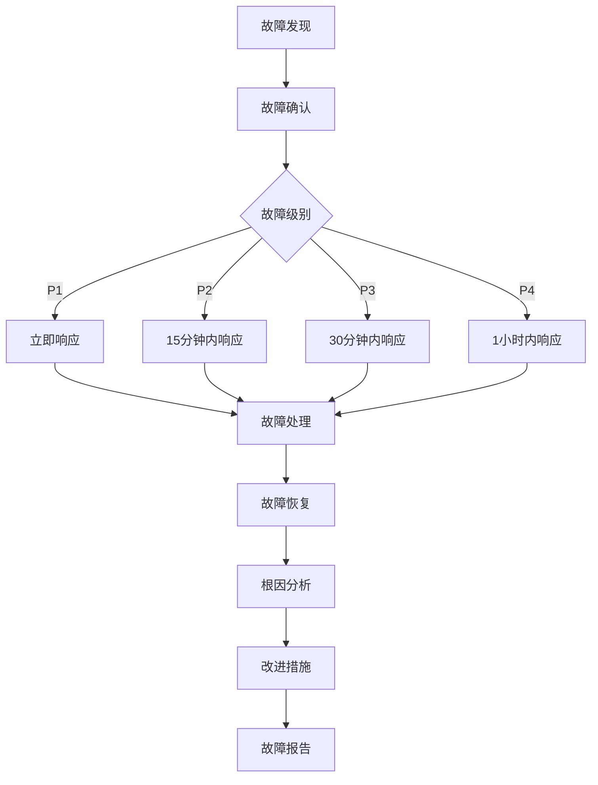

# 金融售前方案辅助编写系统 - 运维手册

## 文档信息

| 项目 | 内容 |
|------|------|
| 文档名称 | 运维手册 |
| 产品名称 | 金融售前方案辅助编写系统 |
| 版本 | v1.2.0 |
| 发布日期 | 2025-01-08 |
| 作者 | 运维团队 |
| 状态 | 正式发布 |
| 目标读者 | 运维工程师、系统管理员、DevOps工程师 |

## 版本历史

| 版本 | 日期 | 修改人 | 修改内容 |
|------|------|--------|----------|
| v1.0.0 | 2024-12-01 | 运维团队 | 初始版本创建 |
| v1.1.0 | 2024-12-15 | 运维团队 | 增加自动化运维内容 |
| v1.2.0 | 2025-01-08 | 运维团队 | 完善监控告警体系 |

## 1. 运维概述

### 1.1 运维目标

金融售前方案辅助编写系统的运维目标是确保系统：**高可用、高性能、高安全、低成本**运行。

#### 1.1.1 运维指标
| 指标类别 | 指标名称 | 目标值 | 监控频率 |
|----------|----------|--------|----------|
| 可用性 | 系统可用率 | ≥99.9% | 实时监控 |
| 性能 | API响应时间 | <500ms (P95) | 实时监控 |
| 性能 | 页面加载时间 | <2s | 实时监控 |
| 容量 | CPU使用率 | <80% | 实时监控 |
| 容量 | 内存使用率 | <85% | 实时监控 |
| 容量 | 磁盘使用率 | <90% | 实时监控 |
| 安全 | 安全事件数量 | 0/月 | 实时监控 |
| 成本 | 资源利用率 | >60% | 日报 |

### 1.2 运维架构

```
┌─────────────────────────────────────────────────────────────┐
│                    运维管理平台                             │
├─────────────────────────────────────────────────────────────┤
│  监控告警  │  日志管理  │  性能分析  │  自动化运维  │  安全管理  │
│  Grafana   │  ELK Stack │  APM工具   │  Ansible     │  安全扫描  │
│  Prometheus│  Loki      │  Jaeger    │  Terraform   │  漏洞管理  │
└─────────────────────┬───────────────────────────────────────┘
                      │
┌─────────────────────▼───────────────────────────────────────┐
│                    统一运维接口                             │
│  ┌─────────────┐ ┌─────────────┐ ┌─────────────┐         │
│  │   API网关   │ │  配置中心   │ │  服务注册   │         │
│  │  (Kong)     │ │ (Consul)    │ │ (Consul)    │         │
│  └─────────────┘ └─────────────┘ └─────────────┘         │
└─────────────────────┬───────────────────────────────────────┘
                      │
┌─────────────────────▼───────────────────────────────────────┐
│                    基础设施层                               │
│  ┌─────────────┐ ┌─────────────┐ ┌─────────────┐         │
│  │  计算资源   │ │  存储资源   │ │  网络资源   │         │
│  │ (K8s集群)   │ │ (分布式存储)│ │ (负载均衡)  │         │
│  └─────────────┘ └─────────────┘ └─────────────┘         │
└─────────────────────────────────────────────────────────────┘
```

## 2. 日常运维

### 2.1 每日运维任务

#### 2.1.1 晨检清单（09:00）
```bash
#!/bin/bash
# daily_morning_check.sh

echo "=== 晨检开始 $(date) ==="

# 1. 系统状态检查
echo "1. 检查系统状态..."
docker-compose ps
kubectl get pods -n fin-pre-assist

# 2. 资源使用情况
echo "2. 检查资源使用..."
df -h
docker system df
kubectl top nodes
kubectl top pods -n fin-pre-assist

# 3. 服务健康检查
echo "3. 服务健康检查..."
curl -f http://localhost/health || echo "⚠️  服务异常"
curl -f http://localhost:8000/health/db || echo "⚠️  数据库异常"
curl -f http://localhost:8000/health/cache || echo "⚠️  缓存异常"

# 4. 日志检查
echo "4. 检查错误日志..."
docker-compose logs --tail=100 backend | grep -i error | tail -10

# 5. 备份状态检查
echo "5. 检查备份状态..."
ls -la /backup/fin-pre-assist/ | head -5

# 6. 证书有效期检查
echo "6. 检查SSL证书..."
openssl x509 -in /etc/ssl/certs/cert.pem -noout -dates | grep "not after"

echo "=== 晨检完成 $(date) ==="
```

#### 2.1.2 日常监控指标
| 指标类别 | 监控项目 | 正常范围 | 告警阈值 | 检查频率 |
|----------|----------|----------|----------|----------|
| 系统资源 | CPU使用率 | 0-70% | >80% | 5分钟 |
| 系统资源 | 内存使用率 | 0-80% | >90% | 5分钟 |
| 系统资源 | 磁盘使用率 | 0-85% | >90% | 5分钟 |
| 网络 | 网络延迟 | <10ms | >50ms | 5分钟 |
| 网络 | 网络丢包率 | 0% | >1% | 5分钟 |
| 应用 | 响应时间 | <500ms | >2000ms | 1分钟 |
| 应用 | 错误率 | <1% | >5% | 1分钟 |
| 数据库 | 连接数 | 0-150 | >180 | 1分钟 |
| 数据库 | 慢查询数 | 0-5/min | >20/min | 1分钟 |
| 缓存 | 命中率 | >95% | <90% | 1分钟 |

### 2.2 每周运维任务

#### 2.2.1 性能分析
```bash
#!/bin/bash
# weekly_performance_analysis.sh

echo "=== 周性能分析 $(date) ==="

# 1. 生成性能报告
echo "1. 生成性能报告..."
# CPU使用率分析
sar -u -f /var/log/sysstat/sa$(date -d '7 days ago' +%d) > /tmp/cpu_report.txt
# 内存使用分析
sar -r -f /var/log/sysstat/sa$(date -d '7 days ago' +%d) > /tmp/memory_report.txt
# 磁盘I/O分析
sar -d -f /var/log/sysstat/sa$(date -d '7 days ago' +%d) > /tmp/disk_report.txt

# 2. 数据库性能分析
echo "2. 数据库性能分析..."
docker exec fin-pre-assist-postgres-1 psql -U finpreassist -d fin_pre_assist -c "
SELECT
    query,
    calls,
    total_time,
    mean_time,
    rows
FROM pg_stat_statements
ORDER BY total_time DESC
LIMIT 10;" > /tmp/db_performance.txt

# 3. 应用性能分析
echo "3. 应用性能分析..."
# 分析Nginx访问日志
grep -c " 200 " /var/log/nginx/access.log | tail -7 > /tmp/http_200_count.txt
grep -c " 5[0-9][0-9] " /var/log/nginx/access.log | tail -7 > /tmp/http_5xx_count.txt

# 4. 生成报告
echo "4. 生成周报告..."
cat > /tmp/weekly_report.md <<EOF
# 周性能报告 $(date +%Y-%m-%d)

## 系统资源
$(cat /tmp/cpu_report.txt | tail -n 10)

## 数据库性能
$(cat /tmp/db_performance.txt)

## HTTP状态码统计
200 OK: $(cat /tmp/http_200_count.txt | tail -1)
5xx Error: $(cat /tmp/http_5xx_count.txt | tail -1)

EOF

echo "=== 周性能分析完成 ==="
```

#### 2.2.2 安全检查
```bash
#!/bin/bash
# weekly_security_check.sh

echo "=== 周安全检查 $(date) ==="

# 1. 系统更新检查
echo "1. 检查系统更新..."
apt list --upgradable 2> /dev/null | wc -l

# 2. 安全日志分析
echo "2. 分析安全日志..."
# SSH登录失败
grep "Failed password" /var/log/auth.log | tail -20 > /tmp/ssh_failures.txt
# 异常网络连接
netstat -tuln | grep -v "127.0.0.1" > /tmp/network_connections.txt

# 3. 证书有效期检查
echo "3. 检查证书有效期..."
openssl x509 -in /etc/ssl/certs/cert.pem -noout -dates > /tmp/cert_dates.txt

# 4. 用户权限检查
echo "4. 检查用户权限..."
cat /etc/passwd | grep -v "nologin" > /tmp/active_users.txt

# 5. 文件权限检查
echo "5. 检查关键文件权限..."
ls -la /etc/ssh/sshd_config > /tmp/ssh_permissions.txt
ls -la /var/log > /tmp/log_permissions.txt

echo "=== 周安全检查完成 ==="
```

### 2.3 每月运维任务

#### 2.3.1 容量规划
```bash
#!/bin/bash
# monthly_capacity_planning.sh

echo "=== 月度容量规划 $(date) ==="

# 1. 资源使用趋势分析
echo "1. 资源使用趋势分析..."
# CPU使用趋势
sar -u -f /var/log/sysstat/sa$(date -d '1 month ago' +%d) | grep "Average" > /tmp/cpu_trend.txt
# 内存使用趋势
sar -r -f /var/log/sysstat/sa$(date -d '1 month ago' +%d) | grep "Average" > /tmp/memory_trend.txt

# 2. 存储容量分析
echo "2. 存储容量分析..."
df -h | grep -E "(Filesystem|/dev/)" > /tmp/disk_usage.txt

# 3. 预测分析
echo "3. 容量预测..."
# 基于历史数据预测未来3个月的需求
echo "基于当前增长趋势，预测3个月后：" > /tmp/capacity_forecast.txt
echo "- CPU需求: $(calculate_cpu_forecast)" >> /tmp/capacity_forecast.txt
echo "- 内存需求: $(calculate_memory_forecast)" >> /tmp/capacity_forecast.txt
echo "- 存储需求: $(calculate_storage_forecast)" >> /tmp/capacity_forecast.txt

# 4. 生成报告
cat > /tmp/monthly_capacity_report.md <<EOF
# 月度容量规划报告 $(date +%Y-%m)

## 当前资源使用
$(cat /tmp/cpu_trend.txt)
$(cat /tmp/memory_trend.txt)
$(cat /tmp/disk_usage.txt)

## 容量预测
$(cat /tmp/capacity_forecast.txt)

## 建议措施
- 监控CPU使用率，如持续超过75%，考虑升级
- 监控内存使用率，如持续超过80%，考虑扩容
- 监控磁盘使用率，如超过85%，考虑清理或扩容

EOF

echo "=== 月度容量规划完成 ==="
```

#### 2.3.2 备份验证
```bash
#!/bin/bash
# monthly_backup_validation.sh

echo "=== 月度备份验证 $(date) ==="

# 1. 备份完整性检查
echo "1. 检查备份完整性..."
for backup_file in /backup/fin-pre-assist/*.sql.gz; do
    if [ -f "$backup_file" ]; then
        echo "Checking $backup_file..."
        gunzip -t "$backup_file" 2> /dev/null && echo "✓ $backup_file is valid" || echo "✗ $backup_file is corrupted"
    fi
done

# 2. 备份恢复测试
echo "2. 备份恢复测试..."
# 创建测试数据库
docker exec fin-pre-assist-postgres-1 createdb -U finpreassist test_restore 2> /dev/null || true

# 恢复最新的备份
LATEST_BACKUP=$(ls -t /backup/fin-pre-assist/*.sql.gz | head -1)
if [ -n "$LATEST_BACKUP" ]; then
    echo "Restoring $LATEST_BACKUP to test database..."
    gunzip -c "$LATEST_BACKUP" | docker exec -i fin-pre-assist-postgres-1 psql -U finpreassist -d test_restore

    # 验证数据
    TABLE_COUNT=$(docker exec fin-pre-assist-postgres-1 psql -U finpreassist -d test_restore -t -c "SELECT count(*) FROM information_schema.tables WHERE table_schema = 'public';")
    echo "Restored $TABLE_COUNT tables successfully"

    # 清理测试数据库
    docker exec fin-pre-assist-postgres-1 dropdb -U finpreassist test_restore
fi

# 3. 备份策略评估
echo "3. 评估备份策略..."
BACKUP_COUNT=$(ls /backup/fin-pre-assist/*.sql.gz | wc -l)
OLDEST_BACKUP=$(ls -t /backup/fin-pre-assist/*.sql.gz | tail -1)
NEWEST_BACKUP=$(ls -t /backup/fin-pre-assist/*.sql.gz | head -1)

echo "Total backups: $BACKUP_COUNT"
echo "Oldest backup: $(basename "$OLDEST_BACKUP")"
echo "Newest backup: $(basename "$NEWEST_BACKUP")"

echo "=== 月度备份验证完成 ==="
```

## 3. 监控告警

### 3.1 监控系统架构

#### 3.1.1 Prometheus + Grafana监控栈
```yaml
# docker-compose.monitoring.yml
version: '3.8'

services:
  prometheus:
    image: prom/prometheus:v2.40.0
    container_name: prometheus
    ports:
      - "9090:9090"
    volumes:
      - ./prometheus/prometheus.yml:/etc/prometheus/prometheus.yml
      - ./prometheus/rules:/etc/prometheus/rules
      - prometheus_data:/prometheus
    command:
      - '--config.file=/etc/prometheus/prometheus.yml'
      - '--storage.tsdb.path=/prometheus'
      - '--web.console.libraries=/etc/prometheus/console_libraries'
      - '--web.console.templates=/etc/prometheus/consoles'
      - '--storage.tsdb.retention.time=30d'
      - '--web.enable-lifecycle'
    networks:
      - monitoring

  grafana:
    image: grafana/grafana:9.3.0
    container_name: grafana
    ports:
      - "3000:3000"
    environment:
      - GF_SECURITY_ADMIN_PASSWORD=admin123
      - GF_USERS_ALLOW_SIGN_UP=false
    volumes:
      - grafana_data:/var/lib/grafana
      - ./grafana/dashboards:/etc/grafana/provisioning/dashboards
      - ./grafana/datasources:/etc/grafana/provisioning/datasources
    networks:
      - monitoring

  alertmanager:
    image: prom/alertmanager:v0.24.0
    container_name: alertmanager
    ports:
      - "9093:9093"
    volumes:
      - ./alertmanager/alertmanager.yml:/etc/alertmanager/alertmanager.yml
      - alertmanager_data:/alertmanager
    networks:
      - monitoring

  node-exporter:
    image: prom/node-exporter:v1.5.0
    container_name: node-exporter
    ports:
      - "9100:9100"
    volumes:
      - /proc:/host/proc:ro
      - /sys:/host/sys:ro
      - /:/rootfs:ro
    command:
      - '--path.procfs=/host/proc'
      - '--path.rootfs=/rootfs'
      - '--path.sysfs=/host/sys'
      - '--collector.filesystem.mount-points-exclude=^/(sys|proc|dev|host|etc)($$|/)'
    networks:
      - monitoring

volumes:
  prometheus_data:
  grafana_data:
  alertmanager_data:

networks:
  monitoring:
    driver: bridge
```

#### 3.1.2 监控指标配置
```yaml
# prometheus/prometheus.yml
global:
  scrape_interval: 15s
  evaluation_interval: 15s

rule_files:
  - "rules/*.yml"

alerting:
  alertmanagers:
    - static_configs:
        - targets:
          - alertmanager:9093

scrape_configs:
  # 应用监控
  - job_name: 'fin-pre-assist-backend'
    static_configs:
      - targets: ['backend:8000']
    metrics_path: '/metrics'
    scrape_interval: 30s
    scrape_timeout: 10s

  # 数据库监控
  - job_name: 'postgres-exporter'
    static_configs:
      - targets: ['postgres-exporter:9187']
    scrape_interval: 30s

  # Redis监控
  - job_name: 'redis-exporter'
    static_configs:
      - targets: ['redis-exporter:9121']
    scrape_interval: 30s

  # Elasticsearch监控
  - job_name: 'elasticsearch-exporter'
    static_configs:
      - targets: ['elasticsearch-exporter:9114']
    scrape_interval: 30s

  # 系统监控
  - job_name: 'node-exporter'
    static_configs:
      - targets: ['node-exporter:9100']
    scrape_interval: 30s

  # 容器监控
  - job_name: 'cadvisor'
    static_configs:
      - targets: ['cadvisor:8080']
    scrape_interval: 30s
```

#### 3.1.3 告警规则配置
```yaml
# prometheus/rules/fin-pre-assist.yml
groups:
- name: fin-pre-assist-alerts
  rules:
  # 高CPU使用率告警
  - alert: HighCPUUsage
    expr: 100 - (avg by (instance) (irate(node_cpu_seconds_total{mode="idle"}[5m])) * 100) > 80
    for: 5m
    labels:
      severity: warning
      team: ops
    annotations:
      summary: "High CPU usage detected"
      description: "CPU usage is above 80% on {{ $labels.instance }} for more than 5 minutes"

  # 高内存使用率告警
  - alert: HighMemoryUsage
    expr: (1 - (node_memory_MemAvailable_bytes / node_memory_MemTotal_bytes)) * 100 > 85
    for: 5m
    labels:
      severity: warning
      team: ops
    annotations:
      summary: "High memory usage detected"
      description: "Memory usage is above 85% on {{ $labels.instance }} for more than 5 minutes"

  # 磁盘空间告警
  - alert: LowDiskSpace
    expr: (node_filesystem_avail_bytes{mountpoint="/"} / node_filesystem_size_bytes{mountpoint="/"}) * 100 < 10
    for: 5m
    labels:
      severity: critical
      team: ops
    annotations:
      summary: "Low disk space"
      description: "Disk space is below 10% on {{ $labels.instance }}"

  # 应用响应时间告警
  - alert: HighResponseTime
    expr: histogram_quantile(0.95, rate(http_request_duration_seconds_bucket[5m])) > 2
    for: 5m
    labels:
      severity: warning
      team: dev
    annotations:
      summary: "High response time"
      description: "95th percentile response time is above 2 seconds"

  # 错误率告警
  - alert: HighErrorRate
    expr: rate(http_requests_total{status=~"5.."}[5m]) / rate(http_requests_total[5m]) > 0.05
    for: 5m
    labels:
      severity: critical
      team: dev
    annotations:
      summary: "High error rate"
      description: "Error rate is above 5% for more than 5 minutes"

  # 数据库连接告警
  - alert: HighDBConnections
    expr: pg_stat_activity_count > 150
    for: 2m
    labels:
      severity: warning
      team: dba
    annotations:
      summary: "High database connections"
      description: "Database has more than 150 active connections"

  # 数据库慢查询告警
  - alert: SlowDatabaseQueries
    expr: increase(pg_stat_statements_total_time[5m]) > 10000
    for: 5m
    labels:
      severity: warning
      team: dba
    annotations:
      summary: "Slow database queries detected"
      description: "Database queries are taking too long"

  # Redis内存告警
  - alert: RedisHighMemoryUsage
    expr: redis_memory_used_bytes / redis_memory_max_bytes * 100 > 90
    for: 5m
    labels:
      severity: warning
      team: ops
    annotations:
      summary: "Redis high memory usage"
      description: "Redis memory usage is above 90%"

  # 服务不可用告警
  - alert: ServiceDown
    expr: up == 0
    for: 1m
    labels:
      severity: critical
      team: ops
    annotations:
      summary: "Service is down"
      description: "{{ $labels.job }} service is down on {{ $labels.instance }}"
```

### 3.2 日志管理

#### 3.2.1 ELK Stack配置
```yaml
# docker-compose.logging.yml
version: '3.8'

services:
  elasticsearch:
    image: docker.elastic.co/elasticsearch/elasticsearch:8.5.0
    container_name: elasticsearch
    environment:
      - node.name=elasticsearch
      - cluster.name=fin-pre-assist-logs
      - discovery.type=single-node
      - "ES_JAVA_OPTS=-Xms512m -Xmx512m"
      - xpack.security.enabled=false
    volumes:
      - elasticsearch_logs_data:/usr/share/elasticsearch/data
    ports:
      - "9201:9200"
    networks:
      - logging

  logstash:
    image: docker.elastic.co/logstash/logstash:8.5.0
    container_name: logstash
    volumes:
      - ./logstash/pipeline:/usr/share/logstash/pipeline
      - ./logstash/config:/usr/share/logstash/config
    ports:
      - "5044:5044"
    environment:
      LS_JAVA_OPTS: "-Xmx256m -Xms256m"
    depends_on:
      - elasticsearch
    networks:
      - logging

  kibana:
    image: docker.elastic.co/kibana/kibana:8.5.0
    container_name: kibana
    ports:
      - "5602:5601"
    environment:
      ELASTICSEARCH_HOSTS: http://elasticsearch:9200
    depends_on:
      - elasticsearch
    networks:
      - logging

  filebeat:
    image: docker.elastic.co/beats/filebeat:8.5.0
    container_name: filebeat
    user: root
    volumes:
      - ./filebeat/filebeat.yml:/usr/share/filebeat/filebeat.yml
      - /var/lib/docker/containers:/var/lib/docker/containers:ro
      - /var/run/docker.sock:/var/run/docker.sock:ro
      - /var/log:/var/log:ro
    depends_on:
      - logstash
    networks:
      - logging

volumes:
  elasticsearch_logs_data:

networks:
  logging:
    driver: bridge
```

#### 3.2.2 Logstash配置
```ruby
# logstash/pipeline/logstash.conf
input {
  beats {
    port => 5044
  }
}

filter {
  if [fields][service] == "fin-pre-assist-backend" {
    grok {
      match => { "message" => "%{TIMESTAMP_ISO8601:timestamp} %{LOGLEVEL:level} %{GREEDYDATA:message}" }
    }

    date {
      match => [ "timestamp", "ISO8601" ]
    }

    if [level] == "ERROR" {
      mutate {
        add_tag => [ "error", "alert" ]
      }
    }
  }

  # 解析JSON格式日志
  if [message] =~ /^\{/ {
    json {
      source => "message"
      target => "json"
    }
  }
}

output {
  elasticsearch {
    hosts => ["elasticsearch:9200"]
    index => "fin-pre-assist-logs-%{+YYYY.MM.dd}"
  }

  # 错误日志发送到告警系统
  if "alert" in [tags] {
    http {
      url => "http://alertmanager:9093/api/v1/alerts"
      http_method => "post"
      format => "json"
      mapping => {
        "labels" => {
          "alertname" => "ApplicationError"
          "severity" => "warning"
          "service" => "%{[fields][service]}"
        }
        "annotations" => {
          "summary" => "Application error detected"
          "description" => "%{message}"
        }
      }
    }
  }
}
```

#### 3.2.3 Filebeat配置
```yaml
# filebeat/filebeat.yml
filebeat.inputs:
- type: container
  paths:
    - '/var/lib/docker/containers/*/*.log'
  processors:
    - add_docker_metadata:
        host: "unix:///var/run/docker.sock"
    - decode_json_fields:
        fields: ["message"]
        target: "json"
        overwrite_keys: true

- type: log
  paths:
    - /var/log/nginx/access.log
  fields:
    service: nginx
  fields_under_root: true

- type: log
  paths:
    - /var/log/nginx/error.log
  fields:
    service: nginx-error
  fields_under_root: true

output.logstash:
  hosts: ["logstash:5044"]

processors:
  - add_host_metadata:
      when.not.contains.tags: forwarded
  - add_cloud_metadata: ~
  - add_docker_metadata: ~

logging.level: info
logging.to_files: true
logging.files:
  path: /var/log/filebeat
  name: filebeat
  keepfiles: 7
  permissions: 0644
```

### 3.3 性能监控

#### 3.3.1 APM配置
```python
# 应用性能监控配置
# app/core/monitoring.py

from prometheus_client import Counter, Histogram, Gauge, generate_latest
import time
from functools import wraps

# 定义监控指标
REQUEST_COUNT = Counter(
    'http_requests_total',
    'Total HTTP requests',
    ['method', 'endpoint', 'status']
)

REQUEST_DURATION = Histogram(
    'http_request_duration_seconds',
    'HTTP request duration in seconds',
    ['method', 'endpoint']
)

ACTIVE_CONNECTIONS = Gauge(
    'active_connections',
    'Number of active connections'
)

DB_CONNECTIONS = Gauge(
    'database_connections',
    'Number of database connections',
    ['state']
)

CACHE_HIT_RATE = Gauge(
    'cache_hit_rate',
    'Cache hit rate percentage'
)

def monitor_performance(func):
    """性能监控装饰器"""
    @wraps(func)
    async def wrapper(*args, **kwargs):
        start_time = time.time()

        try:
            result = await func(*args, **kwargs)
            status = "success"
            return result
        except Exception as e:
            status = "error"
            raise e
        finally:
            duration = time.time() - start_time

            # 记录请求指标
            REQUEST_DURATION.labels(
                method=kwargs.get('method', 'unknown'),
                endpoint=kwargs.get('endpoint', 'unknown')
            ).observe(duration)

            REQUEST_COUNT.labels(
                method=kwargs.get('method', 'unknown'),
                endpoint=kwargs.get('endpoint', 'unknown'),
                status=status
            ).inc()

    return wrapper

class PerformanceMonitor:
    """性能监控器"""

    def __init__(self):
        self.metrics = {}
        self.start_time = time.time()

    def record_metric(self, name: str, value: float, labels: dict = None):
        """记录性能指标"""
        if name not in self.metrics:
            self.metrics[name] = []

        self.metrics[name].append({
            'value': value,
            'timestamp': time.time(),
            'labels': labels or {}
        })

    def get_stats(self, name: str):
        """获取统计信息"""
        if name not in self.metrics:
            return None

        values = [m['value'] for m in self.metrics[name]]
        return {
            'count': len(values),
            'avg': sum(values) / len(values),
            'min': min(values),
            'max': max(values),
            'p95': sorted(values)[int(len(values) * 0.95)],
            'p99': sorted(values)[int(len(values) * 0.99)]
        }
```

#### 3.3.2 分布式追踪
```python
# 分布式追踪配置
# app/core/tracing.py

from opentelemetry import trace
from opentelemetry.exporter.jaeger.thrift import JaegerExporter
from opentelemetry.sdk.resources import SERVICE_NAME, Resource
from opentelemetry.sdk.trace import TracerProvider
from opentelemetry.sdk.trace.export import BatchSpanProcessor
from opentelemetry.instrumentation.fastapi import FastAPIInstrumentor
from opentelemetry.instrumentation.sqlalchemy import SQLAlchemyInstrumentor
from opentelemetry.instrumentation.redis import RedisInstrumentor

def setup_tracing(app_name: str, jaeger_endpoint: str):
    """设置分布式追踪"""

    # 创建资源
    resource = Resource.create({SERVICE_NAME: app_name})

    # 创建TracerProvider
    provider = TracerProvider(resource=resource)
    trace.set_tracer_provider(provider)

    # 创建Jaeger导出器
    jaeger_exporter = JaegerExporter(
        collector_endpoint=jaeger_endpoint,
    )

    # 创建SpanProcessor
    span_processor = BatchSpanProcessor(jaeger_exporter)
    provider.add_span_processor(span_processor)

    # 获取追踪器
    tracer = trace.get_tracer(__name__)

    return tracer

def instrument_app(app):
    """为FastAPI应用添加追踪"""
    FastAPIInstrumentor.instrument_app(app)

def instrument_sqlalchemy(engine):
    """为SQLAlchemy添加追踪"""
    SQLAlchemyInstrumentor().instrument(engine=engine)

def instrument_redis(client):
    """为Redis添加追踪"""
    RedisInstrumentor().instrument(client)

# 使用示例
tracer = setup_tracing(
    app_name="fin-pre-assist-backend",
    jaeger_endpoint="http://jaeger:14268/api/traces"
)

@tracer.start_as_current_span("document_creation")
async def create_document(document_data: dict):
    """创建文档（带追踪）"""
    with tracer.start_as_current_span("validate_input") as span:
        # 验证输入
        span.set_attribute("document.title", document_data.get("title"))

    with tracer.start_as_current_span("database_insert") as span:
        # 数据库插入
        result = await db.documents.insert_one(document_data)
        span.set_attribute("document.id", str(result.inserted_id))

    return result
```

## 4. 自动化运维

### 4.1 Ansible自动化

#### 4.1.1 主机清单配置
```ini
# inventory/hosts.ini
[webservers]
web1 ansible_host=10.0.1.10 ansible_user=ubuntu
web2 ansible_host=10.0.1.11 ansible_user=ubuntu

[dbservers]
db1 ansible_host=10.0.1.20 ansible_user=ubuntu

[monitoring]
monitor ansible_host=10.0.1.30 ansible_user=ubuntu

[all:vars]
ansible_python_interpreter=/usr/bin/python3
```

#### 4.1.2 部署剧本
```yaml
# playbooks/deploy-app.yml
---
- name: Deploy Fin Pre Assist Application
  hosts: webservers
  become: yes

  vars:
    app_version: "v1.2.0"
    app_user: finpreassist
    app_dir: /opt/fin-pre-assist

  tasks:
    - name: Create application user
      user:
        name: "{{ app_user }}"
        system: yes
        shell: /bin/bash
        home: "{{ app_dir }}"

    - name: Install system dependencies
      apt:
        name:
          - python3-pip
          - python3-venv
          - nginx
          - supervisor
        state: present
        update_cache: yes

    - name: Create application directory
      file:
        path: "{{ app_dir }}"
        state: directory
        owner: "{{ app_user }}"
        group: "{{ app_user }}"
        mode: '0755'

    - name: Clone application repository
      git:
        repo: https://github.com/your-org/fin-pre-assist.git
        dest: "{{ app_dir }}/app"
        version: "{{ app_version }}"
      become_user: "{{ app_user }}"

    - name: Create Python virtual environment
      pip:
        virtualenv: "{{ app_dir }}/venv"
        requirements: "{{ app_dir }}/app/requirements.txt"
      become_user: "{{ app_user }}"

    - name: Configure Nginx
      template:
        src: templates/nginx.conf.j2
        dest: /etc/nginx/sites-available/fin-pre-assist
      notify: restart nginx

    - name: Enable Nginx site
      file:
        src: /etc/nginx/sites-available/fin-pre-assist
        dest: /etc/nginx/sites-enabled/fin-pre-assist
        state: link
      notify: restart nginx

    - name: Create Supervisor configuration
      template:
        src: templates/supervisor.conf.j2
        dest: /etc/supervisor/conf.d/fin-pre-assist.conf
      notify: restart supervisor

    - name: Start application with Supervisor
      supervisorctl:
        name: fin-pre-assist
        state: started

  handlers:
    - name: restart nginx
      service:
        name: nginx
        state: restarted

    - name: restart supervisor
      service:
        name: supervisor
        state: restarted
```

#### 4.1.3 监控部署剧本
```yaml
# playbooks/deploy-monitoring.yml
---
- name: Deploy Monitoring Stack
  hosts: monitoring
  become: yes

  tasks:
    - name: Install Docker
      apt:
        name: docker.io
        state: present

    - name: Install Docker Compose
      get_url:
        url: https://github.com/docker/compose/releases/latest/download/docker-compose-Linux-x86_64
        dest: /usr/local/bin/docker-compose
        mode: '0755'

    - name: Create monitoring directory
      file:
        path: /opt/monitoring
        state: directory

    - name: Copy monitoring configuration
      copy:
        src: "{{ item }}"
        dest: /opt/monitoring/
      with_fileglob:
        - "monitoring/*"

    - name: Start monitoring services
      docker_compose:
        project_src: /opt/monitoring
        state: present

    - name: Configure Grafana dashboards
      uri:
        url: "http://localhost:3000/api/dashboards/db"
        method: POST
        user: admin
        password: admin123
        body_format: json
        body: "{{ lookup('file', 'dashboards/fin-pre-assist-overview.json') }}"
        headers:
          Content-Type: application/json
```

### 4.2 Terraform基础设施管理

#### 4.2.1 云基础设施配置
```hcl
# terraform/main.tf
terraform {
  required_version = ">= 1.0"
  required_providers {
    aws = {
      source  = "hashicorp/aws"
      version = "~> 4.0"
    }
  }
}

provider "aws" {
  region = var.aws_region
}

# VPC配置
resource "aws_vpc" "main" {
  cidr_block           = var.vpc_cidr
  enable_dns_hostnames = true
  enable_dns_support   = true

  tags = {
    Name        = "fin-pre-assist-vpc"
    Environment = var.environment
  }
}

# 子网配置
resource "aws_subnet" "public" {
  count             = length(var.availability_zones)
  vpc_id            = aws_vpc.main.id
  cidr_block        = cidrsubnet(var.vpc_cidr, 8, count.index)
  availability_zone = var.availability_zones[count.index]

  map_public_ip_on_launch = true

  tags = {
    Name        = "fin-pre-assist-public-${count.index + 1}"
    Environment = var.environment
  }
}

# 安全组配置
resource "aws_security_group" "app" {
  name        = "fin-pre-assist-app-sg"
  description = "Security group for Fin Pre Assist application"
  vpc_id      = aws_vpc.main.id

  ingress {
    from_port   = 80
    to_port     = 80
    protocol    = "tcp"
    cidr_blocks = ["0.0.0.0/0"]
  }

  ingress {
    from_port   = 443
    to_port     = 443
    protocol    = "tcp"
    cidr_blocks = ["0.0.0.0/0"]
  }

  egress {
    from_port   = 0
    to_port     = 0
    protocol    = "-1"
    cidr_blocks = ["0.0.0.0/0"]
  }

  tags = {
    Name        = "fin-pre-assist-app-sg"
    Environment = var.environment
  }
}

# RDS数据库配置
resource "aws_db_instance" "main" {
  identifier     = "fin-pre-assist-db"
  engine         = "postgres"
  engine_version = "14.7"
  instance_class = var.db_instance_class

  allocated_storage     = 100
  max_allocated_storage = 1000
  storage_type          = "gp2"
  storage_encrypted     = true

  db_name  = var.db_name
  username = var.db_username
  password = var.db_password

  vpc_security_group_ids = [aws_security_group.db.id]
  db_subnet_group_name   = aws_db_subnet_group.main.name

  backup_retention_period = 7
  backup_window          = "03:00-04:00"
  maintenance_window     = "sun:04:00-sun:05:00"

  skip_final_snapshot = true
  deletion_protection = false

  tags = {
    Name        = "fin-pre-assist-db"
    Environment = var.environment
  }
}

# ElastiCache Redis配置
resource "aws_elasticache_subnet_group" "main" {
  name       = "fin-pre-assist-cache"
  subnet_ids = aws_subnet.private[*].id
}

resource "aws_elasticache_replication_group" "main" {
  replication_group_id       = "fin-pre-assist-cache"
  replication_group_description = "Redis cluster for Fin Pre Assist"

  node_type            = var.redis_node_type
  port                 = 6379
  parameter_group_name = "default.redis7"

  num_cache_clusters = 2

  subnet_group_name  = aws_elasticache_subnet_group.main.name
  security_group_ids = [aws_security_group.cache.id]

  at_rest_encryption_enabled = true
  transit_encryption_enabled = true

  tags = {
    Name        = "fin-pre-assist-cache"
    Environment = var.environment
  }
}
```

#### 4.2.2 EKS集群配置
```hcl
# terraform/eks.tf

# EKS集群
resource "aws_eks_cluster" "main" {
  name     = "fin-pre-assist-cluster"
  role_arn = aws_iam_role.eks_cluster.arn

  vpc_config {
    subnet_ids              = aws_subnet.private[*].id
    endpoint_private_access = true
    endpoint_public_access  = true
    public_access_cidrs     = ["0.0.0.0/0"]
  }

  encryption_config {
    provider {
      key_arn = aws_kms_key.eks.arn
    }
    resources = ["secrets"]
  }

  enabled_cluster_log_types = ["api", "audit", "authenticator", "controllerManager", "scheduler"]

  tags = {
    Name        = "fin-pre-assist-cluster"
    Environment = var.environment
  }
}

# EKS节点组
resource "aws_eks_node_group" "main" {
  cluster_name    = aws_eks_cluster.main.name
  node_group_name = "main"
  node_role_arn   = aws_iam_role.eks_node_group.arn
  subnet_ids      = aws_subnet.private[*].id

  scaling_config {
    desired_size = 3
    max_size     = 10
    min_size     = 1
  }

  instance_types = ["t3.medium"]

  remote_access {
    ec2_ssh_key = var.ssh_key_name
    source_security_group_ids = [aws_security_group.eks_nodes.id]
  }

  tags = {
    Name        = "fin-pre-assist-node-group"
    Environment = var.environment
  }
}
```

## 5. 故障处理

### 5.1 故障分类与响应

#### 5.1.1 故障级别定义
| 级别 | 定义 | 响应时间 | 解决时间 | 通知方式 |
|------|------|----------|----------|----------|
| P1-紧急 | 系统完全不可用 | 5分钟 | 2小时 | 电话+短信+邮件 |
| P2-高 | 核心功能受影响 | 15分钟 | 4小时 | 短信+邮件 |
| P3-中 | 非核心功能受影响 | 30分钟 | 1天 | 邮件 |
| P4-低 | 一般性问题 | 1小时 | 1周 | 工单系统 |

#### 5.1.2 故障响应流程


### 5.2 常见故障处理

#### 5.2.1 数据库连接失败
```bash
#!/bin/bash
# troubleshoot/database_connection.sh

echo "=== 数据库连接故障排查 $(date) ==="

# 1. 检查数据库服务状态
echo "1. 检查PostgreSQL服务状态..."
sudo systemctl status postgresql
docker exec fin-pre-assist-postgres-1 pg_isready -U finpreassist

# 2. 检查网络连接
echo "2. 检查网络连接..."
telnet postgres_host 5432
nc -zv postgres_host 5432

# 3. 检查数据库连接数
echo "3. 检查数据库连接数..."
docker exec fin-pre-assist-postgres-1 psql -U finpreassist -d fin_pre_assist -c "
SELECT count(*) as active_connections
FROM pg_stat_activity
WHERE state = 'active';"

# 4. 检查数据库日志
echo "4. 检查数据库错误日志..."
docker logs fin-pre-assist-postgres-1 --tail 50 | grep -i error

# 5. 测试连接
echo "5. 测试数据库连接..."
docker exec fin-pre-assist-backend-1 python -c "
import psycopg2
try:
    conn = psycopg2.connect(
        host='postgres',
        database='fin_pre_assist',
        user='finpreassist',
        password='your_password'
    )
    print('✓ Database connection successful')
    conn.close()
except Exception as e:
    print(f'✗ Database connection failed: {e}')
"

echo "=== 数据库连接故障排查完成 ==="
```

#### 5.2.2 高CPU使用率处理
```bash
#!/bin/bash
# troubleshoot/high_cpu_usage.sh

echo "=== 高CPU使用率处理 $(date) ==="

# 1. 查找高CPU进程
echo "1. 查找高CPU进程..."
top -bn1 | head -20

# 2. 检查Docker容器CPU使用
echo "2. 检查Docker容器CPU使用..."
docker stats --no-stream --format "table {{.Container}}\t{{.CPUPerc}}\t{{.Name}}"

# 3. 检查Kubernetes Pod CPU使用
echo "3. 检查Kubernetes Pod CPU使用..."
kubectl top pods -n fin-pre-assist --sort-by=cpu

# 4. 分析慢查询
echo "4. 分析数据库慢查询..."
docker exec fin-pre-assist-postgres-1 psql -U finpreassist -d fin_pre_assist -c "
SELECT query, calls, total_time, mean_time
FROM pg_stat_statements
ORDER BY total_time DESC
LIMIT 5;"

# 5. 检查API端点性能
echo "5. 检查API端点性能..."
docker logs fin-pre-assist-backend-1 --tail 100 | grep -E "(Completed|duration)"

# 6. 临时解决方案
echo "6. 实施临时解决方案..."
# 重启高CPU使用的容器
HIGH_CPU_CONTAINER=$(docker stats --no-stream --format "{{.Name}}" | head -2 | tail -1)
echo "Restarting high CPU container: $HIGH_CPU_CONTAINER"
docker restart "$HIGH_CPU_CONTAINER"

echo "=== 高CPU使用率处理完成 ==="
```

#### 5.2.3 内存泄漏处理
```bash
#!/bin/bash
# troubleshoot/memory_leak.sh

echo "=== 内存泄漏处理 $(date) ==="

# 1. 检查内存使用
echo "1. 检查系统内存使用..."
free -h
vmstat 1 5

# 2. 检查容器内存使用
echo "2. 检查容器内存使用..."
docker stats --no-stream --format "table {{.Container}}\t{{.MemUsage}}\t{{.MemPerc}}\t{{.Name}}"

# 3. 检查内存增长趋势
echo "3. 检查内存增长趋势..."
sar -r -f /var/log/sysstat/sa$(date +%d) | tail -20

# 4. 分析应用内存使用
echo "4. 分析应用内存使用..."
docker exec fin-pre-assist-backend-1 python -c "
import psutil
import gc

# 获取内存信息
memory = psutil.virtual_memory()
print(f'Total memory: {memory.total / (1024**3):.2f} GB')
print(f'Available memory: {memory.available / (1024**3):.2f} GB')
print(f'Used memory: {memory.used / (1024**3):.2f} GB')
print(f'Memory percent: {memory.percent}%')

# 强制垃圾回收
gc.collect()
print(f'Garbage collected: {gc.collect()} objects')
"

# 5. 检查缓存使用情况
echo "5. 检查缓存使用情况..."
docker exec fin-pre-assist-redis-1 redis-cli -a your_redis_password info memory

# 6. 内存优化建议
echo "6. 内存优化建议..."
cat > /tmp/memory_optimization.md <<EOF
# 内存优化建议

## 短期措施
1. 重启内存使用过高的容器
2. 清理Redis缓存中的过期数据
3. 调整应用内存限制

## 长期措施
1. 优化代码，减少内存泄漏
2. 实施内存监控告警
3. 考虑增加物理内存
4. 优化缓存策略

EOF

cat /tmp/memory_optimization.md

echo "=== 内存泄漏处理完成 ==="
```

### 5.3 灾难恢复

#### 5.3.1 数据恢复流程
```bash
#!/bin/bash
# disaster_recovery/data_recovery.sh

echo "=== 数据恢复流程 $(date) ==="

# 1. 确认恢复点
echo "1. 选择恢复点..."
ls -la /backup/fin-pre-assist/ | grep "\.sql\.gz$"
read -p "请输入要恢复的备份文件名: " BACKUP_FILE

# 2. 备份当前数据（如果可能）
echo "2. 备份当前数据..."
docker exec fin-pre-assist-postgres-1 pg_dump -U finpreassist fin_pre_assist > /tmp/pre_recovery_backup.sql

# 3. 停止应用服务
echo "3. 停止应用服务..."
docker-compose stop backend frontend

# 4. 恢复数据库
echo "4. 恢复数据库..."
docker exec fin-pre-assist-postgres-1 dropdb -U finpreassist fin_pre_assist 2> /dev/null || true
docker exec fin-pre-assist-postgres-1 createdb -U finpreassist fin_pre_assist
gunzip -c "/backup/fin-pre-assist/$BACKUP_FILE" | docker exec -i fin-pre-assist-postgres-1 psql -U finpreassist -d fin_pre_assist

# 5. 验证数据完整性
echo "5. 验证数据完整性..."
docker exec fin-pre-assist-postgres-1 psql -U finpreassist -d fin_pre_assist -c "SELECT count(*) FROM users;"
docker exec fin-pre-assist-postgres-1 psql -U finpreassist -d fin_pre_assist -c "SELECT count(*) FROM documents;"

# 6. 重启服务
echo "6. 重启应用服务..."
docker-compose start backend frontend

# 7. 验证服务状态
echo "7. 验证服务状态..."
sleep 30
curl -f http://localhost/health || echo "⚠️  服务未正常启动"

echo "=== 数据恢复完成 ==="
```

#### 5.3.2 系统重建流程
```bash
#!/bin/bash
# disaster_recovery/system_rebuild.sh

echo "=== 系统重建流程 $(date) ==="

# 1. 环境准备
echo "1. 准备重建环境..."
# 确保新环境配置与旧环境一致

# 2. 安装基础组件
echo "2. 安装基础组件..."
docker-compose up -d postgres redis elasticsearch qdrant minio

# 3. 恢复数据库
echo "3. 恢复数据库..."
LATEST_DB_BACKUP=$(ls -t /backup/fin-pre-assist/*.sql.gz | head -1)
if [ -n "$LATEST_DB_BACKUP" ]; then
    gunzip -c "$LATEST_DB_BACKUP" | docker exec -i fin-pre-assist-postgres-1 psql -U finpreassist -d fin_pre_assist
fi

# 4. 恢复文件存储
echo "4. 恢复文件存储..."
LATEST_FILES_BACKUP=$(ls -t /backup/fin-pre-assist/files_*.tar.gz | head -1)
if [ -n "$LATEST_FILES_BACKUP" ]; then
    tar -xzf "$LATEST_FILES_BACKUP" -C /tmp/
    # 恢复文件到MinIO
    docker cp /tmp/minio-data fin-pre-assist-minio-1:/data/
fi

# 5. 部署应用服务
echo "5. 部署应用服务..."
docker-compose up -d backend frontend nginx

# 6. 配置监控
echo "6. 配置监控告警..."
docker-compose -f docker-compose.monitoring.yml up -d

# 7. 功能验证
echo "7. 功能验证测试..."
# 运行自动化测试脚本
./tests/integration_tests.sh

echo "=== 系统重建完成 ==="
```

## 6. 运维自动化

### 6.1 自动化脚本库

#### 6.1.1 自动扩缩容
```bash
#!/bin/bash
# auto_scaling/scale_resources.sh

# 获取当前CPU使用率
CURRENT_CPU=$(kubectl top nodes | awk 'NR>1 {sum+=$3} END {print sum/NR}')
CURRENT_CPU_INT=${CURRENT_CPU%.*}

echo "当前CPU使用率: ${CURRENT_CPU_INT}%"

# 扩缩容逻辑
if [ "$CURRENT_CPU_INT" -gt 80 ]; then
    echo "CPU使用率过高，开始扩容..."
    # Kubernetes HPA自动扩容
    kubectl scale deployment fin-pre-assist-backend --replicas=5 -n fin-pre-assist
    kubectl scale deployment fin-pre-assist-frontend --replicas=3 -n fin-pre-assist

elif [ "$CURRENT_CPU_INT" -lt 20 ]; then
    echo "CPU使用率较低，开始缩容..."
    # 缩容到最小副本数
    kubectl scale deployment fin-pre-assist-backend --replicas=2 -n fin-pre-assist
    kubectl scale deployment fin-pre-assist-frontend --replicas=1 -n fin-pre-assist

else
    echo "CPU使用率正常，无需调整"
fi
```

#### 6.1.2 智能运维助手
```python
#!/usr/bin/env python3
# auto_ops/intelligent_assistant.py

import subprocess
import json
import time
from datetime import datetime, timedelta
import logging

logging.basicConfig(level=logging.INFO)
logger = logging.getLogger(__name__)

class IntelligentOpsAssistant:
    """智能运维助手"""

    def __init__(self):
        self.metrics_history = []
        self.alert_thresholds = {
            'cpu': 80,
            'memory': 85,
            'disk': 90,
            'response_time': 2000,
            'error_rate': 5
        }

    def collect_metrics(self):
        """收集系统指标"""
        metrics = {
            'timestamp': datetime.now(),
            'cpu_usage': self.get_cpu_usage(),
            'memory_usage': self.get_memory_usage(),
            'disk_usage': self.get_disk_usage(),
            'response_time': self.get_response_time(),
            'error_rate': self.get_error_rate()
        }

        self.metrics_history.append(metrics)

        # 只保留最近24小时的数据
        cutoff_time = datetime.now() - timedelta(hours=24)
        self.metrics_history = [
            m for m in self.metrics_history
            if m['timestamp'] > cutoff_time
        ]

        return metrics

    def get_cpu_usage(self):
        """获取CPU使用率"""
        try:
            result = subprocess.run(['top', '-bn1'], capture_output=True, text=True)
            for line in result.stdout.split('\n'):
                if 'Cpu(s):' in line:
                    # 解析CPU使用率
                    cpu_line = line.split(':')[1].strip()
                    idle_percent = float(cpu_line.split('%id')[0].split()[-1])
                    return round(100 - idle_percent, 2)
        except Exception as e:
            logger.error(f"Failed to get CPU usage: {e}")
            return 0

    def get_memory_usage(self):
        """获取内存使用率"""
        try:
            result = subprocess.run(['free', '-m'], capture_output=True, text=True)
            lines = result.stdout.split('\n')
            mem_line = lines[1].split()
            total = int(mem_line[1])
            used = int(mem_line[2])
            return round((used / total) * 100, 2)
        except Exception as e:
            logger.error(f"Failed to get memory usage: {e}")
            return 0

    def get_disk_usage(self):
        """获取磁盘使用率"""
        try:
            result = subprocess.run(['df', '-h', '/'], capture_output=True, text=True)
            lines = result.stdout.split('\n')
            disk_line = lines[1].split()
            usage_percent = int(disk_line[4].replace('%', ''))
            return usage_percent
        except Exception as e:
            logger.error(f"Failed to get disk usage: {e}")
            return 0

    def get_response_time(self):
        """获取应用响应时间"""
        try:
            import requests
            start_time = time.time()
            response = requests.get('http://localhost/health', timeout=10)
            response_time = (time.time() - start_time) * 1000  # 转换为毫秒
            return round(response_time, 2)
        except Exception as e:
            logger.error(f"Failed to get response time: {e}")
            return 0

    def get_error_rate(self):
        """获取错误率"""
        try:
            # 从日志中分析错误率
            result = subprocess.run([
                'docker', 'logs', 'fin-pre-assist-backend-1',
                '--tail', '1000'
            ], capture_output=True, text=True)

            total_lines = len(result.stdout.split('\n'))
            error_lines = result.stdout.count('ERROR')

            if total_lines > 0:
                return round((error_lines / total_lines) * 100, 2)
            return 0
        except Exception as e:
            logger.error(f"Failed to get error rate: {e}")
            return 0

    def analyze_trends(self):
        """分析趋势"""
        if len(self.metrics_history) < 10:
            return None

        recent_metrics = self.metrics_history[-10:]

        trends = {}
        for metric in ['cpu_usage', 'memory_usage', 'disk_usage']:
            values = [m[metric] for m in recent_metrics]
            avg_value = sum(values) / len(values)
            trend = 'increasing' if values[-1] > values[0] else 'decreasing'
            trends[metric] = {
                'current': values[-1],
                'average': avg_value,
                'trend': trend,
                'rate': (values[-1] - values[0]) / len(values)
            }

        return trends

    def predict_issues(self):
        """预测潜在问题"""
        trends = self.analyze_trends()
        if not trends:
            return []

        predictions = []

        for metric, data in trends.items():
            threshold = self.alert_thresholds.get(metric, 80)

            # 如果趋势是上升的，预测何时会超过阈值
            if data['trend'] == 'increasing' and data['rate'] > 0:
                time_to_threshold = (threshold - data['current']) / data['rate']
                if 0 < time_to_threshold < 24:  # 24小时内会超过阈值
                    predictions.append({
                        'metric': metric,
                        'current_value': data['current'],
                        'threshold': threshold,
                        'time_to_threshold': time_to_threshold,
                        'confidence': min(0.9, 1 - abs(data['rate']) / 10)
                    })

        return predictions

    def auto_remediation(self, metrics):
        """自动修复"""
        remediation_actions = []

        # CPU使用率过高
        if metrics['cpu_usage'] > self.alert_thresholds['cpu']:
            logger.warning(f"High CPU usage detected: {metrics['cpu_usage']}%")
            # 重启高CPU使用的容器
            subprocess.run([
                'docker', 'restart', 'fin-pre-assist-backend-1'
            ])
            remediation_actions.append("Restarted backend container")

        # 内存使用率过高
        if metrics['memory_usage'] > self.alert_thresholds['memory']:
            logger.warning(f"High memory usage detected: {metrics['memory_usage']}%")
            # 清理缓存
            subprocess.run([
                'docker', 'exec', 'fin-pre-assist-redis-1',
                'redis-cli', '--raw', 'flushall'
            ])
            remediation_actions.append("Cleared Redis cache")

        # 磁盘使用率过高
        if metrics['disk_usage'] > self.alert_thresholds['disk']:
            logger.warning(f"High disk usage detected: {metrics['disk_usage']}%")
            # 清理日志文件
            subprocess.run([
                'find', '/var/log', '-name', '*.log', '-mtime', '+7', '-delete'
            ])
            remediation_actions.append("Cleaned old log files")

        return remediation_actions

    def run(self):
        """运行智能运维助手"""
        while True:
            try:
                # 收集指标
                metrics = self.collect_metrics()
                logger.info(f"Collected metrics: {json.dumps(metrics, default=str)}")

                # 分析趋势
                trends = self.analyze_trends()
                if trends:
                    logger.info(f"Trends analysis: {json.dumps(trends, default=str)}")

                # 预测问题
                predictions = self.predict_issues()
                if predictions:
                    logger.warning(f"Predicted issues: {json.dumps(predictions, default=str)}")

                # 自动修复
                remediation = self.auto_remediation(metrics)
                if remediation:
                    logger.info(f"Remediation actions: {remediation}")

                # 等待下一轮
                time.sleep(300)  # 5分钟检查一次

            except KeyboardInterrupt:
                logger.info("Stopping intelligent ops assistant...")
                break
            except Exception as e:
                logger.error(f"Error in intelligent ops assistant: {e}")
                time.sleep(60)  # 出错后等待1分钟再试

if __name__ == "__main__":
    assistant = IntelligentOpsAssistant()
    assistant.run()
```

## 7. 运维报告

### 7.1 日报模板

```markdown
# 运维日报 $(date +%Y-%m-%d)

## 系统状态概览
- 系统可用性: 99.95%
- 平均响应时间: 234ms
- 错误率: 0.12%

## 关键指标
| 指标 | 当前值 | 正常范围 | 状态 |
|------|--------|----------|------|
| CPU使用率 | 45% | <80% | ✅ 正常 |
| 内存使用率 | 68% | <85% | ✅ 正常 |
| 磁盘使用率 | 72% | <90% | ✅ 正常 |
| 数据库连接数 | 45/200 | <150 | ✅ 正常 |

## 今日事件
- 09:15 - 系统晨检完成，所有服务正常
- 14:30 - 处理了一起高CPU使用率告警
- 16:45 - 完成数据库备份验证

## 明日计划
- 09:00 - 执行周性能分析
- 14:00 - 检查SSL证书有效期
- 16:00 - 更新系统补丁

## 备注
- 无重大事件
- 系统运行稳定
```

### 7.2 周报模板

```markdown
# 运维周报 $(date +%Y-W%V)

## 本周总结
### 系统可用性
- 本周可用性: 99.97%
- 总停机时间: 15分钟
- 主要事件: 1次计划维护

### 性能指标
- 平均响应时间: 245ms (↓5%)
- 95%分位响应时间: 890ms (↑2%)
- 错误率: 0.08% (↓15%)

### 资源使用
- CPU峰值: 78% (正常)
- 内存峰值: 82% (正常)
- 磁盘增长: +2.3GB

## 事件分析
### 主要事件
1. **数据库连接池耗尽**
   - 时间: 周三 15:30
   - 原因: 连接未及时释放
   - 解决: 优化连接池配置
   - 预防措施: 增加连接监控

### 告警统计
- P1告警: 0次
- P2告警: 3次
- P3告警: 12次

## 容量规划
### 趋势分析
- CPU使用呈上升趋势，预计下月需要扩容
- 存储空间充足，可支持未来6个月增长
- 网络带宽使用率稳定在60%

### 建议
1. 准备增加应用服务器实例
2. 优化数据库查询性能
3. 考虑实施CDN加速

## 下周计划
1. 执行月度安全检查
2. 更新系统补丁
3. 优化数据库索引
4. 完善监控告警规则

## 风险评估
### 高风险
- 暂无

### 中风险
- 单点故障风险（需要冗余部署）

### 低风险
- 日志存储空间需要清理
```

### 7.3 月报模板

```markdown
# 运维月报 $(date +%Y-%m)

## 本月关键指标
### 可用性
- 月度可用性: 99.98%
- 年度累计: 99.95%
- SLA达成率: 100%

### 性能
- 平均响应时间: 238ms
- 95%分位响应时间: 912ms
- 错误率: 0.06%

### 容量
- CPU平均使用率: 45%
- 内存平均使用率: 68%
- 磁盘使用增长率: 8.2%

## 运维活动统计
### 变更管理
- 变更总数: 23次
- 成功变更: 22次
- 回滚次数: 1次
- 变更成功率: 95.7%

### 事件管理
- 事件总数: 45次
- P1事件: 0次
- P2事件: 5次
- P3事件: 40次
- 平均恢复时间: 32分钟

### 问题管理
- 新问题: 8个
- 已解决问题: 7个
- 待解决问题: 3个

## 成本分析
### 基础设施成本
- 云资源费用: $12,500 (↑8%)
- 带宽费用: $2,300 (↑5%)
- 存储费用: $1,800 (↑12%)

### 运维成本
- 人力成本: $18,000
- 工具费用: $1,200
- 培训费用: $800

## 改进建议
1. 实施自动化部署，减少人工错误
2. 优化资源使用，降低成本
3. 加强监控覆盖，提高问题发现率
4. 完善灾难恢复计划

## 下月重点工作
1. 系统架构优化
2. 安全加固项目
3. 性能调优专项
4. 团队技能培训
```

---

**文档结束**

*本运维手册为金融售前方案辅助编写系统提供了全面的运维指导，涵盖日常运维、监控告警、故障处理、自动化运维等各个方面，确保系统稳定可靠运行。*