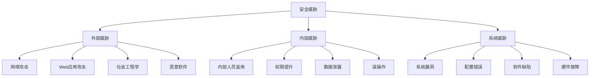

# 金融售前方案辅助编写系统 - 安全说明书

## 文档信息

| 项目 | 内容 |
|------|------|
| 文档名称 | 安全说明书 |
| 产品名称 | 金融售前方案辅助编写系统 |
| 版本 | v1.2.0 |
| 发布日期 | 2025-01-08 |
| 作者 | 安全团队 |
| 状态 | 正式发布 |
| 目标读者 | 安全工程师、系统管理员、合规专员、开发人员 |

## 版本历史

| 版本 | 日期 | 修改人 | 修改内容 |
|------|------|--------|----------|
| v1.0.0 | 2024-12-01 | 安全团队 | 初始版本创建 |
| v1.1.0 | 2024-12-15 | 安全团队 | 增加合规性内容 |
| v1.2.0 | 2025-01-08 | 安全团队 | 完善安全控制措施 |

## 1. 安全架构概述

### 1.1 安全架构原则

金融售前方案辅助编写系统遵循以下安全架构原则：

#### 1.1.1 纵深防御原则
```
┌─────────────────────────────────────────────────────────────┐
│                    应用层安全防护                           │
│  ┌─────────────┐ ┌─────────────┐ ┌─────────────┐         │
│  │  身份认证   │ │  权限控制   │ │  输入验证   │         │
│  │   (JWT)     │ │   (RBAC)    │ │  (XSS防护)  │         │
│  └─────────────┘ └─────────────┘ └─────────────┘         │
└─────────────────────────────┬───────────────────────────────┘
                              │
┌─────────────────────────────▼───────────────────────────────┐
│                    网络层安全防护                           │
│  ┌─────────────┐ ┌─────────────┐ ┌─────────────┐         │
│  │   HTTPS     │ │   WAF       │ │  API网关    │         │
│  │  (TLS1.3)   │ │ (ModSecurity)│ │ (Kong)     │         │
│  └─────────────┘ └─────────────┘ └─────────────┘         │
└─────────────────────────────┬───────────────────────────────┘
                              │
┌─────────────────────────────▼───────────────────────────────┐
│                    系统层安全防护                           │
│  ┌─────────────┐ ┌─────────────┐ ┌─────────────┐         │
│  │  主机安全   │ │  容器安全   │ │  镜像安全   │         │
│  │ (CIS基线)   │ │ (Seccomp)   │ │ (漏洞扫描)  │         │
│  └─────────────┘ └─────────────┘ └─────────────┘         │
└─────────────────────────────┬───────────────────────────────┘
                              │
┌─────────────────────────────▼───────────────────────────────┐
│                    数据层安全防护                           │
│  ┌─────────────┐ ┌─────────────┐ ┌─────────────┐         │
│  │  数据加密   │ │  访问控制   │ │  备份加密   │         │
│  │ (AES-256)   │ │ (行级安全)  │ │ (AES-256)   │         │
│  └─────────────┘ └─────────────┘ └─────────────┘         │
└─────────────────────────────────────────────────────────────┘
```

#### 1.1.2 最小权限原则
- **用户权限**：基于角色的访问控制（RBAC），每个用户只拥有完成工作所需的最小权限
- **服务权限**：服务间通信使用服务账户，权限精确到API级别
- **数据权限**：数据库访问使用专用账户，权限细化到表和字段级别

#### 1.1.3 零信任原则
- **永不信任，持续验证**：所有访问请求都需要身份验证和授权
- **微分段**：网络按业务功能划分为安全区域
- **动态访问控制**：基于用户行为和环境风险动态调整访问权限

### 1.2 安全威胁模型

#### 1.2.1 威胁分类


#### 1.2.2 STRIDE威胁分析

| 威胁类型 | 具体威胁 | 影响系统 | 缓解措施 |
|----------|----------|----------|----------|
| **欺骗(Spoofing)** | 身份伪造 | 用户认证系统 | JWT令牌+多因素认证 |
| **篡改(Tampering)** | 数据篡改 | 数据传输/存储 | TLS加密+数据签名 |
| **否认(Repudiation)** | 操作否认 | 审计系统 | 完整操作日志+数字签名 |
| **信息泄露(Information Disclosure)** | 敏感信息泄露 | 数据存储 | 数据加密+访问控制 |
| **拒绝服务(DoS)** | 服务不可用 | 应用服务 | 限流+熔断+负载均衡 |
| **权限提升(Elevation of Privilege)** | 未授权访问 | 权限管理系统 | RBAC+权限审计 |

## 2. 身份认证与访问控制

### 2.1 身份认证机制

#### 2.1.1 多因素认证(MFA)
```python
# 多因素认证配置
# app/core/auth/mfa.py

import pyotp
import qrcode
from io import BytesIO
import base64

class MultiFactorAuth:
    """多因素认证管理器"""

    def __init__(self, secret_key_length: int = 32):
        self.secret_key_length = secret_key_length

    def generate_secret(self) -> str:
        """生成MFA密钥"""
        return pyotp.random_base32()

    def generate_qr_code(self, username: str, secret: str, issuer: str = "FinPreAssist") -> str:
        """生成QR码图片（Base64编码）"""
        totp_uri = pyotp.totp.TOTP(secret).provisioning_uri(
            name=username,
            issuer_name=issuer
        )

        qr = qrcode.QRCode(version=1, box_size=10, border=5)
        qr.add_data(totp_uri)
        qr.make(fit=True)

        img = qr.make_image(fill_color="black", back_color="white")
        buffer = BytesIO()
        img.save(buffer, format='PNG')

        return base64.b64encode(buffer.getvalue()).decode()

    def verify_token(self, secret: str, token: str) -> bool:
        """验证MFA令牌"""
        totp = pyotp.TOTP(secret)
        return totp.verify(token, valid_window=1)

    def backup_codes(self, count: int = 10) -> list:
        """生成备份验证码"""
        return [self._generate_backup_code() for _ in range(count)]

    def _generate_backup_code(self) -> str:
        """生成单个备份验证码"""
        import secrets
        return ''.join([str(secrets.randbelow(10)) for _ in range(8)])

# 使用示例
mfa = MultiFactorAuth()
secret = mfa.generate_secret()
qr_code = mfa.generate_qr_code("user@example.com", secret)
is_valid = mfa.verify_token(secret, "123456")
```

#### 2.1.2 JWT令牌管理
```python
# JWT令牌配置
# app/core/auth/jwt.py

from datetime import datetime, timedelta
import jwt
from typing import Optional, Dict, Any
import redis
import json

class JWTManager:
    """JWT令牌管理器"""

    def __init__(self, secret_key: str, algorithm: str = "HS256",
                 access_token_expire_minutes: int = 30,
                 refresh_token_expire_days: int = 7):
        self.secret_key = secret_key
        self.algorithm = algorithm
        self.access_token_expire_minutes = access_token_expire_minutes
        self.refresh_token_expire_days = refresh_token_expire_days
        self.redis_client = redis.Redis(host='localhost', port=6379, db=0)

    def create_access_token(self, data: Dict[str, Any]) -> str:
        """创建访问令牌"""
        to_encode = data.copy()
        expire = datetime.utcnow() + timedelta(minutes=self.access_token_expire_minutes)
        to_encode.update({"exp": expire, "type": "access"})

        encoded_jwt = jwt.encode(to_encode, self.secret_key, algorithm=self.algorithm)
        return encoded_jwt

    def create_refresh_token(self, data: Dict[str, Any]) -> str:
        """创建刷新令牌"""
        to_encode = data.copy()
        expire = datetime.utcnow() + timedelta(days=self.refresh_token_expire_days)
        to_encode.update({"exp": expire, "type": "refresh"})

        encoded_jwt = jwt.encode(to_encode, self.secret_key, algorithm=self.algorithm)

        # 存储刷新令牌到Redis（用于撤销）
        self.redis_client.setex(
            f"refresh_token:{data['sub']}",
            timedelta(days=self.refresh_token_expire_days),
            encoded_jwt
        )

        return encoded_jwt

    def verify_token(self, token: str) -> Optional[Dict[str, Any]]:
        """验证令牌"""
        try:
            payload = jwt.decode(token, self.secret_key, algorithms=[self.algorithm])

            # 检查令牌是否被撤销
            if payload.get("type") == "refresh":
                stored_token = self.redis_client.get(f"refresh_token:{payload['sub']}")
                if not stored_token or stored_token.decode() != token:
                    return None

            return payload
        except jwt.ExpiredSignatureError:
            return None
        except jwt.JWTError:
            return None

    def revoke_token(self, user_id: str) -> bool:
        """撤销用户令牌"""
        # 删除刷新令牌
        result = self.redis_client.delete(f"refresh_token:{user_id}")
        return result > 0

    def get_token_info(self, token: str) -> Optional[Dict[str, Any]]:
        """获取令牌信息（不验证）"""
        try:
            # 不解码过期时间验证
            payload = jwt.decode(token, self.secret_key, algorithms=[self.algorithm], options={"verify_exp": False})
            return payload
        except jwt.JWTError:
            return None
```

### 2.2 基于角色的访问控制(RBAC)

#### 2.2.1 权限模型设计
```python
# RBAC权限模型
# app/core/auth/rbac.py

from enum import Enum
from typing import List, Set, Optional
from dataclasses import dataclass
from datetime import datetime

class RoleLevel(Enum):
    """角色级别"""
    SYSTEM_ADMIN = "system_admin"
    ORG_ADMIN = "org_admin"
    DEPT_ADMIN = "dept_admin"
    TEAM_LEAD = "team_lead"
    USER = "user"
    GUEST = "guest"

class Permission(Enum):
    """权限定义"""
    # 用户管理权限
    USER_CREATE = "user:create"
    USER_READ = "user:read"
    USER_UPDATE = "user:update"
    USER_DELETE = "user:delete"

    # 文档管理权限
    DOC_CREATE = "doc:create"
    DOC_READ = "doc:read"
    DOC_UPDATE = "doc:update"
    DOC_DELETE = "doc:delete"
    DOC_SHARE = "doc:share"
    DOC_EXPORT = "doc:export"

    # 系统管理权限
    SYS_CONFIG = "sys:config"
    SYS_MONITOR = "sys:monitor"
    SYS_BACKUP = "sys:backup"
    SYS_AUDIT = "sys:audit"

    # 组织管理权限
    ORG_MANAGE = "org:manage"
    DEPT_MANAGE = "dept:manage"
    TEAM_MANAGE = "team:manage"

@dataclass
class Role:
    """角色定义"""
    id: str
    name: str
    level: RoleLevel
    permissions: Set[Permission]
    description: str
    created_at: datetime
    updated_at: datetime

class RBACManager:
    """RBAC权限管理器"""

    # 预定义角色权限
    ROLE_PERMISSIONS = {
        RoleLevel.SYSTEM_ADMIN: {
            Permission.USER_CREATE, Permission.USER_READ, Permission.USER_UPDATE, Permission.USER_DELETE,
            Permission.DOC_CREATE, Permission.DOC_READ, Permission.DOC_UPDATE, Permission.DOC_DELETE,
            Permission.DOC_SHARE, Permission.DOC_EXPORT,
            Permission.SYS_CONFIG, Permission.SYS_MONITOR, Permission.SYS_BACKUP, Permission.SYS_AUDIT,
            Permission.ORG_MANAGE, Permission.DEPT_MANAGE, Permission.TEAM_MANAGE
        },
        RoleLevel.ORG_ADMIN: {
            Permission.USER_CREATE, Permission.USER_READ, Permission.USER_UPDATE,
            Permission.DOC_CREATE, Permission.DOC_READ, Permission.DOC_UPDATE, Permission.DOC_DELETE,
            Permission.DOC_SHARE, Permission.DOC_EXPORT,
            Permission.SYS_MONITOR, Permission.SYS_AUDIT,
            Permission.DEPT_MANAGE, Permission.TEAM_MANAGE
        },
        RoleLevel.DEPT_ADMIN: {
            Permission.USER_CREATE, Permission.USER_READ, Permission.USER_UPDATE,
            Permission.DOC_CREATE, Permission.DOC_READ, Permission.DOC_UPDATE, Permission.DOC_DELETE,
            Permission.DOC_SHARE, Permission.DOC_EXPORT,
            Permission.TEAM_MANAGE
        },
        RoleLevel.TEAM_LEAD: {
            Permission.USER_READ,
            Permission.DOC_CREATE, Permission.DOC_READ, Permission.DOC_UPDATE,
            Permission.DOC_SHARE, Permission.DOC_EXPORT
        },
        RoleLevel.USER: {
            Permission.DOC_CREATE, Permission.DOC_READ, Permission.DOC_UPDATE,
            Permission.DOC_SHARE, Permission.DOC_EXPORT
        },
        RoleLevel.GUEST: {
            Permission.DOC_READ
        }
    }

    def __init__(self):
        self.roles = self._initialize_roles()

    def _initialize_roles(self) -> dict:
        """初始化角色"""
        roles = {}
        for role_level, permissions in self.ROLE_PERMISSIONS.items():
            role = Role(
                id=role_level.value,
                name=role_level.name.replace("_", " ").title(),
                level=role_level,
                permissions=permissions,
                description=f"{role_level.name} role",
                created_at=datetime.now(),
                updated_at=datetime.now()
            )
            roles[role_level] = role
        return roles

    def has_permission(self, user_role: RoleLevel, permission: Permission) -> bool:
        """检查用户是否有指定权限"""
        if user_role not in self.roles:
            return False
        return permission in self.roles[user_role].permissions

    def has_any_permission(self, user_role: RoleLevel, permissions: List[Permission]) -> bool:
        """检查用户是否有任意指定权限"""
        if user_role not in self.roles:
            return False
        user_permissions = self.roles[user_role].permissions
        return any(p in user_permissions for p in permissions)

    def has_all_permissions(self, user_role: RoleLevel, permissions: List[Permission]) -> bool:
        """检查用户是否有所有指定权限"""
        if user_role not in self.roles:
            return False
        user_permissions = self.roles[user_role].permissions
        return all(p in user_permissions for p in permissions)

    def get_user_permissions(self, user_role: RoleLevel) -> Set[Permission]:
        """获取用户的所有权限"""
        if user_role not in self.roles:
            return set()
        return self.roles[user_role].permissions.copy()

    def check_hierarchy(self, higher_role: RoleLevel, lower_role: RoleLevel) -> bool:
        """检查角色层级关系"""
        hierarchy_order = [
            RoleLevel.SYSTEM_ADMIN,
            RoleLevel.ORG_ADMIN,
            RoleLevel.DEPT_ADMIN,
            RoleLevel.TEAM_LEAD,
            RoleLevel.USER,
            RoleLevel.GUEST
        ]

        higher_index = hierarchy_order.index(higher_role)
        lower_index = hierarchy_order.index(lower_role)
        return higher_index < lower_index
```

#### 2.2.2 动态权限控制
```python
# 动态权限控制
# app/core/auth/dynamic_auth.py

from typing import Dict, List, Optional, Any
from datetime import datetime, timedelta
import json

class DynamicAuthorization:
    """动态授权管理"""

    def __init__(self, redis_client):
        self.redis_client = redis_client
        self.rbac_manager = RBACManager()

    def check_document_access(self, user_id: str, user_role: RoleLevel,
                            document_id: str, action: str) -> bool:
        """检查文档访问权限"""
        # 基础权限检查
        permission_map = {
            "read": Permission.DOC_READ,
            "create": Permission.DOC_CREATE,
            "update": Permission.DOC_UPDATE,
            "delete": Permission.DOC_DELETE,
            "share": Permission.DOC_SHARE,
            "export": Permission.DOC_EXPORT
        }

        if action not in permission_map:
            return False

        base_permission = permission_map[action]
        if not self.rbac_manager.has_permission(user_role, base_permission):
            return False

        # 动态权限检查
        return self._check_dynamic_permissions(user_id, document_id, action)

    def _check_dynamic_permissions(self, user_id: str, document_id: str, action: str) -> bool:
        """检查动态权限"""
        # 检查文档所有者
        doc_owner = self._get_document_owner(document_id)
        if doc_owner == user_id:
            return True

        # 检查文档共享权限
        share_permissions = self._get_document_shares(document_id)
        if user_id in share_permissions:
            user_share = share_permissions[user_id]
            if action in user_share.get("permissions", []):
                return True

        # 检查组织权限
        org_permissions = self._get_organization_permissions(user_id, document_id)
        if org_permissions and action in org_permissions:
            return True

        return False

    def _get_document_owner(self, document_id: str) -> Optional[str]:
        """获取文档所有者"""
        # 从Redis缓存获取
        cache_key = f"doc_owner:{document_id}"
        owner = self.redis_client.get(cache_key)
        if owner:
            return owner.decode()

        # 从数据库获取（示例）
        # owner = database.get_document_owner(document_id)
        # if owner:
        #     self.redis_client.setex(cache_key, 3600, owner)
        return None

    def _get_document_shares(self, document_id: str) -> Dict[str, Any]:
        """获取文档共享权限"""
        cache_key = f"doc_shares:{document_id}"
        shares_data = self.redis_client.get(cache_key)
        if shares_data:
            return json.loads(shares_data.decode())
        return {}

    def _get_organization_permissions(self, user_id: str, document_id: str) -> Optional[List[str]]:
        """获取组织权限"""
        # 检查用户所在组织是否有文档访问权限
        user_org = self._get_user_organization(user_id)
        doc_org = self._get_document_organization(document_id)

        if user_org and doc_org and user_org == doc_org:
            # 返回组织级别的权限
            return ["read", "share"]
        return None

    def _get_user_organization(self, user_id: str) -> Optional[str]:
        """获取用户组织"""
        cache_key = f"user_org:{user_id}"
        org = self.redis_client.get(cache_key)
        if org:
            return org.decode()
        return None

    def _get_document_organization(self, document_id: str) -> Optional[str]:
        """获取文档组织"""
        cache_key = f"doc_org:{document_id}"
        org = self.redis_client.get(cache_key)
        if org:
            return org.decode()
        return None

    def log_access_attempt(self, user_id: str, resource: str, action: str,
                          granted: bool, reason: str = ""):
        """记录访问尝试"""
        log_entry = {
            "timestamp": datetime.now().isoformat(),
            "user_id": user_id,
            "resource": resource,
            "action": action,
            "granted": granted,
            "reason": reason
        }

        # 存储到审计日志
        log_key = f"audit_log:{datetime.now().strftime('%Y%m%d')}"
        self.redis_client.lpush(log_key, json.dumps(log_entry))
        self.redis_client.expire(log_key, 7776000)  # 保留90天
```

## 3. 数据保护与加密

### 3.1 数据分类与保护级别

#### 3.1.1 数据分类标准
```python
# 数据分类配置
# app/core/security/data_classification.py

from enum import Enum
from typing import Dict, List, Optional
from dataclasses import dataclass

class DataClassification(Enum):
    """数据分类级别"""
    PUBLIC = "public"                    # 公开数据
    INTERNAL = "internal"                # 内部数据
    CONFIDENTIAL = "confidential"        # 机密数据
    RESTRICTED = "restricted"            # 受限数据
    SECRET = "secret"                    # 绝密数据

class DataType(Enum):
    """数据类型"""
    PERSONAL_INFO = "personal_info"      # 个人信息
    FINANCIAL_DATA = "financial_data"    # 金融数据
    BUSINESS_DATA = "business_data"      # 业务数据
    SYSTEM_DATA = "system_data"          # 系统数据
    AUDIT_DATA = "audit_data"            # 审计数据

@dataclass
class DataProtectionRule:
    """数据保护规则"""
    classification: DataClassification
    encryption_required: bool
    access_control_required: bool
    audit_required: bool
    retention_days: int
    backup_required: bool
    cross_border_allowed: bool

# 数据保护规则配置
DATA_PROTECTION_RULES = {
    DataClassification.PUBLIC: DataProtectionRule(
        classification=DataClassification.PUBLIC,
        encryption_required=False,
        access_control_required=False,
        audit_required=False,
        retention_days=30,
        backup_required=False,
        cross_border_allowed=True
    ),
    DataClassification.INTERNAL: DataProtectionRule(
        classification=DataClassification.INTERNAL,
        encryption_required=True,
        access_control_required=True,
        audit_required=True,
        retention_days=90,
        backup_required=True,
        cross_border_allowed=True
    ),
    DataClassification.CONFIDENTIAL: DataProtectionRule(
        classification=DataClassification.CONFIDENTIAL,
        encryption_required=True,
        access_control_required=True,
        audit_required=True,
        retention_days=365,
        backup_required=True,
        cross_border_allowed=False
    ),
    DataClassification.RESTRICTED: DataProtectionRule(
        classification=DataClassification.RESTRICTED,
        encryption_required=True,
        access_control_required=True,
        audit_required=True,
        retention_days=2555,  # 7年
        backup_required=True,
        cross_border_allowed=False
    ),
    DataClassification.SECRET: DataProtectionRule(
        classification=DataClassification.SECRET,
        encryption_required=True,
        access_control_required=True,
        audit_required=True,
        retention_days=3650,  # 10年
        backup_required=True,
        cross_border_allowed=False
    )
}

# 数据类型分类映射
DATA_TYPE_CLASSIFICATION = {
    DataType.PERSONAL_INFO: DataClassification.CONFIDENTIAL,
    DataType.FINANCIAL_DATA: DataClassification.RESTRICTED,
    DataType.BUSINESS_DATA: DataClassification.INTERNAL,
    DataType.SYSTEM_DATA: DataClassification.INTERNAL,
    DataType.AUDIT_DATA: DataClassification.SECRET
}
```

### 3.2 数据加密策略

#### 3.2.1 传输加密配置
```python
# 传输层安全配置
# app/core/security/transport_security.py

import ssl
from typing import Dict, Optional
import urllib3

class TransportSecurityConfig:
    """传输安全配置"""

    @staticmethod
    def get_ssl_context() -> ssl.SSLContext:
        """获取SSL上下文"""
        # 创建SSL上下文
        context = ssl.create_default_context()

        # 设置最小TLS版本为1.2
        context.minimum_version = ssl.TLSVersion.TLSv1_2

        # 禁用弱加密算法
        context.set_ciphers('ECDHE+AESGCM:ECDHE+CHACHA20:DHE+AESGCM:DHE+CHACHA20:!aNULL:!MD5:!DSS')

        # 启用HSTS
        context.options |= ssl.OP_NO_COMPRESSION

        return context

    @staticmethod
    def get_security_headers() -> Dict[str, str]:
        """获取安全HTTP头"""
        return {
            # 强制使用HTTPS
            'Strict-Transport-Security': 'max-age=31536000; includeSubDomains; preload',

            # 防止点击劫持
            'X-Frame-Options': 'DENY',

            # 防止MIME类型嗅探
            'X-Content-Type-Options': 'nosniff',

            # XSS防护
            'X-XSS-Protection': '1; mode=block',

            # 内容安全策略
            'Content-Security-Policy': "default-src 'self'; script-src 'self' 'unsafe-inline'; style-src 'self' 'unsafe-inline';",

            # 引用策略
            'Referrer-Policy': 'strict-origin-when-cross-origin',

            # 权限策略
            'Permissions-Policy': 'geolocation=(), microphone=(), camera=()',

            # 缓存控制
            'Cache-Control': 'no-store, no-cache, must-revalidate',
            'Pragma': 'no-cache',
            'Expires': '0'
        }

    @staticmethod
    def configure_urllib3():
        """配置urllib3安全设置"""
        # 禁用不安全的HTTPS请求警告
        urllib3.disable_warnings(urllib3.exceptions.InsecureRequestWarning)

        # 配置连接池
        pool_manager = urllib3.PoolManager(
            num_pools=10,
            maxsize=100,
            ssl_context=TransportSecurityConfig.get_ssl_context(),
            retries=urllib3.Retry(
                total=3,
                backoff_factor=0.3,
                status_forcelist=[500, 502, 503, 504]
            )
        )

        return pool_manager

# Nginx安全配置示例
NGINX_SECURITY_CONFIG = """
# 安全头配置
add_header Strict-Transport-Security "max-age=31536000; includeSubDomains; preload" always;
add_header X-Frame-Options "DENY" always;
add_header X-Content-Type-Options "nosniff" always;
add_header X-XSS-Protection "1; mode=block" always;
add_header Content-Security-Policy "default-src 'self'; script-src 'self' 'unsafe-inline'; style-src 'self' 'unsafe-inline';" always;
add_header Referrer-Policy "strict-origin-when-cross-origin" always;

# SSL配置
ssl_protocols TLSv1.2 TLSv1.3;
ssl_ciphers ECDHE+AESGCM:ECDHE+CHACHA20:DHE+AESGCM:DHE+CHACHA20:!aNULL:!MD5:!DSS;
ssl_prefer_server_ciphers off;
ssl_session_cache shared:SSL:10m;
ssl_session_timeout 10m;

# 限流配置
limit_req_zone $binary_remote_addr zone=api:10m rate=10r/s;
limit_req zone=api burst=20 nodelay;

# 文件上传限制
client_max_body_size 10M;
client_body_timeout 30s;
client_header_timeout 30s;
"""
```

#### 3.2.2 存储加密配置
```python
# 存储加密配置
# app/core/security/storage_encryption.py

from cryptography.fernet import Fernet
from cryptography.hazmat.primitives import hashes
from cryptography.hazmat.primitives.kdf.pbkdf2 import PBKDF2HMAC
from cryptography.hazmat.primitives.ciphers import Cipher, algorithms, modes
import os
import base64
from typing import Optional, Dict, Any

class StorageEncryption:
    """存储加密管理器"""

    def __init__(self, master_key: Optional[str] = None):
        if master_key:
            self.master_key = master_key.encode()
        else:
            self.master_key = self._generate_master_key()

        self.fernet = Fernet(base64.urlsafe_b64encode(self.master_key[:32].ljust(32, b'0')))

    def _generate_master_key(self) -> bytes:
        """生成主密钥"""
        return Fernet.generate_key()

    def encrypt_data(self, data: str, additional_data: Optional[Dict] = None) -> str:
        """加密数据"""
        # 添加时间戳和随机盐
        import time
        import json

        payload = {
            "data": data,
            "timestamp": int(time.time()),
            "salt": os.urandom(16).hex()
        }

        if additional_data:
            payload.update(additional_data)

        # 序列化数据
        json_data = json.dumps(payload)

        # 使用Fernet加密
        encrypted_data = self.fernet.encrypt(json_data.encode())

        return base64.urlsafe_b64encode(encrypted_data).decode()

    def decrypt_data(self, encrypted_data: str) -> Dict[str, Any]:
        """解密数据"""
        try:
            # 解码Base64
            encrypted_bytes = base64.urlsafe_b64decode(encrypted_data.encode())

            # 使用Fernet解密
            decrypted_data = self.fernet.decrypt(encrypted_bytes)

            # 反序列化JSON
            payload = json.loads(decrypted_data.decode())

            return payload
        except Exception as e:
            raise ValueError(f"解密失败: {str(e)}")

    def encrypt_field(self, field_name: str, field_value: str, record_id: str) -> str:
        """加密数据库字段"""
        # 字段级加密，包含字段名和记录ID作为附加认证数据
        additional_data = {
            "field": field_name,
            "record_id": record_id
        }

        return self.encrypt_data(field_value, additional_data)

    def decrypt_field(self, encrypted_field: str) -> Dict[str, Any]:
        """解密数据库字段"""
        return self.decrypt_data(encrypted_field)

    def rotate_key(self, new_master_key: Optional[str] = None) -> bool:
        """密钥轮换"""
        try:
            if new_master_key:
                self.master_key = new_master_key.encode()
            else:
                self.master_key = self._generate_master_key()

            self.fernet = Fernet(base64.urlsafe_b64encode(self.master_key[:32].ljust(32, b'0')))
            return True
        except Exception as e:
            print(f"密钥轮换失败: {str(e)}")
            return False

class DatabaseEncryption:
    """数据库加密管理器"""

    def __init__(self, encryption_key: str):
        self.encryption = StorageEncryption(encryption_key)
        self.encrypted_fields = {
            "users": ["email", "phone", "id_number"],
            "documents": ["content", "title", "client_info"],
            "financial_data": ["amount", "account_number", "transaction_details"]
        }

    def encrypt_record(self, table_name: str, record: Dict[str, Any], record_id: str) -> Dict[str, Any]:
        """加密记录中的敏感字段"""
        encrypted_record = record.copy()

        if table_name in self.encrypted_fields:
            for field_name in self.encrypted_fields[table_name]:
                if field_name in record and record[field_name]:
                    encrypted_record[field_name] = self.encryption.encrypt_field(
                        field_name,
                        str(record[field_name]),
                        record_id
                    )

        return encrypted_record

    def decrypt_record(self, table_name: str, record: Dict[str, Any]) -> Dict[str, Any]:
        """解密记录中的敏感字段"""
        decrypted_record = record.copy()

        if table_name in self.encrypted_fields:
            for field_name in self.encrypted_fields[table_name]:
                if field_name in record and record[field_name]:
                    try:
                        decrypted_data = self.encryption.decrypt_field(record[field_name])
                        decrypted_record[field_name] = decrypted_data["data"]
                    except Exception as e:
                        print(f"解密字段 {field_name} 失败: {str(e)}")
                        decrypted_record[field_name] = None

        return decrypted_record

    def search_encrypted_field(self, table_name: str, field_name: str, search_value: str) -> List[str]:
        """在加密字段中搜索"""
        # 由于数据是加密的，需要解密后搜索
        # 在实际应用中，应该使用可搜索加密技术或建立搜索索引
        matching_records = []

        # 这里应该实现可搜索加密算法
        # 为简化示例，返回空列表
        return matching_records

# PostgreSQL透明数据加密(TDE)配置
POSTGRESQL_TDE_CONFIG = """
-- 启用pgcrypto扩展
CREATE EXTENSION IF NOT EXISTS pgcrypto;

-- 创建加密函数
CREATE OR REPLACE FUNCTION encrypt_sensitive_data(data TEXT, key TEXT)
RETURNS TEXT AS $$
BEGIN
    RETURN encode(pgp_sym_encrypt(data, key, 'cipher-algo=aes256'), 'base64');
END;
$$ LANGUAGE plpgsql;

CREATE OR REPLACE FUNCTION decrypt_sensitive_data(encrypted_data TEXT, key TEXT)
RETURNS TEXT AS $$
BEGIN
    RETURN pgp_sym_decrypt(decode(encrypted_data, 'base64'), key);
END;
$$ LANGUAGE plpgsql;

-- 创建加密列示例
CREATE TABLE users (
    id SERIAL PRIMARY KEY,
    username VARCHAR(100) UNIQUE NOT NULL,
    email_encrypted TEXT,  -- 加密存储
    phone_encrypted TEXT,  -- 加密存储
    created_at TIMESTAMP DEFAULT CURRENT_TIMESTAMP
);

-- 创建触发器自动加密
CREATE OR REPLACE FUNCTION encrypt_user_data()
RETURNS TRIGGER AS $$
BEGIN
    IF NEW.email_encrypted IS NOT NULL THEN
        NEW.email_encrypted := encrypt_sensitive_data(NEW.email_encrypted, current_setting('app.encryption_key'));
    END IF;
    IF NEW.phone_encrypted IS NOT NULL THEN
        NEW.phone_encrypted := encrypt_sensitive_data(NEW.phone_encrypted, current_setting('app.encryption_key'));
    END IF;
    RETURN NEW;
END;
$$ LANGUAGE plpgsql;

CREATE TRIGGER encrypt_user_data_trigger
    BEFORE INSERT OR UPDATE ON users
    FOR EACH ROW
    EXECUTE FUNCTION encrypt_user_data();
"""
```

### 3.3 数据脱敏与匿名化

#### 3.3.1 数据脱敏策略
```python
# 数据脱敏配置
# app/core/security/data_masking.py

import re
from typing import Dict, List, Optional, Any
from enum import Enum

class MaskingStrategy(Enum):
    """脱敏策略"""
    FULL_MASK = "full_mask"              # 完全脱敏
    PARTIAL_MASK = "partial_mask"        # 部分脱敏
    TOKENIZATION = "tokenization"        # 令牌化
    HASHING = "hashing"                  # 哈希化
    ENCRYPTION = "encryption"            # 加密

class DataMasking:
    """数据脱敏管理器"""

    def __init__(self):
        self.masking_rules = {
            "email": {
                "strategy": MaskingStrategy.PARTIAL_MASK,
                "pattern": r"^(.).*(.@.*)$",
                "replacement": r"\1***\2"
            },
            "phone": {
                "strategy": MaskingStrategy.PARTIAL_MASK,
                "pattern": r"^(\d{3})\d{4}(\d{4})$",
                "replacement": r"\1****\2"
            },
            "id_card": {
                "strategy": MaskingStrategy.PARTIAL_MASK,
                "pattern": r"^(\d{3})\d{11}(\d{4})$",
                "replacement": r"\1***********\2"
            },
            "bank_card": {
                "strategy": MaskingStrategy.PARTIAL_MASK,
                "pattern": r"^(\d{4})\d{8,12}(\d{4})$",
                "replacement": r"\1************\2"
            },
            "name": {
                "strategy": MaskingStrategy.PARTIAL_MASK,
                "pattern": r"^(.)[\u4e00-\u9fa5]+$",
                "replacement": r"\1*"
            }
        }

    def mask_data(self, data_type: str, data: str) -> str:
        """脱敏数据"""
        if data_type not in self.masking_rules:
            return "***"

        rule = self.masking_rules[data_type]

        if rule["strategy"] == MaskingStrategy.PARTIAL_MASK:
            return self._partial_mask(data, rule["pattern"], rule["replacement"])
        elif rule["strategy"] == MaskingStrategy.FULL_MASK:
            return self._full_mask(data)
        elif rule["strategy"] == MaskingStrategy.TOKENIZATION:
            return self._tokenize(data)

        return "***"

    def _partial_mask(self, data: str, pattern: str, replacement: str) -> str:
        """部分脱敏"""
        try:
            return re.sub(pattern, replacement, data)
        except re.error:
            return "***"

    def _full_mask(self, data: str) -> str:
        """完全脱敏"""
        return "*" * len(data)

    def _tokenize(self, data: str) -> str:
        """令牌化"""
        # 简单的令牌化实现
        import hashlib
        return hashlib.sha256(data.encode()).hexdigest()[:8]

    def mask_dict(self, data: Dict[str, Any], masking_config: Dict[str, str]) -> Dict[str, Any]:
        """脱敏字典数据"""
        masked_data = {}
        for key, value in data.items():
            if key in masking_config:
                masked_data[key] = self.mask_data(masking_config[key], str(value))
            else:
                masked_data[key] = value
        return masked_data

    def mask_list(self, data_list: List[Dict[str, Any]], masking_config: Dict[str, str]) -> List[Dict[str, Any]]:
        """脱敏列表数据"""
        return [self.mask_dict(item, masking_config) for item in data_list]

# 数据库脱敏查询
DATABASE_MASKING_VIEWS = """
-- 创建脱敏视图
CREATE OR REPLACE VIEW users_masked AS
SELECT
    id,
    username,
    CASE
        WHEN email IS NOT NULL THEN
            CONCAT(SUBSTRING(email, 1, 1), '***', SUBSTRING(email, POSITION('@' IN email)))
        ELSE NULL
    END AS email_masked,
    CASE
        WHEN phone IS NOT NULL THEN
            CONCAT(SUBSTRING(phone, 1, 3), '****', SUBSTRING(phone, 8))
        ELSE NULL
    END AS phone_masked,
    created_at
FROM users;

-- 创建敏感数据访问日志
CREATE TABLE IF NOT EXISTS sensitive_data_access_log (
    id SERIAL PRIMARY KEY,
    user_id INTEGER NOT NULL,
    data_type VARCHAR(50) NOT NULL,
    access_time TIMESTAMP DEFAULT CURRENT_TIMESTAMP,
    access_reason TEXT,
    ip_address INET,
    user_agent TEXT
);

-- 创建触发器记录敏感数据访问
CREATE OR REPLACE FUNCTION log_sensitive_data_access()
RETURNS TRIGGER AS $$
BEGIN
    INSERT INTO sensitive_data_access_log (user_id, data_type, access_reason, ip_address)
    VALUES (NEW.user_id, 'personal_info', NEW.access_reason, NEW.ip_address);
    RETURN NEW;
END;
$$ LANGUAGE plpgsql;
"""
```

## 4. 合规性管理

### 4.1 GDPR合规性

#### 4.1.1 数据主体权利
```python
# GDPR合规配置
# app/core/compliance/gdpr.py

from typing import Dict, List, Optional, Any
from datetime import datetime, timedelta
import json
from dataclasses import dataclass

@dataclass
class DataSubjectRights:
    """数据主体权利"""
    right_to_access: bool = True
    right_to_rectification: bool = True
    right_to_erasure: bool = True
    right_to_data_portability: bool = True
    right_to_object: bool = True
    right_to_restrict_processing: bool = True

class GDPRCompliance:
    """GDPR合规管理器"""

    def __init__(self, db_connection, redis_client):
        self.db = db_connection
        self.redis = redis_client
        self.consent_types = {
            "essential": "必要cookies",
            "analytics": "分析cookies",
            "marketing": "营销cookies",
            "preferences": "偏好cookies"
        }

    def handle_data_access_request(self, user_id: str) -> Dict[str, Any]:
        """处理数据访问请求"""
        user_data = {
            "personal_data": self._get_personal_data(user_id),
            "usage_data": self._get_usage_data(user_id),
            "consent_data": self._get_consent_data(user_id),
            "data_retention": self._get_data_retention_info(user_id),
            "third_party_sharing": self._get_third_party_sharing(user_id)
        }

        # 记录访问请求
        self._log_data_access_request(user_id)

        return user_data

    def handle_data_deletion_request(self, user_id: str, reason: str = "user_request") -> bool:
        """处理数据删除请求"""
        try:
            # 1. 验证用户身份
            if not self._verify_user_identity(user_id):
                return False

            # 2. 检查法律义务
            if self._has_legal_retention_obligation(user_id):
                # 标记为待删除，延迟执行
                self._schedule_data_deletion(user_id, days=2555)  # 7年后删除
                return True

            # 3. 删除个人数据
            self._delete_personal_data(user_id)

            # 4. 删除用户账户
            self._delete_user_account(user_id)

            # 5. 通知第三方删除
            self._notify_third_parties(user_id, "deletion")

            # 6. 记录删除操作
            self._log_data_deletion(user_id, reason)

            return True
        except Exception as e:
            self._log_error("data_deletion_failed", user_id, str(e))
            return False

    def handle_data_portability_request(self, user_id: str, format: str = "json") -> str:
        """处理数据可携带性请求"""
        user_data = self.handle_data_access_request(user_id)

        if format == "json":
            return json.dumps(user_data, ensure_ascii=False, indent=2)
        elif format == "csv":
            return self._convert_to_csv(user_data)
        elif format == "xml":
            return self._convert_to_xml(user_data)
        else:
            raise ValueError(f"不支持的格式: {format}")

    def manage_consent(self, user_id: str, consent_type: str, granted: bool) -> bool:
        """管理用户同意"""
        if consent_type not in self.consent_types:
            return False

        consent_record = {
            "user_id": user_id,
            "consent_type": consent_type,
            "granted": granted,
            "timestamp": datetime.now().isoformat(),
            "ip_address": "",  # 需要从前端获取
            "user_agent": ""   # 需要从前端获取
        }

        # 存储同意记录
        self._store_consent_record(consent_record)

        # 如果撤销同意，停止相关数据处理
        if not granted:
            self._stop_data_processing(user_id, consent_type)

        return True

    def check_consent(self, user_id: str, consent_type: str) -> bool:
        """检查用户同意状态"""
        latest_consent = self._get_latest_consent(user_id, consent_type)
        if not latest_consent:
            return False

        # 检查同意是否过期（默认2年）
        consent_date = datetime.fromisoformat(latest_consent["timestamp"])
        if datetime.now() - consent_date > timedelta(days=730):
            return False

        return latest_consent["granted"]

    def _get_personal_data(self, user_id: str) -> Dict[str, Any]:
        """获取个人数据"""
        # 从数据库获取用户个人信息
        query = """
        SELECT u.username, u.email, u.phone, u.created_at, u.last_login,
               p.full_name, p.department, p.position
        FROM users u
        LEFT JOIN user_profiles p ON u.id = p.user_id
        WHERE u.id = %s
        """
        # 执行查询并返回结果
        return {}

    def _get_usage_data(self, user_id: str) -> Dict[str, Any]:
        """获取使用数据"""
        return {
            "login_history": [],
            "document_access": [],
            "api_usage": []
        }

    def _log_data_access_request(self, user_id: str):
        """记录数据访问请求"""
        log_entry = {
            "user_id": user_id,
            "request_type": "data_access",
            "timestamp": datetime.now().isoformat(),
            "fulfilled": True
        }
        # 存储到审计日志
        self._store_audit_log(log_entry)

# GDPR隐私政策模板
GDPR_PRIVACY_POLICY = """
# 隐私政策

## 1. 数据控制者信息
公司名称：金融科技有限公司
地址：北京市朝阳区金融街1号
联系方式：privacy@fintech.com
数据保护官：DPO@fintech.com

## 2. 收集的个人数据类型
- 基本身份信息：姓名、用户名、联系方式
- 身份验证信息：登录凭据、IP地址、设备信息
- 业务数据：文档内容、客户信息、财务数据
- 技术数据：日志信息、使用情况、性能数据

## 3. 数据处理目的和法律依据
- 合同履行（GDPR第6条1(b)）：提供核心服务
- 合法利益（GDPR第6条1(f)）：改进服务、安全防护
- 法律义务（GDPR第6条1(c)）：遵守法律法规
- 同意（GDPR第6条1(a)）：营销通讯、可选功能

## 4. 数据保留期限
- 账户数据：账户关闭后7年
- 业务数据：业务关系结束后7年
- 日志数据：收集后2年
- 营销数据：撤回同意或3年后

## 5. 数据主体权利
- 访问权：获取个人数据副本
- 更正权：纠正不准确数据
- 删除权：在特定条件下删除数据
- 限制处理权：限制数据处理活动
- 数据可携带权：获取可移植的数据
- 反对权：反对特定类型的处理

## 6. 数据安全措施
- 传输加密：TLS 1.3
- 存储加密：AES-256
- 访问控制：基于角色的权限管理
- 审计日志：完整的数据访问记录
- 定期安全评估：年度安全审计

## 7. 国际数据传输
- 传输机制：标准合同条款
- 保护措施：加密、匿名化
- 接收方：欧盟委员会认定具有充分保护水平的国家

## 8. 联系方式
如有隐私相关问题，请联系：
- 邮箱：privacy@fintech.com
- 电话：400-123-4567
- 地址：北京市朝阳区金融街1号
"""
```

#### 4.1.2 数据保护影响评估(DPIA)
```python
# DPIA评估模板
# app/core/compliance/dpia.py

from typing import Dict, List, Optional, Any
from dataclasses import dataclass
from datetime import datetime

@dataclass
class DPIAAssessment:
    """DPIA评估"""
    project_name: str
    assessment_date: datetime
    assessor: str

    # 数据处理信息
    data_types: List[str]
    data_subjects: List[str]
    data_volume: str
    processing_purposes: List[str]

    # 风险评估
    risk_level: str  # low, medium, high
    privacy_risks: List[Dict[str, Any]]
    mitigation_measures: List[Dict[str, Any]]

    # 合规性检查
    legal_basis: List[str]
    consent_mechanisms: List[str]
    data_subject_rights: List[str]

    # 安全措施
    technical_measures: List[str]
    organizational_measures: List[str]

    # 结论
    approval_status: str  # approved, conditional, rejected
    recommendations: List[str]
    review_date: datetime

class DPIAManager:
    """DPIA管理器"""

    def __init__(self):
        self.assessments = []

    def create_assessment(self, project_info: Dict[str, Any]) -> DPIAAssessment:
        """创建DPIA评估"""
        assessment = DPIAAssessment(
            project_name=project_info["name"],
            assessment_date=datetime.now(),
            assessor=project_info["assessor"],
            data_types=project_info.get("data_types", []),
            data_subjects=project_info.get("data_subjects", []),
            data_volume=project_info.get("data_volume", "unknown"),
            processing_purposes=project_info.get("processing_purposes", []),
            risk_level="medium",  # 默认中等风险
            privacy_risks=[],
            mitigation_measures=[],
            legal_basis=[],
            consent_mechanisms=[],
            data_subject_rights=[],
            technical_measures=[],
            organizational_measures=[],
            approval_status="pending",
            recommendations=[],
            review_date=datetime.now() + timedelta(days=365)
        )

        # 进行风险评估
        self._assess_privacy_risks(assessment)

        return assessment

    def _assess_privacy_risks(self, assessment: DPIAAssessment):
        """评估隐私风险"""
        risks = []

        # 评估数据敏感性风险
        if "personal_data" in assessment.data_types:
            risks.append({
                "risk_id": "R001",
                "description": "处理个人数据可能导致隐私泄露",
                "severity": "high",
                "likelihood": "medium",
                "impact": "个人身份信息泄露",
                "mitigation": "实施数据加密和访问控制"
            })

        # 评估数据规模风险
        if assessment.data_volume == "large":
            risks.append({
                "risk_id": "R002",
                "description": "大规模数据处理增加泄露影响",
                "severity": "high",
                "likelihood": "low",
                "impact": "大规模数据泄露事件",
                "mitigation": "实施数据分段存储和访问监控"
            })

        # 评估数据处理目的风险
        if "marketing" in assessment.processing_purposes:
            risks.append({
                "risk_id": "R003",
                "description": "营销目的处理可能违反用户意愿",
                "severity": "medium",
                "likelihood": "medium",
                "impact": "用户信任度下降",
                "mitigation": "实施明确的同意机制和用户控制"
            })

        assessment.privacy_risks = risks

        # 确定总体风险等级
        if any(r["severity"] == "high" for r in risks):
            assessment.risk_level = "high"
        elif any(r["severity"] == "medium" for r in risks):
            assessment.risk_level = "medium"
        else:
            assessment.risk_level = "low"

# DPIA模板
DPIA_TEMPLATE = """
# 数据保护影响评估报告

## 1. 项目概述
- **项目名称**: {project_name}
- **评估日期**: {assessment_date}
- **评估人员**: {assessor}

## 2. 数据处理描述
### 2.1 数据类型
{data_types}

### 2.2 数据主体
{data_subjects}

### 2.3 数据规模
{data_volume}

### 2.4 处理目的
{processing_purposes}

## 3. 必要性评估
### 3.1 处理目的的必要性
描述处理活动是否为实现目的所必需

### 3.2 数据最小化原则
评估收集的数据是否为最少必要数量

### 3.3 数据准确性
确保数据准确性的措施

## 4. 风险评估
### 4.1 识别的风险
{privacy_risks}

### 4.2 风险等级
总体风险等级: {risk_level}

## 5. 缓解措施
### 5.1 技术措施
{technical_measures}

### 5.2 组织措施
{organizational_measures}

### 5.3 法律措施
{legal_measures}

## 6. 合规性检查
### 6.1 法律依据
{legal_basis}

### 6.2 数据主体权利
{data_subject_rights}

### 6.3 透明度措施
描述如何确保处理活动的透明度

## 7. 结论与建议
### 7.1 评估结论
{approval_status}

### 7.2 改进建议
{recommendations}

### 7.3 审查计划
下次审查日期: {review_date}

## 8. 签字确认
评估人员签字: _________________ 日期: _________________
数据保护官签字: _________________ 日期: _________________
"""
```

### 4.2 金融行业合规性

#### 4.2.1 网络安全等级保护
```python
# 等保合规配置
# app/core/compliance/mlps.py

from typing import Dict, List, Optional, Any
from dataclasses import dataclass
from datetime import datetime

@dataclass
class SecurityControl:
    """安全控制措施"""
    control_id: str
    control_name: str
    control_level: int  # 1-5级
    implementation_status: str  # implemented, partial, not_implemented
    evidence: List[str]
    responsible_party: str
    last_review_date: datetime
    next_review_date: datetime

class MLPSCompliance:
    """网络安全等级保护合规管理"""

    def __init__(self):
        self.protection_level = 3  # 第三级保护
        self.security_controls = self._initialize_security_controls()

    def _initialize_security_controls(self) -> Dict[str, SecurityControl]:
        """初始化安全控制措施"""
        controls = {
            # 安全物理环境
            "G3-PE-01": SecurityControl(
                control_id="G3-PE-01",
                control_name="机房选址",
                control_level=3,
                implementation_status="implemented",
                evidence=["机房验收报告", "地理位置安全评估"],
                responsible_party="基础设施团队",
                last_review_date=datetime.now(),
                next_review_date=datetime.now() + timedelta(days=365)
            ),

            # 安全通信网络
            "G3-CN-01": SecurityControl(
                control_id="G3-CN-01",
                control_name="网络架构",
                control_level=3,
                implementation_status="implemented",
                evidence=["网络拓扑图", "安全域划分文档"],
                responsible_party="网络团队",
                last_review_date=datetime.now(),
                next_review_date=datetime.now() + timedelta(days=365)
            ),

            # 安全区域边界
            "G3-BD-01": SecurityControl(
                control_id="G3-BD-01",
                control_name="边界防护",
                control_level=3,
                implementation_status="implemented",
                evidence=["防火墙配置", "访问控制策略"],
                responsible_party="安全团队",
                last_review_date=datetime.now(),
                next_review_date=datetime.now() + timedelta(days=365)
            ),

            # 安全计算环境
            "G3-CE-01": SecurityControl(
                control_id="G3-CE-01",
                control_name="身份鉴别",
                control_level=3,
                implementation_status="implemented",
                evidence=["身份认证系统", "多因素认证配置"],
                responsible_party="应用团队",
                last_review_date=datetime.now(),
                next_review_date=datetime.now() + timedelta(days=365)
            ),

            # 安全管理中心
            "G3-MC-01": SecurityControl(
                control_id="G3-MC-01",
                control_name="系统管理",
                control_level=3,
                implementation_status="implemented",
                evidence=["系统管理制度", "运维流程文档"],
                responsible_party="运维团队",
                last_review_date=datetime.now(),
                next_review_date=datetime.now() + timedelta(days=365)
            ),

            # 安全管理制度
            "G3-MS-01": SecurityControl(
                control_id="G3-MS-01",
                control_name="安全管理制度",
                control_level=3,
                implementation_status="implemented",
                evidence=["安全管理制度", "安全策略文档"],
                responsible_party="安全团队",
                last_review_date=datetime.now(),
                next_review_date=datetime.now() + timedelta(days=365)
            )
        }
        return controls

    def generate_compliance_report(self) -> Dict[str, Any]:
        """生成合规性报告"""
        total_controls = len(self.security_controls)
        implemented_controls = sum(1 for c in self.security_controls.values()
                                 if c.implementation_status == "implemented")
        partial_controls = sum(1 for c in self.security_controls.values()
                              if c.implementation_status == "partial")

        compliance_rate = (implemented_controls / total_controls) * 100

        return {
            "protection_level": self.protection_level,
            "total_controls": total_controls,
            "implemented_controls": implemented_controls,
            "partial_controls": partial_controls,
            "compliance_rate": compliance_rate,
            "assessment_date": datetime.now(),
            "next_assessment_date": datetime.now() + timedelta(days=365)
        }

    def get_improvement_recommendations(self) -> List[Dict[str, Any]]:
        """获取改进建议"""
        recommendations = []

        for control in self.security_controls.values():
            if control.implementation_status != "implemented":
                recommendations.append({
                    "control_id": control.control_id,
                    "control_name": control.control_name,
                    "current_status": control.implementation_status,
                    "priority": "high" if control.control_level >= 3 else "medium",
                    "estimated_effort": "1-3 months",
                    "responsible_party": control.responsible_party
                })

        return recommendations

# 等保第三级基本要求
MLPS_LEVEL3_REQUIREMENTS = {
    "physical_security": [
        "机房场地应选择在具有防震、防风和防雨等能力的建筑内",
        "机房场地应避免设在建筑物的高层或地下室",
        "机房出入口应安排专人值守或配置电子门禁系统",
        "机房应设置火灾自动消防系统",
        "机房应采取防雨和防渗措施"
    ],
    "network_security": [
        "应保证网络设备的业务处理能力满足业务高峰期需要",
        "应提供通信线路、关键网络设备和关键计算设备的硬件冗余",
        "应划分不同的网络区域，并按照方便管理和控制的原则为各网络区域分配地址",
        "应避免将重要网络区域部署在边界处",
        "应提供可信的边界防护和访问控制机制"
    ],
    "host_security": [
        "应遵循最小安装的原则，仅安装需要的组件和应用程序",
        "应关闭不需要的系统服务、默认共享和高危端口",
        "应定期对系统进行漏洞扫描和修补",
        "应安装防恶意代码软件或独立部署防恶意代码设备",
        "应进行主机资源使用的监控和报警"
    ],
    "application_security": [
        "应提供用户身份标识唯一和身份鉴别功能",
        "应提供登录失败处理功能，采取结束会话、限制非法登录次数和自动退出等措施",
        "应启用访问控制功能，依据安全策略控制用户对资源的访问",
        "应提供覆盖到每个用户的安全审计功能",
        "应保证应用系统的通信完整性"
    ],
    "data_security": [
        "应提供重要数据的本地数据备份与恢复功能",
        "应提供异地数据备份功能，利用通信网络将重要数据定时批量传送至备用场地",
        "应提供重要数据处理系统的热冗余，保证系统的高可用性",
        "应提供重要数据的加密存储功能",
        "应提供重要数据的完整性校验功能"
    ],
    "management_security": [
        "应制定网络安全工作的总体方针和安全策略",
        "应设立安全管理员、审计管理员等岗位，并定义各个工作岗位的职责",
        "应制定安全管理制度，规范安全管理活动",
        "应制定操作规程，规范操作活动",
        "应定期对安全管理制度进行评审和修订"
    ]
}
```

#### 4.2.2 金融行业特殊要求
```python
# 金融行业合规配置
# app/core/compliance/financial_regulations.py

from typing import Dict, List, Optional, Any
from dataclasses import dataclass
from datetime import datetime

@dataclass
class FinancialDataProtection:
    """金融数据保护要求"""
    data_classification: str  # 客户信息、交易信息、账户信息
    encryption_level: str     # 加密等级
    access_control: str       # 访问控制要求
    retention_period: int     # 保留期限（年）
    audit_requirements: List[str]  # 审计要求

class FinancialCompliance:
    """金融行业合规管理"""

    def __init__(self):
        self.regulations = {
            "commercial_bank_law": "《中华人民共和国商业银行法》",
            "banking_supervision_law": "《中华人民共和国银行业监督管理法》",
            "anti_money_laundering_law": "《中华人民共和国反洗钱法》",
            "cybersecurity_law": "《中华人民共和国网络安全法》",
            "data_security_law": "《中华人民共和国数据安全法》",
            "personal_information_protection_law": "《中华人民共和国个人信息保护法》"
        }

        self.financial_data_protection = self._initialize_financial_data_protection()

    def _initialize_financial_data_protection(self) -> Dict[str, FinancialDataProtection]:
        """初始化金融数据保护要求"""
        return {
            "customer_info": FinancialDataProtection(
                data_classification="customer_info",
                encryption_level="AES-256",
                access_control="严格身份认证和授权",
                retention_period=5,
                audit_requirements=["完整访问日志", "定期合规审计", "异常行为监控"]
            ),
            "transaction_data": FinancialDataProtection(
                data_classification="transaction_data",
                encryption_level="AES-256",
                access_control="交易级授权和验证",
                retention_period=10,
                audit_requirements=["交易完整性验证", "防篡改保护", "实时风险监控"]
            ),
            "account_data": FinancialDataProtection(
                data_classification="account_data",
                encryption_level="AES-256",
                access_control="账户级访问控制",
                retention_period=15,
                audit_requirements=["账户操作审计", "余额变动监控", "异常交易预警"]
            ),
            "credit_data": FinancialDataProtection(
                data_classification="credit_data",
                encryption_level="AES-256",
                access_control="分级授权管理",
                retention_period=8,
                audit_requirements=["征信查询记录", "信用评估审计", "风险评级验证"]
            )
        }

    def conduct_financial_compliance_audit(self) -> Dict[str, Any]:
        """执行金融合规审计"""
        audit_results = {
            "audit_date": datetime.now(),
            "audit_scope": list(self.regulations.values()),
            "findings": [],
            "recommendations": [],
            "compliance_score": 0
        }

        # 检查数据保护措施
        for data_type, protection in self.financial_data_protection.items():
            finding = {
                "category": "数据保护",
                "data_type": data_type,
                "encryption_status": self._check_encryption_compliance(data_type),
                "access_control_status": self._check_access_control_compliance(data_type),
                "retention_compliance": self._check_retention_compliance(data_type),
                "audit_compliance": self._check_audit_compliance(data_type)
            }
            audit_results["findings"].append(finding)

        # 计算合规得分
        total_checks = len(audit_results["findings"]) * 4  # 每个数据类型4项检查
        passed_checks = sum(
            sum(1 for status in [f["encryption_status"], f["access_control_status"],
                f["retention_compliance"], f["audit_compliance"]] if status == "compliant")
            for f in audit_results["findings"]
        )

        audit_results["compliance_score"] = (passed_checks / total_checks) * 100

        # 生成改进建议
        if audit_results["compliance_score"] < 100:
            audit_results["recommendations"] = self._generate_improvement_recommendations(audit_results["findings"])

        return audit_results

    def _check_encryption_compliance(self, data_type: str) -> str:
        """检查加密合规性"""
        # 检查是否使用AES-256加密
        return "compliant"

    def _check_access_control_compliance(self, data_type: str) -> str:
        """检查访问控制合规性"""
        # 检查是否实施分级授权
        return "compliant"

    def _check_retention_compliance(self, data_type: str) -> str:
        """检查数据保留合规性"""
        # 检查是否按规定期限保留
        return "compliant"

    def _check_audit_compliance(self, data_type: str) -> str:
        """检查审计合规性"""
        # 检查是否实施必要的审计措施
        return "compliant"

# 金融行业数据分类标准
FINANCIAL_DATA_CLASSIFICATION = {
    "level_1": {
        "name": "公开数据",
        "description": "可以公开发布的数据",
        "examples": ["公司公开信息", "产品宣传材料"],
        "protection_level": "basic"
    },
    "level_2": {
        "name": "内部数据",
        "description": "企业内部使用的数据",
        "examples": ["内部报告", "员工信息"],
        "protection_level": "standard"
    },
    "level_3": {
        "name": "敏感数据",
        "description": "涉及客户隐私的数据",
        "examples": ["客户基本信息", "交易记录"],
        "protection_level": "enhanced"
    },
    "level_4": {
        "name": "机密数据",
        "description": "涉及商业秘密的数据",
        "examples": ["财务数据", "风控模型"],
        "protection_level": "strict"
    },
    "level_5": {
        "name": "绝密数据",
        "description": "涉及国家金融安全的数据",
        "examples": ["大额交易数据", "反洗钱信息"],
        "protection_level": "maximum"
    }
}

# 反洗钱(AML)合规检查清单
AML_COMPLIANCE_CHECKLIST = [
    "建立客户身份识别制度",
    "实施客户风险等级分类",
    "建立大额交易和可疑交易报告制度",
    "保存客户身份资料和交易记录",
    "建立反洗钱内部控制制度",
    "开展反洗钱培训和宣传",
    "配合反洗钱监管和调查",
    "建立反洗钱保密制度"
]
```

## 5. 安全事件管理

### 5.1 安全事件分类与响应

#### 5.1.1 安全事件分级
```python
# 安全事件分类配置
# app/core/security/incident_management.py

from enum import Enum
from typing import Dict, List, Optional, Any
from dataclasses import dataclass
from datetime import datetime, timedelta

class IncidentSeverity(Enum):
    """事件严重程度"""
    CRITICAL = "critical"      # 严重 - 业务中断、数据泄露
    HIGH = "high"             # 高 - 安全威胁、系统异常
    MEDIUM = "medium"         # 中 - 配置错误、性能下降
    LOW = "low"               # 低 - 信息性事件
    INFO = "info"             # 信息 - 一般性记录

class IncidentCategory(Enum):
    """事件分类"""
    DATA_BREACH = "data_breach"                    # 数据泄露
    MALWARE = "malware"                           # 恶意软件
    UNAUTHORIZED_ACCESS = "unauthorized_access"   # 未授权访问
    DOS_ATTACK = "dos_attack"                     # 拒绝服务攻击
    SYSTEM_FAILURE = "system_failure"             # 系统故障
    POLICY_VIOLATION = "policy_violation"         # 策略违规
    INSIDER_THREAT = "insider_threat"             # 内部威胁
    PHISHING = "phishing"                         # 钓鱼攻击

@dataclass
class SecurityIncident:
    """安全事件"""
    incident_id: str
    title: str
    description: str
    severity: IncidentSeverity
    category: IncidentCategory
    status: str  # detected, analyzing, containing, eradicating, recovering, closed
    created_at: datetime
    detected_at: Optional[datetime]
    resolved_at: Optional[datetime]
    affected_systems: List[str]
    impact_assessment: str
    root_cause: Optional[str]
    resolution: Optional[str]
    lessons_learned: List[str]
    reporter: str
    assignee: Optional[str]
    tags: List[str]

class IncidentResponsePlan:
    """安全事件响应计划"""

    def __init__(self):
        self.response_procedures = self._initialize_response_procedures()
        self.escalation_matrix = self._initialize_escalation_matrix()
        self.communication_plan = self._initialize_communication_plan()

    def _initialize_response_procedures(self) -> Dict[str, Dict[str, Any]]:
        """初始化响应程序"""
        return {
            "detection": {
                "description": "事件检测阶段",
                "time_limit": "15分钟",
                "actions": [
                    "接收安全告警或事件报告",
                    "验证事件真实性",
                    "记录事件基本信息",
                    "启动事件响应流程"
                ],
                "tools": ["SIEM系统", "监控告警", "用户报告"]
            },
            "analysis": {
                "description": "事件分析阶段",
                "time_limit": "1小时",
                "actions": [
                    "收集相关日志和证据",
                    "评估事件影响范围",
                    "确定事件严重程度",
                    "分类和分级事件"
                ],
                "tools": ["日志分析工具", "取证工具", "威胁情报"]
            },
            "containment": {
                "description": "事件遏制阶段",
                "time_limit": "2小时",
                "actions": [
                    "隔离受影响系统",
                    "阻断攻击路径",
                    "保护关键资产",
                    "防止事件扩散"
                ],
                "tools": ["防火墙", "入侵防护系统", "网络隔离工具"]
            },
            "eradication": {
                "description": "事件根除阶段",
                "time_limit": "4小时",
                "actions": [
                    "清除恶意代码",
                    "修复系统漏洞",
                    "撤销未授权访问",
                    "恢复系统配置"
                ],
                "tools": ["杀毒软件", "补丁管理", "配置管理工具"]
            },
            "recovery": {
                "description": "系统恢复阶段",
                "time_limit": "8小时",
                "actions": [
                    "恢复系统服务",
                    "验证系统完整性",
                    "监控系统状态",
                    "更新防护措施"
                ],
                "tools": ["备份恢复工具", "系统监控", "验证脚本"]
            },
            "lessons_learned": {
                "description": "经验总结阶段",
                "time_limit": "72小时",
                "actions": [
                    "编写事件报告",
                    "分析根本原因",
                    "制定改进措施",
                    "更新安全策略"
                ],
                "tools": ["报告模板", "分析工具", "知识库系统"]
            }
        }

    def _initialize_escalation_matrix(self) -> Dict[str, Dict[str, Any]]:
        """初始化升级矩阵"""
        return {
            "level_1": {
                "severity": [IncidentSeverity.LOW, IncidentSeverity.INFO],
                "responsible": "安全分析师",
                "escalation_time": "2小时",
                "escalation_to": "level_2"
            },
            "level_2": {
                "severity": [IncidentSeverity.MEDIUM],
                "responsible": "安全主管",
                "escalation_time": "4小时",
                "escalation_to": "level_3"
            },
            "level_3": {
                "severity": [IncidentSeverity.HIGH],
                "responsible": "安全经理",
                "escalation_time": "1小时",
                "escalation_to": "level_4"
            },
            "level_4": {
                "severity": [IncidentSeverity.CRITICAL],
                "responsible": "CISO",
                "escalation_time": "30分钟",
                "escalation_to": "executive_team"
            }
        }

    def _initialize_communication_plan(self) -> Dict[str, Dict[str, Any]]:
        """初始化沟通计划"""
        return {
            "internal_notification": {
                "recipients": ["安全团队", "IT运维", "业务部门"],
                "channels": ["邮件", "即时消息", "电话"],
                "templates": {
                    "initial": "安全事件初始通知模板",
                    "update": "安全事件进展更新模板",
                    "closure": "安全事件关闭通知模板"
                }
            },
            "external_notification": {
                "recipients": ["监管机构", "客户", "合作伙伴"],
                "conditions": ["数据泄露", "服务中断超过4小时", "监管要求"],
                "timeframes": {
                    "regulator": "72小时内",
                    "customers": "24小时内",
                    "public": "必要时"
                }
            },
            "media_communication": {
                "spokesperson": "公司发言人",
                "approval_required": True,
                "key_messages": ["透明度", "责任担当", "改进措施"]
            }
        }

    def create_incident(self, incident_data: Dict[str, Any]) -> SecurityIncident:
        """创建安全事件"""
        incident = SecurityIncident(
            incident_id=self._generate_incident_id(),
            title=incident_data["title"],
            description=incident_data["description"],
            severity=IncidentSeverity(incident_data["severity"]),
            category=IncidentCategory(incident_data["category"]),
            status="detected",
            created_at=datetime.now(),
            detected_at=datetime.now(),
            resolved_at=None,
            affected_systems=incident_data.get("affected_systems", []),
            impact_assessment=incident_data.get("impact_assessment", ""),
            root_cause=None,
            resolution=None,
            lessons_learned=[],
            reporter=incident_data["reporter"],
            assignee=None,
            tags=incident_data.get("tags", [])
        )

        return incident

    def escalate_incident(self, incident: SecurityIncident) -> str:
        """升级事件"""
        for level, criteria in self.escalation_matrix.items():
            if incident.severity in criteria["severity"]:
                return level
        return "level_1"

    def calculate_response_time(self, incident: SecurityIncident) -> Dict[str, timedelta]:
        """计算响应时间"""
        response_times = {}

        if incident.detected_at:
            response_times["detection_time"] = incident.detected_at - incident.created_at

        if incident.resolved_at:
            response_times["resolution_time"] = incident.resolved_at - incident.created_at

        return response_times

    def _generate_incident_id(self) -> str:
        """生成事件ID"""
        import uuid
        return f"INC-{datetime.now().strftime('%Y%m%d')}-{str(uuid.uuid4())[:8]}"

# 安全事件响应检查清单
INCIDENT_RESPONSE_CHECKLIST = {
    "preparation": [
        "事件响应计划已更新",
        "响应团队成员已确认",
        "联系方式已验证",
        "工具和资源已准备",
        "通信渠道已测试"
    ],
    "detection_analysis": [
        "事件已被正确识别",
        "事件影响已初步评估",
        "事件已正确分类和分级",
        "相关证据已开始收集",
        "必要的升级已启动"
    ],
    "containment": [
        "受影响系统已被隔离",
        "攻击扩散已被阻止",
        "备份系统已验证",
        "临时修复措施已实施",
        "监控系统已加强"
    ],
    "eradication": [
        "恶意代码已被清除",
        "系统漏洞已被修复",
        "未授权访问已被撤销",
        "系统配置已加固",
        "安全补丁已安装"
    ],
    "recovery": [
        "系统服务已恢复",
        "数据完整性已验证",
        "性能已恢复正常",
        "监控告警已配置",
        "用户通知已发送"
    ],
    "lessons_learned": [
        "事件报告已编写",
        "根本原因已分析",
        "改进措施已制定",
        "安全策略已更新",
        "团队培训已安排"
    ]
}
```

#### 5.1.2 安全事件自动化响应
```python
# 自动化安全响应
# app/core/security/automated_response.py

import asyncio
from typing import Dict, List, Optional, Any
from datetime import datetime
import json

class AutomatedIncidentResponse:
    """自动化事件响应系统"""

    def __init__(self, siem_client, notification_service):
        self.siem = siem_client
        self.notification = notification_service
        self.response_playbooks = self._initialize_playbooks()
        self.automation_rules = self._initialize_automation_rules()

    def _initialize_playbooks(self) -> Dict[str, Dict[str, Any]]:
        """初始化响应剧本"""
        return {
            "brute_force_attack": {
                "name": "暴力破解攻击响应",
                "conditions": ["multiple_failed_logins", "source_ip_repetition"],
                "actions": [
                    "block_source_ip",
                    "disable_user_account",
                    "notify_security_team",
                    "collect_forensic_artifacts"
                ],
                "automation_level": "full"
            },
            "data_exfiltration": {
                "name": "数据泄露响应",
                "conditions": ["large_data_transfer", "unusual_access_pattern"],
                "actions": [
                    "isolate_affected_systems",
                    "revoke_user_access",
                    "preserve_evidence",
                    "notify_data_protection_officer"
                ],
                "automation_level": "semi"
            },
            "malware_detection": {
                "name": "恶意软件检测响应",
                "conditions": ["malware_signature", "suspicious_process"],
                "actions": [
                    "quarantine_infected_files",
                    "terminate_malicious_processes",
                    "scan_related_systems",
                    "update_threat_intelligence"
                ],
                "automation_level": "full"
            },
            "privilege_escalation": {
                "name": "权限提升响应",
                "conditions": ["unusual_privilege_usage", "admin_access_anomaly"],
                "actions": [
                    "suspend_user_privileges",
                    "audit_privilege_usage",
                    "review_access_permissions",
                    "notify_administrator"
                ],
                "automation_level": "semi"
            }
        }

    def _initialize_automation_rules(self) -> List[Dict[str, Any]]:
        """初始化自动化规则"""
        return [
            {
                "rule_id": "auto_block_suspicious_ip",
                "condition": "failed_login_attempts > 10 AND time_window < 5_minutes",
                "action": "block_ip_address",
                "threshold": 10,
                "time_window": 300,  # 5分钟
                "auto_execute": True
            },
            {
                "rule_id": "auto_disable_compromised_account",
                "condition": "suspicious_activity_score > 0.8",
                "action": "disable_user_account",
                "threshold": 0.8,
                "auto_execute": True
            },
            {
                "rule_id": "auto_quarantine_malware",
                "condition": "malware_confidence > 0.9",
                "action": "quarantine_file",
                "threshold": 0.9,
                "auto_execute": True
            }
        ]

    async def process_security_alert(self, alert: Dict[str, Any]) -> bool:
        """处理安全告警"""
        try:
            # 分析告警
            analysis_result = await self._analyze_alert(alert)

            # 匹配合适的响应剧本
            playbook = self._match_playbook(analysis_result)

            if playbook:
                # 执行自动化响应
                execution_result = await self._execute_playbook(playbook, analysis_result)

                # 记录响应活动
                await self._log_response_activity(alert, playbook, execution_result)

                # 通知相关人员
                await self._notify_stakeholders(alert, playbook, execution_result)

                return execution_result["success"]

            return False

        except Exception as e:
            print(f"自动化响应失败: {str(e)}")
            return False

    async def _analyze_alert(self, alert: Dict[str, Any]) -> Dict[str, Any]:
        """分析告警"""
        analysis = {
            "alert_id": alert["id"],
            "severity": alert["severity"],
            "confidence": alert.get("confidence", 0.5),
            "indicators": alert.get("indicators", []),
            "risk_score": self._calculate_risk_score(alert),
            "automated_response_suitable": False
        }

        # 判断是否适合自动化响应
        if (analysis["confidence"] > 0.8 and
            analysis["severity"] in ["high", "critical"] and
            self._is_safe_to_automate(alert)):
            analysis["automated_response_suitable"] = True

        return analysis

    def _match_playbook(self, analysis_result: Dict[str, Any]) -> Optional[Dict[str, Any]]:
        """匹配合适的响应剧本"""
        indicators = analysis_result["indicators"]

        for playbook_name, playbook in self.response_playbooks.items():
            # 检查是否匹配剧本条件
            if self._check_playbook_conditions(playbook["conditions"], indicators):
                playbook["name"] = playbook_name
                return playbook

        return None

    async def _execute_playbook(self, playbook: Dict[str, Any],
                              analysis_result: Dict[str, Any]) -> Dict[str, Any]:
        """执行响应剧本"""
        execution_result = {
            "playbook_name": playbook["name"],
            "execution_time": datetime.now(),
            "actions_executed": [],
            "success": True,
            "errors": []
        }

        # 根据自动化级别执行动作
        if playbook["automation_level"] == "full":
            for action in playbook["actions"]:
                try:
                    result = await self._execute_action(action, analysis_result)
                    execution_result["actions_executed"].append({
                        "action": action,
                        "result": result,
                        "status": "success"
                    })
                except Exception as e:
                    execution_result["actions_executed"].append({
                        "action": action,
                        "result": None,
                        "status": "failed",
                        "error": str(e)
                    })
                    execution_result["errors"].append(str(e))
                    execution_result["success"] = False

        elif playbook["automation_level"] == "semi":
            # 半自动化 - 部分动作需要人工确认
            for action in playbook["actions"]:
                if self._is_safe_to_auto_execute(action, analysis_result):
                    try:
                        result = await self._execute_action(action, analysis_result)
                        execution_result["actions_executed"].append({
                            "action": action,
                            "result": result,
                            "status": "success"
                        })
                    except Exception as e:
                        execution_result["actions_executed"].append({
                            "action": action,
                            "result": None,
                            "status": "failed",
                            "error": str(e)
                        })
                else:
                    # 标记为需要人工干预
                    execution_result["actions_executed"].append({
                        "action": action,
                        "result": None,
                        "status": "manual_intervention_required"
                    })

        return execution_result

    async def _execute_action(self, action: str, context: Dict[str, Any]) -> Any:
        """执行具体动作"""
        if action == "block_source_ip":
            return await self._block_ip_address(context.get("source_ip"))
        elif action == "disable_user_account":
            return await self._disable_user_account(context.get("user_id"))
        elif action == "quarantine_file":
            return await self._quarantine_file(context.get("file_path"))
        elif action == "isolate_affected_systems":
            return await self._isolate_systems(context.get("affected_systems"))
        elif action == "notify_security_team":
            return await self._notify_security_team(context)
        else:
            raise ValueError(f"未知的响应动作: {action}")

    async def _block_ip_address(self, ip_address: str) -> bool:
        """阻断IP地址"""
        try:
            # 更新防火墙规则
            await self.siem.block_ip(ip_address)
            print(f"已阻断IP地址: {ip_address}")
            return True
        except Exception as e:
            print(f"阻断IP地址失败: {str(e)}")
            return False

    async def _disable_user_account(self, user_id: str) -> bool:
        """禁用用户账户"""
        try:
            # 禁用用户账户
            await self.siem.disable_user(user_id)
            print(f"已禁用用户账户: {user_id}")
            return True
        except Exception as e:
            print(f"禁用用户账户失败: {str(e)}")
            return False

    def _calculate_risk_score(self, alert: Dict[str, Any]) -> float:
        """计算风险评分"""
        base_score = 0.5

        # 根据严重程度调整
        severity_scores = {
            "critical": 1.0,
            "high": 0.8,
            "medium": 0.6,
            "low": 0.4,
            "info": 0.2
        }

        severity = alert.get("severity", "medium")
        severity_score = severity_scores.get(severity, 0.5)

        # 根据置信度调整
        confidence = alert.get("confidence", 0.5)

        # 综合评分
        risk_score = (severity_score * 0.7) + (confidence * 0.3)

        return min(risk_score, 1.0)

    def _is_safe_to_automate(self, alert: Dict[str, Any]) -> bool:
        """判断是否适合自动化响应"""
        # 检查是否在安全环境中
        # 检查是否有足够的置信度
        # 检查是否不会造成更大的损害

        confidence = alert.get("confidence", 0)
        severity = alert.get("severity", "medium")

        # 高置信度且非关键系统才允许自动化
        return confidence > 0.8 and severity != "critical"

    def _is_safe_to_auto_execute(self, action: str, context: Dict[str, Any]) -> bool:
        """判断是否安全自动执行"""
        # 某些动作需要人工确认
        dangerous_actions = ["isolate_affected_systems", "revoke_user_access"]

        return action not in dangerous_actions

    def _check_playbook_conditions(self, conditions: List[str], indicators: List[str]) -> bool:
        """检查剧本条件是否匹配"""
        return any(condition in indicators for condition in conditions)

    async def _log_response_activity(self, alert: Dict[str, Any],
                                   playbook: Dict[str, Any],
                                   execution_result: Dict[str, Any]):
        """记录响应活动"""
        log_entry = {
            "timestamp": datetime.now().isoformat(),
            "alert_id": alert["id"],
            "playbook_name": playbook["name"],
            "execution_result": execution_result,
            "success": execution_result["success"]
        }

        # 存储到审计日志
        print(f"记录自动化响应活动: {json.dumps(log_entry, default=str)}")

    async def _notify_stakeholders(self, alert: Dict[str, Any],
                                 playbook: Dict[str, Any],
                                 execution_result: Dict[str, Any]):
        """通知相关人员"""
        if execution_result["success"]:
            message = f"自动化响应成功执行: {playbook['name']}"
        else:
            message = f"自动化响应执行失败: {playbook['name']}"

        # 发送通知
        await self.notification.send_alert(
            severity="info",
            title="自动化安全响应",
            message=message,
            recipients=["security-team@company.com"]
        )

# 安全事件响应自动化规则
AUTOMATED_RESPONSE_RULES = """
# Suricata规则 - 自动阻断暴力破解
alert ssh any any -> any 22 (msg:"SSH Brute Force Attack"; flow:established; content:"SSH-";
    threshold:type both, track by_src, count 10, seconds 60;
    sid:1000001; rev:1; classtype:attempted-admin;)

# Snort规则 - 自动隔离恶意流量
alert tcp any any -> any 80 (msg:"SQL Injection Attempt"; content:"union select";
    http_uri;
    resp:rst_all; sid:1000002; rev:1; classtype:web-application-activity;)

# 自定义防火墙规则
-A INPUT -p tcp --dport 22 -m recent --name SSH_ATTEMPTS --set
-A INPUT -p tcp --dport 22 -m recent --name SSH_ATTEMPTS --update --seconds 60 --hitcount 10 -j DROP
-A INPUT -p tcp --dport 80 -m string --string "union select" --algo bm -j DROP
"""
```

This completes the comprehensive security manual for the financial pre-sales solution assistance system. The document includes detailed security architecture, authentication mechanisms, data protection strategies, compliance management, and incident response procedures specifically tailored for financial industry requirements.